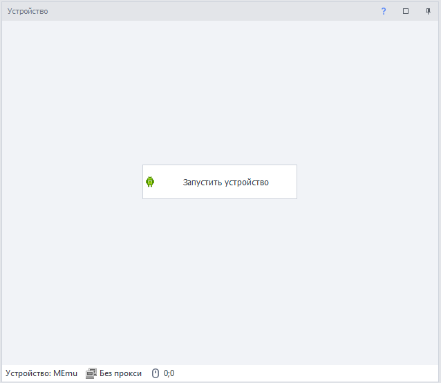
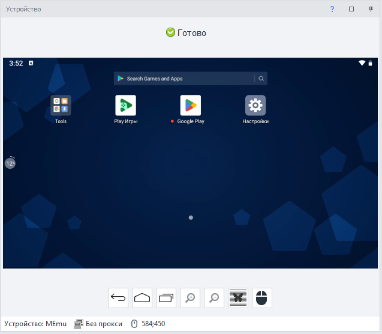

---
sidebar_position: 4
title: Окно устройства
description: Взаимодействие с устройством.
---  
## Начало работы.
В данном окне можно взаимодействовать как с эмулятором, так и с реальным устройством.  
Когда вы запустите ProjectMaker окно устройства будет выглядеть вот так:  

Для начала работы вам нужно нажать **Запустить устройство**. Если при этом включена **Запись** проекта, то на холст с экшенами будет добавлено два действия: **Выбрать устройство** и **Запуск/перезапуск устройства**.  
## Компоненты окна.   
Такое окно вы увидите после успешного запуска устройства:  

Тут вы можете напрямую взаимодействовать с ним: кликать, свайпать, открывать приложения, все действия будут транслироваться. А если включена запись, то они еще и будут добавляться на холст в виде соответствующих экшенов.