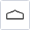
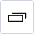

---
sidebar_position: 4
title: Окно устройства
description: Взаимодействие с устройством.
---  
## Начало работы.
В данном окне можно взаимодействовать как с эмулятором, так и с реальным устройством.  
Когда вы запустите ProjectMaker окно устройства будет выглядеть вот так:  

Для начала работы вам нужно нажать **Запустить устройство**. Если при этом включена **Запись** проекта, то на холст с экшенами будет добавлено два действия: **Выбрать устройство** и **Запуск/перезапуск устройства**.  
_______________________________________________ 
## Компоненты окна.   
Такое окно вы увидите после успешного запуска устройства:  

Тут вы можете напрямую взаимодействовать с ним: кликать, свайпать, открывать приложения, все действия будут транслироваться. А если включена запись, то они еще и будут добавляться на холст в виде соответствующих экшенов.  
_______________________________________________ 
### Кнопки управления эмулятором.  
  

| Кнопка      | Описание |
| ----------- | ----------- |
|  | Переход на прошлый экран. |
|    | Возврат на домашний экран. |
|    | Открыть список недавних приложений. |
|    | Увеличение масштаба*   |
|    | Уменьшение масштаба*      |
|    | Закрыть участок изображения. Используется для тестирования поиска по картинке.      |
|    | Начать запись движения мышью       |  
:::info **(*) Примечание.**
Масштаб также можно изменить дважды кликнув колесиком мыши в окне эмулятора с зажатой клавишей ***Ctrl***.  
:::  
_______________________________________________ 
### Имя текущего устройства/эмулятора.  
   

Устройство, которое активно в данный момент.  
_______________________________________________ 
### Установленный прокси.  
   

Отображает текущий установленный прокси.  
_______________________________________________ 
### Координаты мыши.  
  

Если курсор находится в пределах окна устройства, то здесь будут отображены его текущие координаты (X, Y).  
Эти координаты можно использовать в экшенах **Эмуляция swipe**  и **Эмуляция touch**. 
_______________________________________________ 
### Контекстное меню.  
  

Кликнув ПКМ по любому месту окна, вы откроете контекстное меню.  
#### Доступные кнопки:  
- **Очистить текст**.  
Позволяет очистить всё содержимое поля ввода.  
Если включена запись, то в проект добавится экшен **Эмуляции клавиатуры** с таким содержимым `{AndroidKeys.CLEAR}`  
- **Установить значение из профиля**.  
Позволяет установить в поле ввода значение из **Профиля** проекта.  
Если включена запись, то в проект добавится экшен **Установить значение** с макросом из выбранного профиля.  
- **Установить значение переменной**.  
Позволяет установить в поле ввода значение из пользовательской переменной.  
Если включена запись, то в проект добавится экшен **Установить значение** с макросом выбранной переменной.  
:::info **Обратите внимание.**
Первые три кнопки, которые мы сейчас рассмотрели, отображаются только для полей ввода.  
:::  
- **Исследовать элемент**.  
Вызывает окно **Свойства элемента** для более детального изучения. Так же выбранный элемент будет выделен в окне **Дерева элементов**.  
- **Следовать за курсором**.  
При включении данной опции элемент, который находится под курсором, будет подсвечен и выделен, а его свойства попадут в **Окно свойства элементов**.  

**Пример.**

<!--All you need is a blank line-->

      

     
- **В конструктор действий**.  
Отправляет элемент в **Конструктор действий**.  
- **Поисках xPath**.  
Анализирует элемент на странице и выводит информацию в формате xPath.  

- **Это капча!**.  
Позволяет отметить изображение как капчу и отправить ее либо на ручное распонзавание, либо с помощью специального модуля (например, [**CapMonster.Cloud](https://capmonster.cloud/)).  

 

- **Приклеить к капче**.  
Позволяет соединить несколько отдельных картинок в одну и отправить цельное изображение на распознавание.  
- **Поле для результата распознавания каптчи**.  
Вводит результат распознавания в поле ввода и, если включена **Запись**, добавляет экшен **Установки значения**.
- **Создать проверку наличия текста**.  
Позволяет проверить наличие определенного текста. Он вводится в окно ввода, а затем создается специальный экшен, где можно указать дополнительные параметры поиска.  

 

- **Поиск по картинке**.  
Выполняет поиск по выбранной картинке. Открывается дополнительное окно с настройкой параметров поиска.  

 
