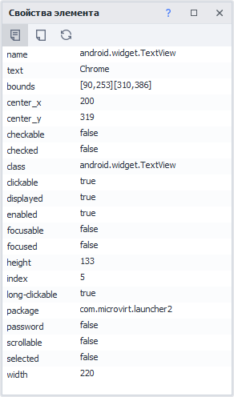

---
sidebar_position: 3
title: Свойства элемента
description: Окно с атрибутами элемента.
---  
:::info **Пожалуйста, ознакомьтесь с [*Правилами использования материалов на данном ресурсе*](../../Disclaimer).**
:::
_______________________________________________  
## Описание.

При анализе структуры нередко встречаются одинаковые на первый взгляд элементы, которые могут запутать при работе с ними. Воспользовавшись окном **Свойства элемента**, можно детально изучить атрибуты объектов.  

  
_______________________________________________  
## Как работать с окном?  
### Включение окна.  
Для включения окна надо нажать в верхнем меню по пункту **Окно** и выбрать **Свойства элемента**.  
  
:::info **Если после включения окно все еще не отображается.**
То нужно сделать сброс расположения окон до значения по умолчанию. Сделать это можно с помощью кнопки **«Сбросить панели»** в настройках программы, во вкладке [**Отладка**](../../Settings/Debugging).
::: 
_______________________________________________    
### Отображение информации по нужному элементу.  
Есть несколько способов того, как можно отобразить информацию по интересующему вас элементу:  
- добавить его в [Конструктор действий](./ActionBuilder),  
- выбрать в [Окне дерева элементов](./ElementTree),  
- ПКМ по нужному элементу → Исследовать или Следовать за курсором.  
_______________________________________________  
### Вкладка «Свойства».  
  

На ней отображаются атрибуты выбранного элемента. Она открыта по умолчанию.  
_______________________________________________ 
### Кнопка «Показать пустые поля».  
  

После включения во вкладке Свойства дополнительно будут отображены пустые атрибуты, если таковые есть.  
_______________________________________________   
### Кнопка «Обновить поля».  
  
  
С помощью данной кнопки можно обновить значения атрибутов элемента.  
_______________________________________________ 
## Полезные ссылки.  
- [**Конструктор действий**](./ActionBuilder).  
- [**Древо элементов**](./ElementTree).  
- [**Поиск элементов**](../../pm/Creating/ElementSearch).