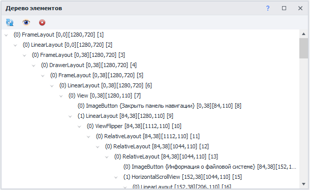
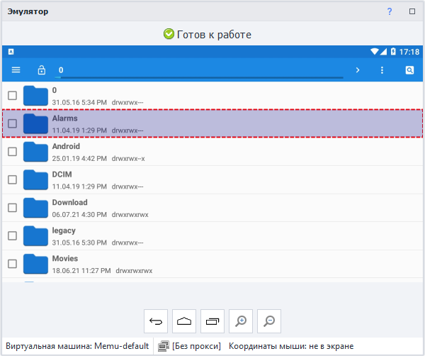
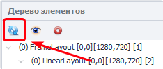
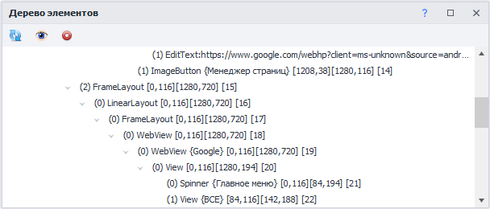
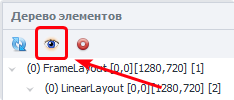
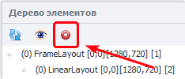
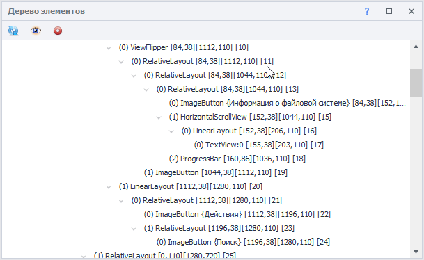
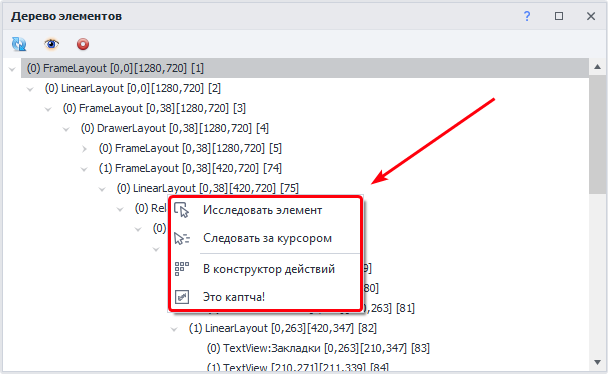
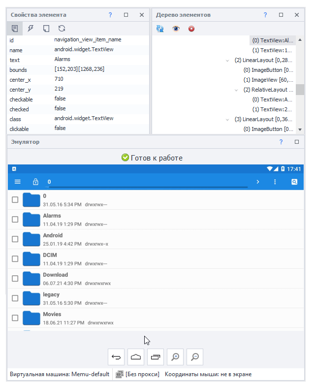
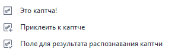

  
В этой статье мы детально рассмотрим окно под названием «Дерево элементов». В нем отображается структура страницы, которая находится на главном экране эмулятора, в виде древа. То есть все элементы выходят друг из друга в порядке взаимосвязи.  
> *При выделении элемента **в Древе** он также будет подсвечен **в Окне эмулятора**:*  
>   

Структуру страницы можно вывести в виде XML строки с помощью действия  
**Получить структуру элементов (XML)**, которое вы найдете в Утилитах.  

## Функции.  
### 1. Обновить содержимое.  
   
Эта кнопка обновляет структуру элементов. Нажимать ее нужно каждый раз при открытии новой страницы приложения, чтобы подгрузить актуальную структуру.  
### 2. WebView.    
> *WebView — это компонент пользовательского интерфейса, который используется в мобильных приложений для отображения веб-содержимого (HTML, CSS, JavaScript) прямо внутри приложения. Он позволяет интегрировать веб-страниц без перенаправления в отдельный веб-браузер.*  

Если в древе присутствует подобный элемент, то после первого клика по кнопке «Обновить» его содержимое не будет отображено, нужно нажать повторно. Причем отобразится не HTML-структура web-страницы, а именно стандартная разметка Android.   

### 3. Только видимые элементы.  
  

Включает отображение только тех элементов, которые находятся в области видимости.  
### 4. Автообновление.  
> *При включении данной функции <mark>перестает работать свайп мышкой в окне эмулятора</mark>.  
Но свайп через колесо мыши по-прежнему будет работать.*  

  

Данная функция всегда работает, когда включена автозапись действий. То есть перед каждой записью экшена в проекте структура будет обновляться до актуальной.  
> *Для корректной работы Автообновления надо убедиться, что отключена настройка  
**Запись нажатий через поиск по картинкам** на вкладке Запись.*  
### 5. Сворачивание.  
  
Для удобства работы вы можете сворачивать любые элементы в древе.  
## Контекстное меню.  
   
Выберете элемент и нажмите по нему правой кнопкой мыши, чтобы открыть Контекстное меню.  
### 1. Исследовать элемент.  
Позволяет детально изучить элемент, открыв его **Свойства**.  

    
### 2. Следовать за курсором.  
После включения данной опции элемент под курсором будет подсвечен, выделен в древе, а также отобразятся его свойства.  
  
### 3. В конструктор действий.  
Отправляет элемент в конструктор, чтобы взаимодействовать с ним в рамках проекта.  
### 4. Это капча!   
При нажатии создается экшен **Распознавание капчи**. Параметры для поиска подбираются автоматически. После выбора пункта **Это капча!** появляется два дополнительных параметра.  
  
#### Приклеить к каптче.  
Этот параметр позволяет соединить несколько отдельных картинок в одну и отправить цельное изображение на сервис распознавания каптчи. Удобно использовать, когда каптча состоит из нескольких отдельных элементов.  
#### Поле для результата распознавания каптчи.  
Вводит результат распознавания в поле ввода и, если включена **Запись**, добавляет экшен  
**Установка значения**. 