---
sidebar_position: 9
title: Окно лога
description: Вывод сообщений пользователю
---  
## Что такое Лог и для чего он нужен?  
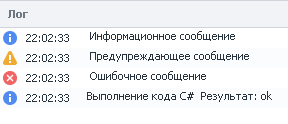  

Лог служит для вывода уведомлений пользователю. Они бывают трёх типов:  
- **Информационное ( ¡ )**.  
Например, `Начинаем работу`; `Приступаем к регистрации`; `Успешно создали аккаунт`;  
- **Предупреждающее ( ❕ )**.  
Любые некритические ошибки, которые не влияют на работу шаблона.  
- **Ошибка ( ❌ )**.  
Они сообщают пользователю, что произошла серьезная ошибка, на которую нужно обязательно обратить внимание.  

Лог особенно полезен для отслеживания ошибок в работе шаблона. Которые, например, могут привести к долгому его выполнению.  

:::info **Полезно.**
Уведомления в лог выводятся с помощью экшена **Оповещение**. В нем же можно снять галочку с пункта **Показывать в ZennoDroid**, чтобы сообщения отображались только в ProjectMaker.

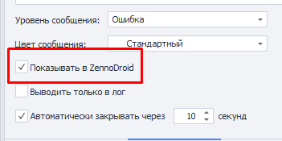
::: 
_______________________________________________  
## Как работать с Логом?  
### Включение.  
Верхняя панель → Окно → Лог:  

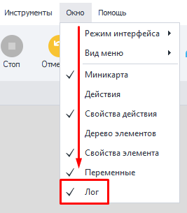 

<details>
<summary>**У меня не отображается Лог. Что делать?**</summary>
<!--All you need is a blank line-->

    Бывают случаи, когда окно лога не отображается, хоть и включено. Если после нескольких попыток оно так и не появилось, то нужно произвести общий **сброс настроек** окон в ProjectMaker.  

    **ВНИМАНИЕ**. *Дальнейшие действия приведут к сбросу настроек окон. Если вы настраивали интерфейс под себя, расположив окна удобным способом, то все эти настройки будут удалены, вернувшись к значению по умолчанию.*  

    Открываем **Редактирование → Настройки → Отладка → в самом низу Сбросить панели. Теперь перезагружаем ProjectMaker. Все настройки будут сброшены, а работоспособность Лога восстановлена.  

    Данный метод можно также использовать при проблемах с другими окнами. 
</details>  
_______________________________________________ 
### Внешний вид.  
#### Окно вывода сообщений.  
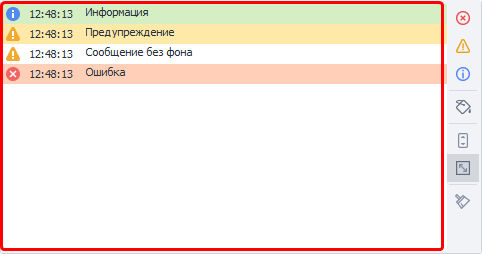 

Здесь отображается иконка, соответствующая типу уведомления, затем время и сам текст сообщения.  
_______________________________________________ 
#### Сортировка по типу и цвету.  
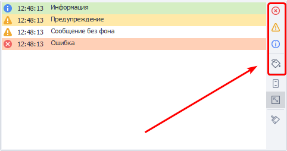 

С помощью кнопок в данной секции можно фильтровать выводимые сообщения.  
_______________________________________________ 
#### Автопрокрутка.  
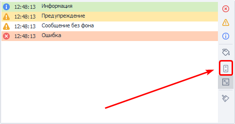 

Если нажата данная кнопка, то окно Лога будет автоматически прокручиваться, тем самым всегда показывая последнее сообщение.  
:::info **Условия отключения.**
В Настройках на вкладке *Другое* можно изменить условия, при которых будет отключаться автопрокрутка. 
:::  
_______________________________________________ 
#### Автоподбор высоты строк.  
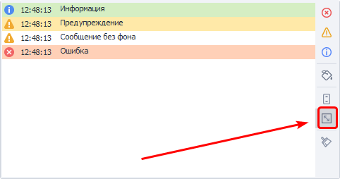  

Если сообщение слишком большое, то высота строки будет подобрана таким образом, чтоб полностью его вместить.  

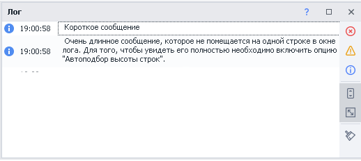 

Когда данная опция отключена, отображается только верхняя строка из всего сообщения.  
_______________________________________________ 
#### Очистить лог.  
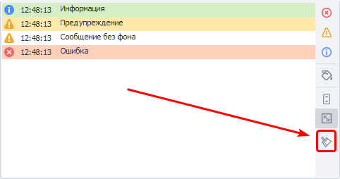 

Эта кнопка очищает окно от всех сообщений.  
_______________________________________________ 
#### Двойной клик по записи в логе.  
Если дважды кликнуть на интересующей записи в логе, то фокус проекта сместится на экшен, который оставил это сообщение.  
_______________________________________________ 
#### Низкая высота окна.  
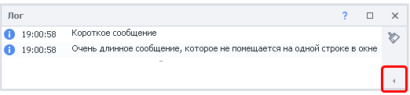

Кнопки из правого блока сворачиваются при уменьшении высоты окна лога. Для получения доступа к ним необходимо кликнуть на выделенную кнопку.  
_______________________________________________ 
### Контекстное меню.  
Вызывается нажатием ПКМ по уведомлению.  

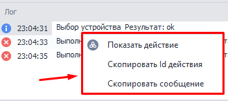 

- **Показать действие.** Смещает фокус на экшен, который отправил выбранное сообщение.  
- **Скопировать Id действия.** Скопируется уникальный номер экшена, который можно использовать для поиска по проекту. Он выглядит примерно так: `3e6988d1-9518-4535-a6d2-f0a33420c730`.   
- **Скопировать сообщение.** В буфер обмена сохраняется полный текст сообщения.    
_______________________________________________ 
## Функции для опытных пользователей.  
### Файл Лога на компьютере.  
PM и ZD дополнительно сохраняют все логи на компьютере в папке с установленной программой.  
Вот так выглядит путь: `C:\Program Files\ZennoLab\RU\ZennoDroid Pro\2.3.8.0\Progs\Logs`  

По умолчанию логи всех проектов пишутся в один файл. Это можно изменить с помощью C# кода, который нужно разместить в начале шаблона:  
```js 
// Перенаправляем лог для данного шаблона в отдельный  файл.
project.LogOptions.LogFile = @"D:\log.txt";
// Для каждого потока будет создан свой файл c логом.
// К имени файлов (в нашем случае log) будут приписываться идентификаторы потоков.
project.LogOptions.SplitLogByThread = true;  
```  
_______________________________________________ 
## Расширенный вариант лога.  
Включаем через *Редактирование → Настройки → Отладка →*  ***Расширенный вариант окна лога***.  

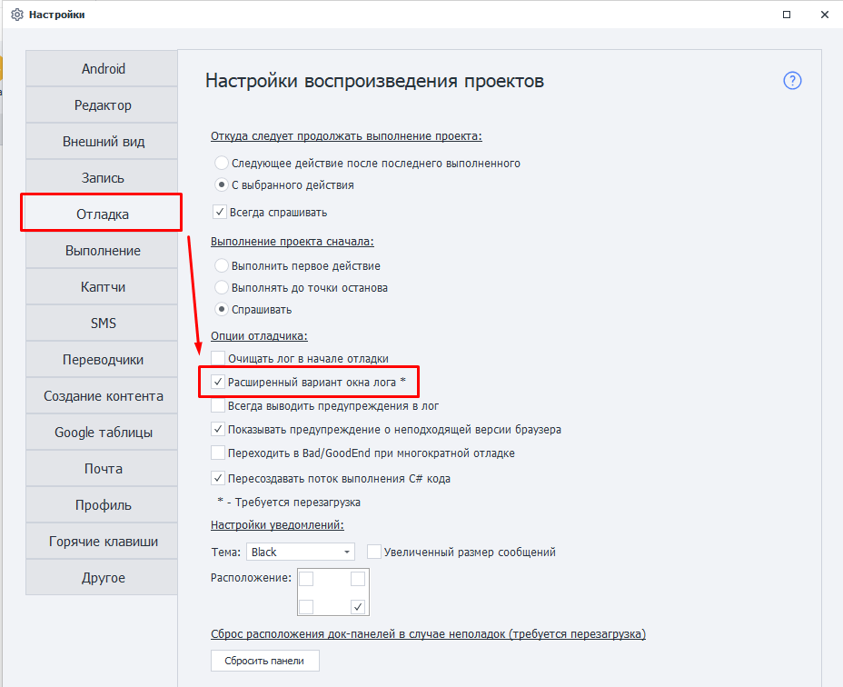 

Нужно перезапустить ProjectMaker, чтобы изменения вступили в силу.  
:::info **Настройка также автоматически включится и для ZennoDroid.**  
::: 
_______________________________________________ 
### Чем отличается расширенный вариант?  
#### Заголовки.  
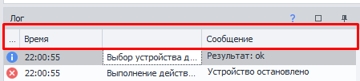  

- Тип сообщений.  
- Время.  
- *Безымянный заголовок*.  
- Сообщение.  
Кликнув по любому из заголовков, можно отсортировать сообщения под ним.   
_______________________________________________ 
#### Фильтр сообщений:  
При наведении курсора мыши на любой из заголовков появляется иконка фильтра.  

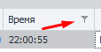 

- **Фильтры для времени.**  
Доступно множество условий для тонкой настройки фильтра (по дням недели; между двумя датами; до определенного дня; и так далее).  

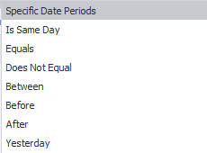 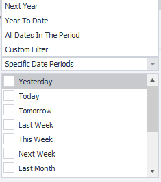 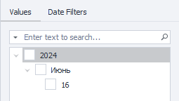

- **Текстовые фильтры.**  
Они доступны для Безымянной колонки и текста Сообщений. 

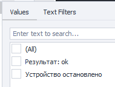   

<details>
<summary>**Краткое описание доступных фильтров.**</summary>
<!--All you need is a blank line-->

    **`Equals`** — строка равна фильтру (точное совпадение),  
    **`Does Not Equal`** — НЕ равна фильтру,  
    **`Begins With`** - начинается с…,  
    **`Ends With`** - заканчивается на…,  
    **`Contains`** - содержит...,  
    **`Does Not Contain`** - НЕ содержит...,  
    **`Is Blank`** - строка пуста,  
    **`Is Not Blank`** - НЕ пустая строка,  
    **`Custom`** - составной фильтр.  
</details>   
_______________________________________________ 
#### Контекстное меню заголовков.  
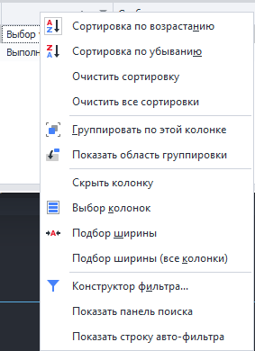  

Кликнув ПКМ по заголовку откроется контекстное меню с дополнительными функциями: *группировка по выбранной колонке*, *скрытие колонок*, *подбор ширины*.  
Но самые интересные из них: ***Авто-фильтр*** и ***Конструктор фильтров***.   
_______________________________________________ 
#### Авто-фильтр.  
<details>
<summary>**Открываем контекстное меню заголовков и выбираем в самом низу *Показать строку авто-фильтра*.**</summary>
<!--All you need is a blank line-->

    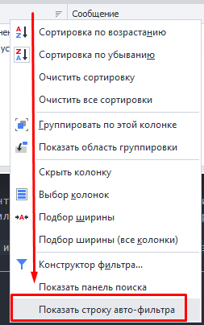 
</details>   
  
При активации появляется дополнительная строка под заголовками. Теперь вы можете создать фильтр с собственной логикой.  

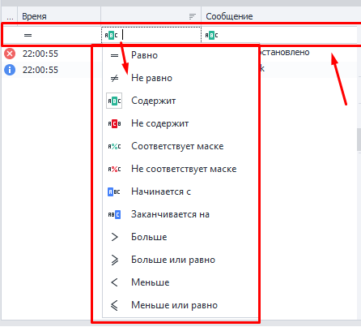 

Слева у каждой строки есть значок, после клика по которому появляется выбор типа фильтрации.  
Типы фильтров и вводимые значение зависят от вида колонки. Для *Времени* это операторы сравнения и даты, а для *Сообщений* вместо дат поиск по тексту.  
_______________________________________________ 
#### Конструктор фильтров.  
<details>
<summary>**Открывается также через контекстное меню.**</summary>
<!--All you need is a blank line-->

    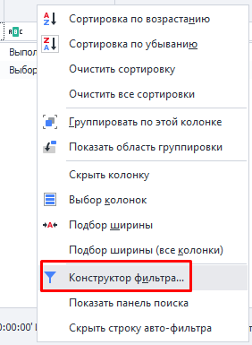    
</details>  

Разберем доступные кнопки.  

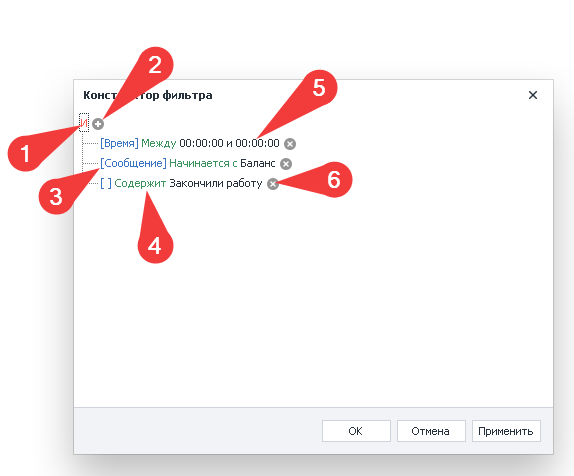  

**1.** Кнопка управления условиями: можно добавить одно новое или целую группу, либо вовсе удалить все условия.  
Доступные варианты:  
    - ***И*** — удовлетворяет ВСЕМ условиям,  
    - ***ИЛИ*** — удовлетворяет хотя бы одному из условий,  
    - ***НЕ И*** — НЕ удовлетворяет ВСЕМ условиям,  
    - ***НЕ ИЛИ*** — НЕ удовлетворяет хотя бы одному из условий.  

**2.** С помощью данной кнопки можно добавить дополнительное условие.  
**3.** 🟦 Синим цветом в квадратных скобках указана колонка к которой применяется фильтр.  
:::tip ***Безымянная колонка.***  
*На скриншоте она расположена последней. Хоть у неё и нет собственного имени, но фильтровать по ней можно.*
:::  
**4.** 🟩 Зелёным цветом пишется тип фильтра.  
**5.** ⬛ Чёрный текст — это данные для фильтра, которые вводит пользователь.  
**6.** Эта кнопка позволяет легко удалить фильтр.  
_______________________________________________ 
### Подробнее о Безымянной колонке.
#### Как заполнить ее?  
Для этого необходимо использовать кубик ***Свой C# код*** и обладать минимальными знаниями по работе с C# кодом. Написать в данную колонку с помощью стандартного экшена *Оповещения* не получится.  

Для вывода сообщений в лог существует четыре метода:  
- ***`project.SendInfoToLog`*** — выводит информационные сообщения,  
- ***`project.SendWarningToLog`*** — уведомления о некритических ошибках,  
- ***`project.SendErrorToLog`*** — ошибка, на которую стоит обратить внимание,  
- ***`project.SendToLog`*** — задает цвет сообщения.  

#### Первый вариант:  
```js 
// Аргументы:
// 1й - строка, которая выведется в колонке "Сообщение"
// 2й - bool, надо ли выводить это сообщение в лог ZennoPoster
project.SendInfoToLog("Message", true);  
```
#### Второй вариант: 
```js
// Аргументы:
// 1й - строка, которая выведется в колонке "Сообщение"
// 2й - строка, данная строка появится в  безымянной колонке.
// 3й - bool, надо ли выводить это сообщение в лог ZennoPoster
project.SendInfoToLog("Message", "Way", true);
```
#### Результат:  

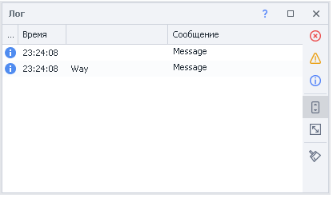 
_______________________________________________ 
#### Для чего использовать Безымянную колонку?  
- При многопоточной работе сюда можно заносить имя аккаунта, а в *Сообщения* — действие, которое этот аккаунт сейчас выполняет. И потом по необходимости можно будет группировать или фильтровать уведомления по этой колонке.  
- В случае работы с большими проектами вы можете добавлять сюда ту часть шаблона, которая в данный момент выполняется. А в *Сообщении* писать конкретное действие. Например, при регистрации, заполнении профиля, поиске товара, парсинге и обработке товаров, публикации обработанных данных, которые выполняются в рамках одного проекта. 
