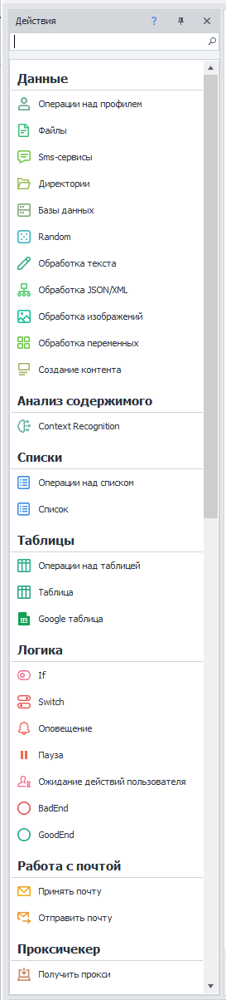
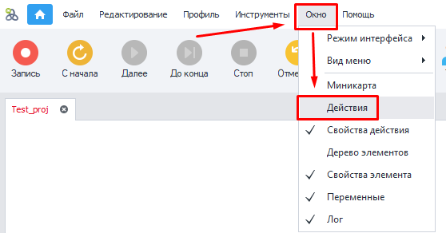
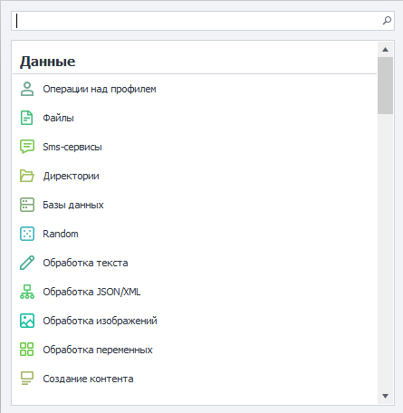
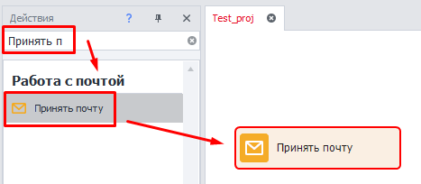
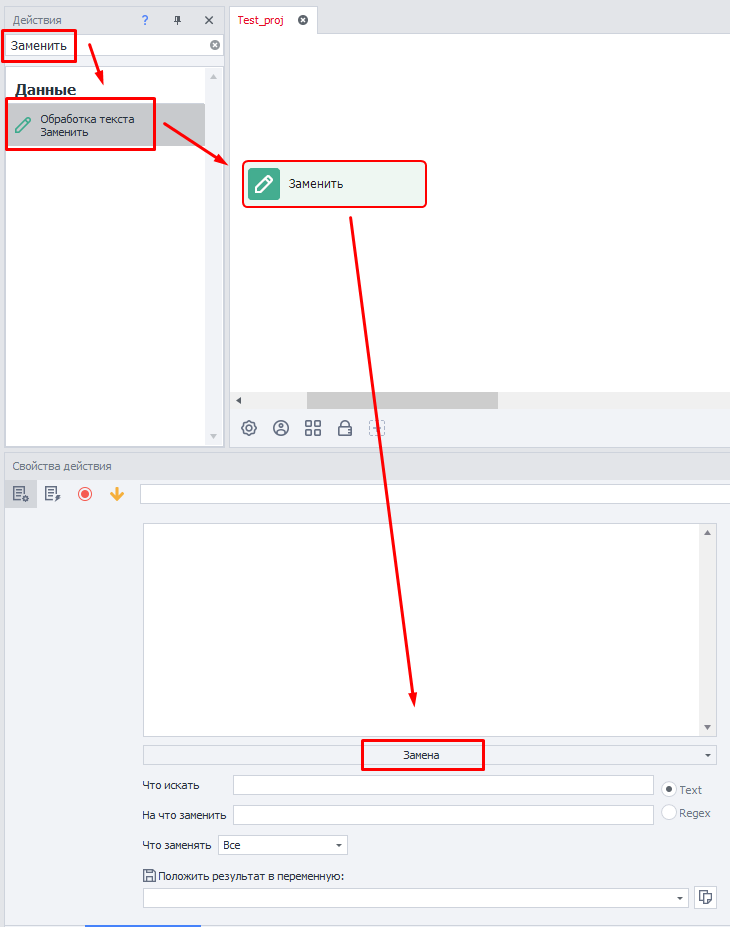
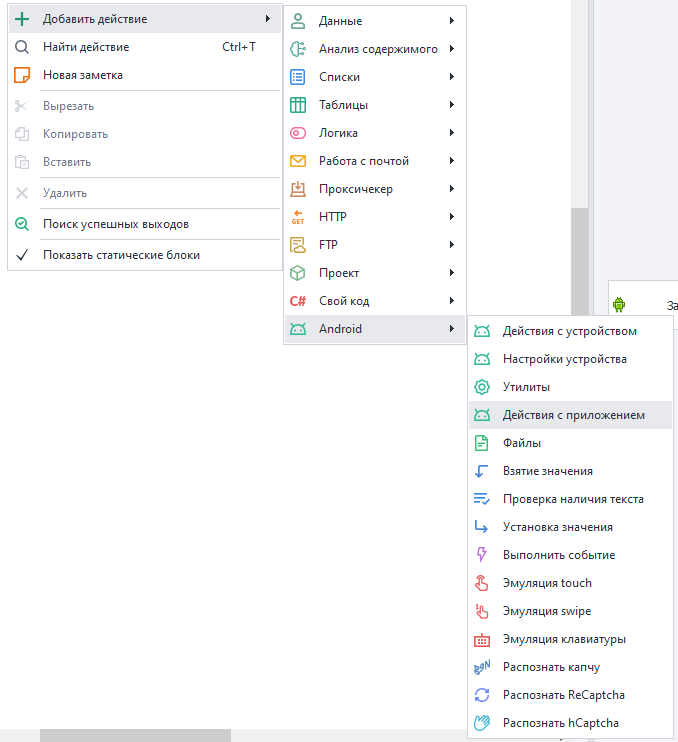

---
sidebar_position: 7
title: Окно действий
description: Как найти и добавить экшен?
---  

**Это окно навигации по экшенам, которое позволяет быстро найти и добавить их в проект.**

<!--All you need is a blank line-->

     

  

Если забыли где находится необходимая функция просто введите ключевые слова для её поиска. Таким образом сокращается время на написание проекта.
_______________________________________________ 
### Как его открыть?  
#### Закрепить среди прочих окон:  
Через верхнюю панель → Окно → Действия:  

  
_______________________________________________ 
#### Вызвать плавающее окно:  
Нажать в любом месте комбинацию `Ctrl`+`T`:  

   
_______________________________________________ 
### Что можно делать?  
- Найти экшен по названию или его функции.  
- Добавить действие в проект.  
- Быстрый перенос экшенов двойным кликом.  
_______________________________________________ 
## Как работать с этим окном?  
### Поиск по названию и добавление в проект.  
:::tip **Интересно.**
При активном окне нажатие комбинации клавиш `Ctrl` + `T` установит курсор в строке поиска.  
:::  
  

Пишем примерное название → Выбираем нужный экшен → Добавляем в проект двойным кликом или переносом.  
_______________________________________________ 
Можно также выполнить поиск не по названию, а по конкретной функции. Тогда действие создастся сразу с выбранной функцией:

   
_______________________________________________ 
### Альтернативный способ добавления.  
Любое действие можно добавить проект, нажав ПКМ на пустом месте холста проекта и выбрав **Добавить действие**.  

 