---
sidebar_position: 6
title: Окно профиля 
description: Параметры виртуальной личности.
---  
:::info **Пожалуйста, ознакомьтесь с [*Правилами использования материалов на данном ресурсе*](../../Disclaimer).**
:::
_______________________________________________

Это окно служит для отображения информации о текущей личности. Чтобы его открыть нужно кликнуть по кнопке **Текущий профиль**.
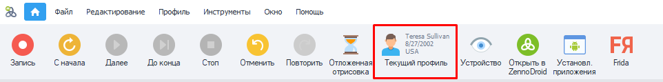  
_______________________________________________  
## Что такое Профиль и для чего он нужен?  
**Профиль** — это виртуальная личность, которую генерирует **ProjectMaker**. Вы можете задать для него браузер, ОС, платформу, национальность, пол, возраст, эмулируемые данные и др.  

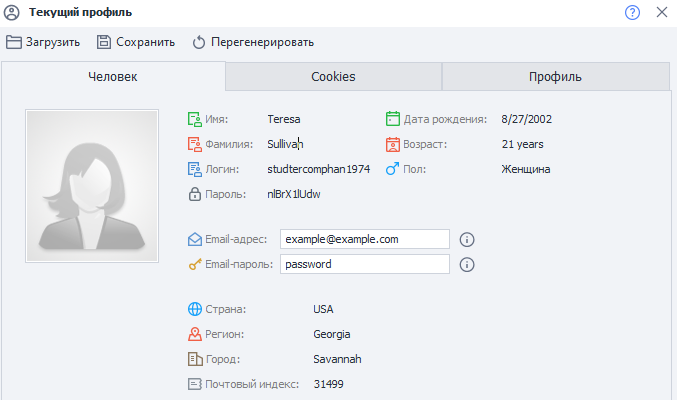 

Данную функцию полезно использовать во время создания или отладки проекта, чтобы проверить, как он выполняется с разными наборами данных. Можно быстро сгенерировать профиль с новыми данными, либо загрузить другой из файла.  
:::info **При сохранении/загрузке профиля также передаются куки и кэш браузера.**
:::  
_______________________________________________   
## Работа с Профилем.  
### Загрузка, сохранение и генерация.  
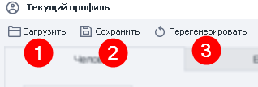  

**1. Загрузить.** Позволяет загрузить ранее сохраненный профиль. После клика по кнопке откроется стандартное окно выбора файлов.  
**2. Сохранить.** Сохранение текущего профиля по указанному пути.  
**3. Перегенерировать.** Полное обновление всех параметров профиля.  
:::tip ***Можно и так.***
*Эти же действия во время работы можно выполнить через экшен **Операции над профилем**. Еще там доступно изменение некоторых полей.*
:::   
_______________________________________________  
### Вкладка «Человек».  
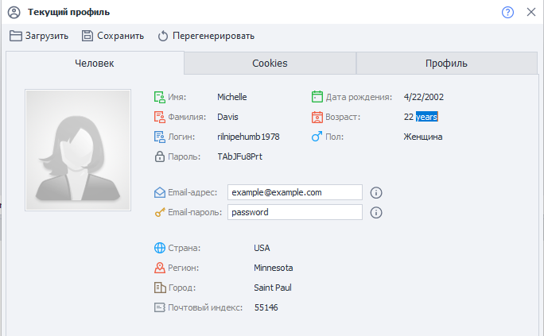  

Здесь отображается базовая информация по текущему профилю. Почти все параметры доступны только для чтения и копирования. А изменить можно лишь email и пароль от него в рамках текущего профиля.   
:::tip ***Как скопировать?***
*Дважды кликните на нужное значение, чтобы выделить его → ПКМ для вызова уже привычного контекстного меню → **Копировать**.*
:::  
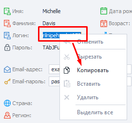   

:::info **Имейте в виду.**
В настройках программы можно установить *Email по умолчанию* и *Национальность* для всех профилей.
:::  
_______________________________________________ 
### Вкладка «Cookies».  
Тут отображаются все куки, которые есть у текущего профиля.  

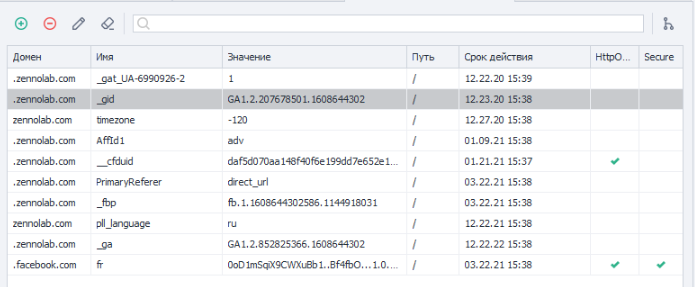     

#### Редактирование.  
С помощью этих кнопок можно редактировать Cookie.  

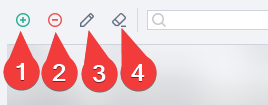    

**1.** Добавить новую Cookie.  
**2.** Удалить выбранную.  
**3.** Редактировать.  
**4.** Очистить все разом или только выделенную.  

#### Поиск.  
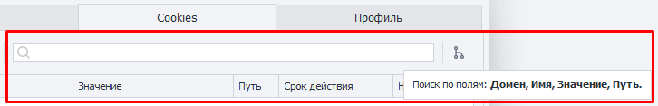    

Через строку поиска можно искать Cookie по интересующим параметрам. А рядом есть кнопка, отвечающая за сортировку по домену. Оба инструмента можно использовать сообща.  
_______________________________________________ 
### Вкладка «Профиль».  

**Здесь можно найти подробную информацию о сгенерированной личности.**

<!--All you need is a blank line-->

    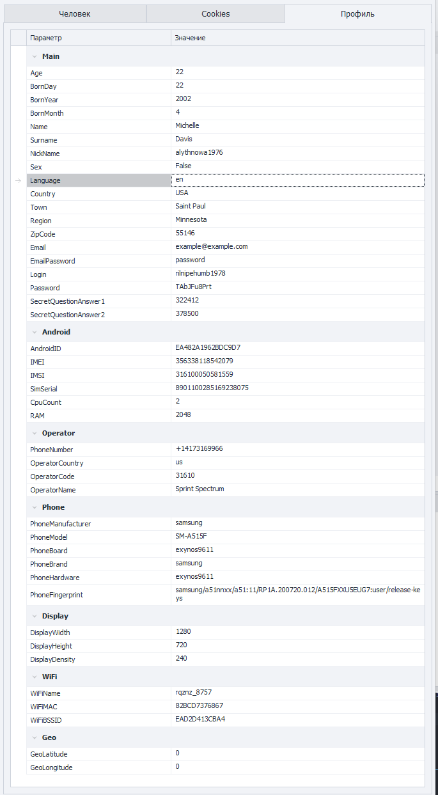   

    
   
:::tip **Пол профиля в ProjectMaker имеет логический тип:**  
- мужской `True`  
- женский `False`
:::
_______________________________________________ 
## Доступ к данным профиля через переменные.  
### С помощью окна Переменные.  
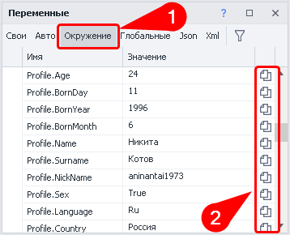  

В окне Переменных во вкладке **Окружение (1)** можно найти список тех, которые подойдут нам при работе с Профилем. Они будут начинаться со слова `Profile`. Там же можно сразу **скопировать макрос (2)** выбранной переменной.
_______________________________________________ 
### Вручную.
В любом поле, которое поддерживает макросы переменных (например, в действии **Оповещение**), нажимаем комбинацию клавиш `Ctrl+Пробел`. Находим `{}Profile` и нажимаем на него. Затем ставим точку, чтобы вызвать еще один выпадающий список, но уже со всеми переменными профиля. Дважды нажимаем по необходимой переменной, и она автоматически вставится.  
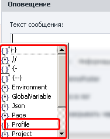 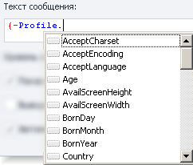  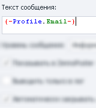

:::info **Переменные, которых нет в окне Профиля.**
`{-Profile.NickName-}` (ее значение отличается от `{-Profile.Login-}`)  
`{-Profile.SecretQuestionAnswer1-}` и `{-Profile.SecretQuestionAnswer2-}`
:::  
_______________________________________________
## Полезные ссылки.  
- [**Окно переменных**](./Variables). 
- [**Профиль**](../../Project%20Editor/Static%20Block%20Panel/Profile).
- [**Операции над профилем**](../../Data/WorkWithProfile).

