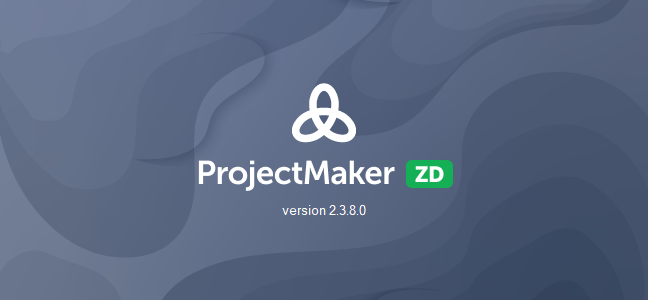
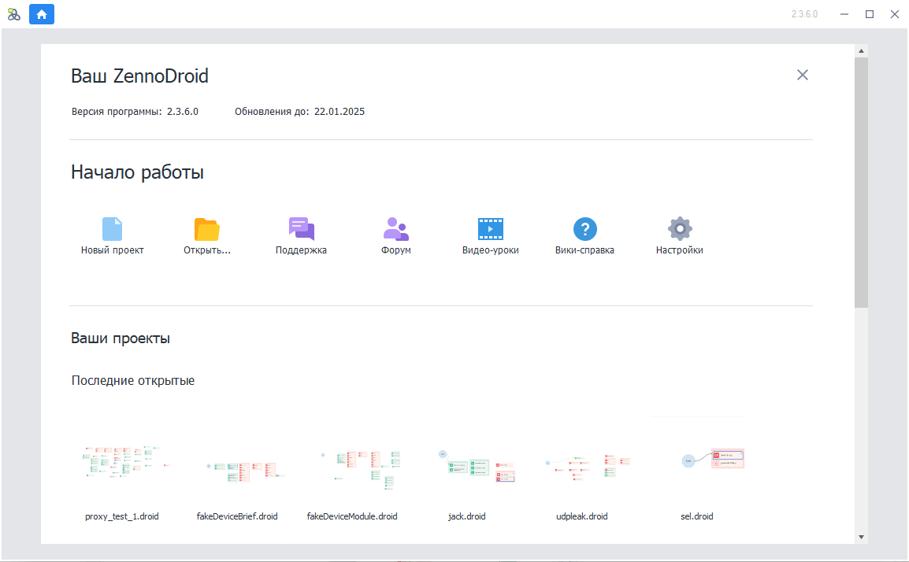
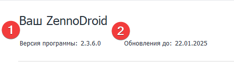
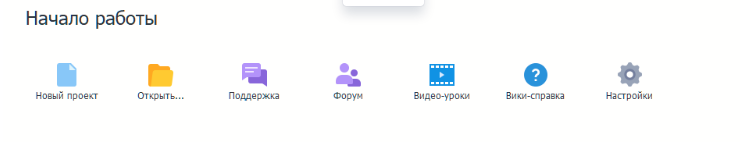
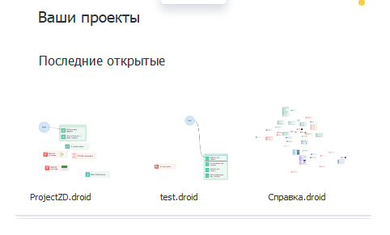
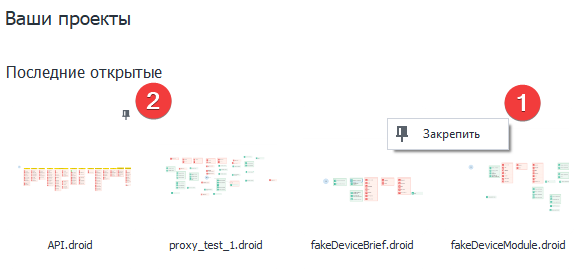

---
sidebar_position: 1
title: Стартовая страница
description: Знакомство с начальным экраном в ProjectMaker.
---  
:::info **Пожалуйста, ознакомьтесь с [*Правилами использования материалов на данном ресурсе*](../Disclaimer).**
:::
_______________________________________________
## Запуск программы.
  
_______________________________________________
## Стартовый экран.  
  
### Состоит из трех блоков:  
- **Ваш ZennoDroid**.  
- **Начало работы**.  
- **Ваши проекты**.  
_______________________________________________  
## Ваш ZennoDroid.  
  
Здесь вы можете увидеть:  
**1.** Текущую версию программы.  
**2.** Дату, до которой оплачены обновления.  
:::info **Вы можете ознакомиться с тарифами на обновление вашей версии в [**личном кабинете**](https://account.zennolab.com/personal-area-sale/updates).**  
:::  
_______________________________________________ 
## Начало работы.  
  
### Что доступно в этом блоке:  
- Создать новый проект.  
- Открыть проект из файла.  
- [Написать **в поддержку**](https://helpdesk.zennolab.com/ru)  
- Перейти на [**Форум**](https://zenno.club/discussion/). Там можно обсудить программу, задать вопрос или найти полезную информацию.  
- Посмотреть [**Видео-уроки**](https://www.youtube.com/@ZennoLabcom/playlists).  
- Открыть **Справку** в браузере.  
- Перейти в [**Настройки**](../category/настройки) программы.  
_______________________________________________  
## Ваши проекты.  
   
В последнем блоке находятся последние открытые проекты. Их количество можно изменить в **Настройки → Редактирование → Запоминать кол-во последних проектов**.  
:::tip **Если вы часто работаете с отдельными проектами, то их можно закрепить.**  
|               | 
| :----------------: | 
| *Кликните правой кнопкой мыши на проекте и нажмите **Закрепить**.*        |  
:::  
_______________________________________________ 
## Полезные ссылки.  
- [**Установка ZennoDroid**](../Installation/ZD_Install).  
- [**Запуск эмулятора**](../get-started/Memu_Start).  
- [**Редактор проектов**](../category/редактор-проектов). 