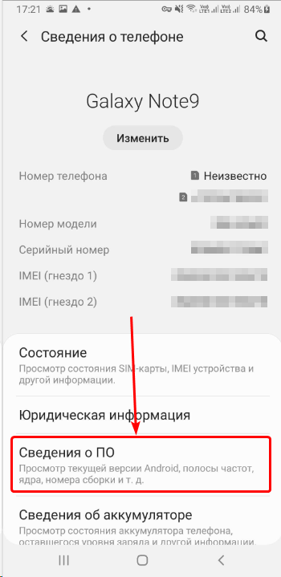
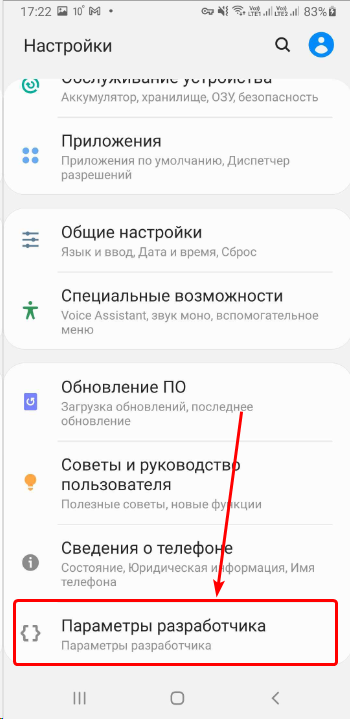
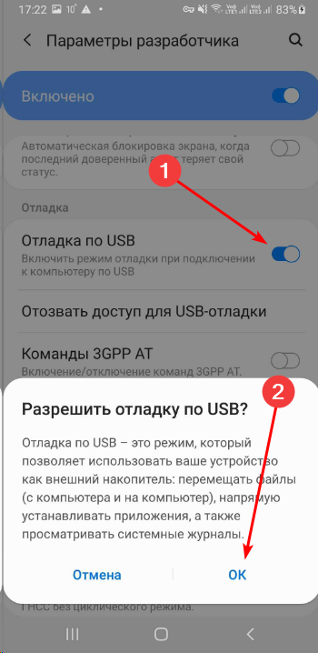
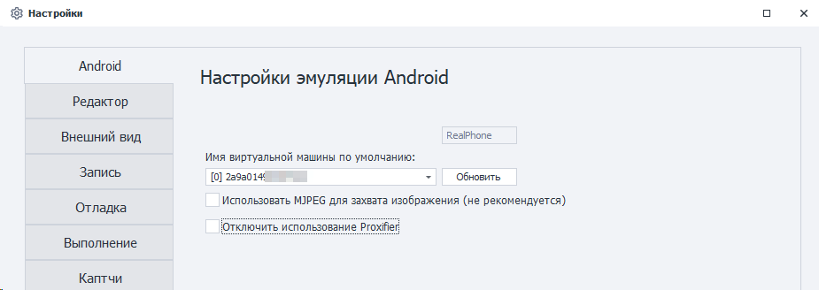
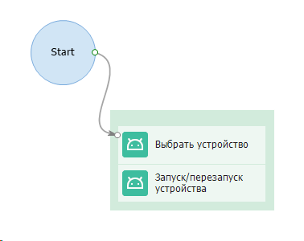

export const VideoSample = ({source}) => (
  <video controls playsInline muted preload="auto" className='docsVideo'>
    <source src={source} type="video/mp4" />
</video>
);  

## Подключение реального устройства к ZennoDroid  

Для подключения смартфона к ZennoDroid требуется выполнить ряд простых действий.  
К сожалению, написать универсальную документацию по подключению невозможно, так как процесс настройки может отличаться в зависимости от производителя телефона, версии Android и UI оболочки.

Данная статья написана на основе тестирования несколько типов устройств. Если у Вас что-то не получается, то напишите нам в службу поддержки.  

> ***Краткое содержание**:*   
> *1. Входим в режим разработчика.*  
> *2. Запускаем отладку по USB.*  
> *3. Подключаемся к ZennoDroid.*  

### Включаем режим разработчика на Android версии 5.0 - 12  
#### Подробная инструкция:  

1. Открываем настройки устройства.  
2. Нажимаем на раздел **«О телефоне»**/**«Сведения о телефоне»**  

  

3. Переходим к графе **«Номер сборки»**.  
> Если не находите такой пункт, то нажмите на **«Сведения о ПО»**, после этого откроется нужный раздел.  

  

4. Нажмите несколько раз на опцию **«Номер сборки»**. В результате ваших действий на экране устройства появится всплывающая надпись *«Вы стали разработчиком!»*.  

   

5. Теперь вы увидите, что в меню настроек телефона появился новый пункт  
**«Параметры разработчика»**.  

  

### Запускаем отладку по USB  
#### Подробная инструкция:  

1. Переходим в тот самый пункт, который у нас только что появился: **«Параметры разработчика»** или **«Для разработчиков»**. Название может отличаться на разных девайсах.  
2. Находим параметр **«Отладка по USB»**, включаем его и подтверждаем.  
> Если у вас также присутствуют настройки **«Установка через USB»** и **«Отладка по USB (Настройки безопасности)»**, то их нужно включить для корректной работы.  

   

> На устройствах с Root эти настройки можно включить c помощью действия  
**«Консольная команда ADB shell»:**  
*su -c setprop persist.security.adbinstall 1*    
*su -c setprop persist.security.adbinput 1*  

### Подключаем устройство к ZennoDroid 
#### Подробная инструкция:  

1. Теперь, когда на смартфоне включен режим отладки, подключаем его по USB к компьютеру, на котором установлен ZennoDroid.  
2. На телефоне выпрыгнет вопрос такого типа: *«Разрешаете ли Вы отладку с этого компьютера?»*. Ставим галочку и жмем *Разрешить*.  

  

3. Запускаем **ProjectMaker for ZennoDroid** и открываем в нем **Настройки → Android**, чтобы убедиться, что подключенное устройство доступно для выбора.  
> Если в выпадающем меню пусто, нажмите *Обновить*. В случае, когда ничего не поменялось, напишите нам в [службу поддержки](https://helpdesk.zennolab.com/ru).  

  

4. Создаём проект или открываем уже существующий. Жмём кнопку *«Запустить устройство»* в окне **Устройство**. Либо запускаем его через действия *«Выбрать»* и *«Запустить»*.  

   

> Также будет установлено несколько приложений в фоновом режиме:  
> - com.genymobile.gnirehtet для использования прокси;  
> - com.android.adbkeyboard внешняя клавиатура;  
> - io.appium.settings для фиктивной эмуляции геопозиции;  
> - io.appium.uiautomator2.server для корректной работы с деревом элементов;  

#### У меня появилось окно о запросе установки неизвестного мне приложения, что делать?  

На некоторых телефонах не удаётся произвести фоновую установку вышеописанных приложений. В таком случае может появиться окно о разрешении установки. Подтвердите установку каждого из них для корректной работы ZennoDroid.

  

