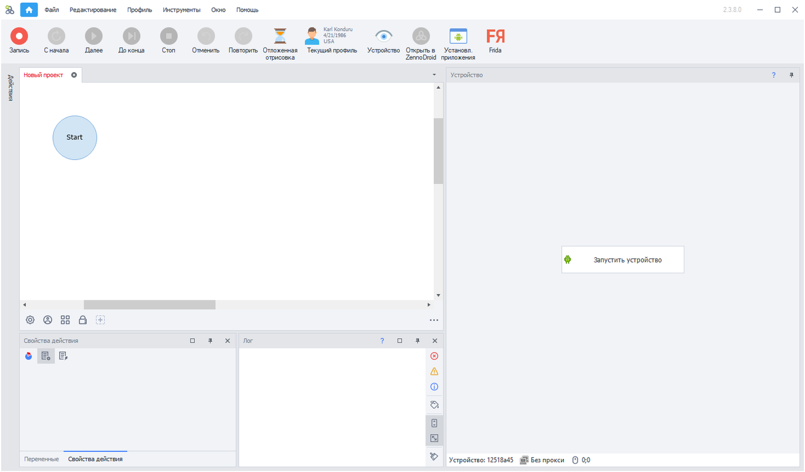

export const VideoSample = ({source}) => (
  <video controls playsInline muted preload="auto" className='docsVideo'>
    <source src={source} type="video/mp4" />
</video>
);  

## Начало работы с устройством  

> *Перед началом работы необходимо подключить устройство к компьютеру и настроить его.*  
*Подробнее читайте в статье:* [***Подключение устройства***](docs\tutorials\Devices\Connection.mdx)  

### Запуск устройства:  

1. После подключения устройства нужно добавить в проект действия:  
**«Выбрать устройство»** и **«Запуск/Перезапуск устройства»**.  
2. Выполнить запись проекта.     

  
 