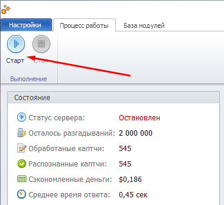
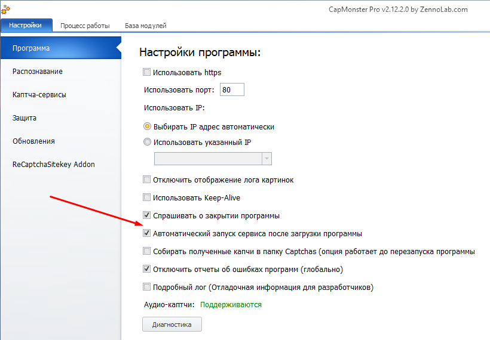
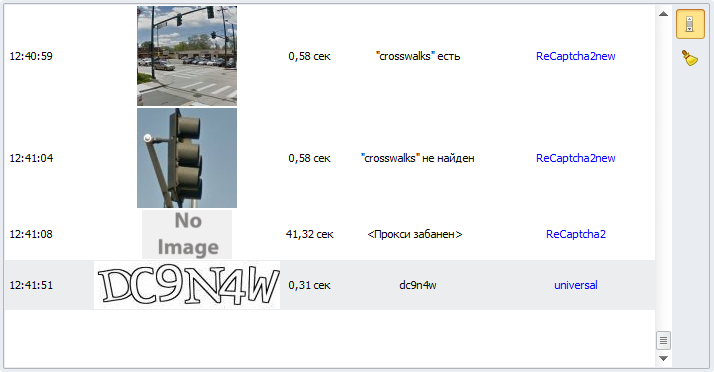
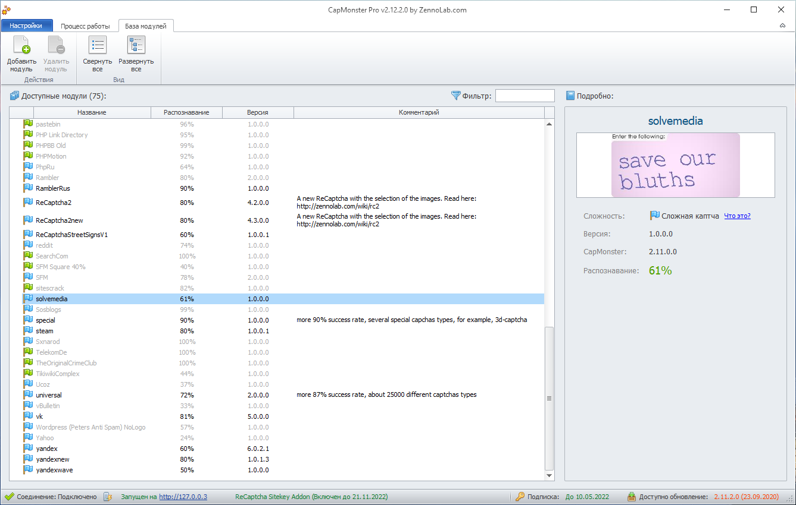
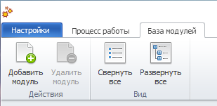
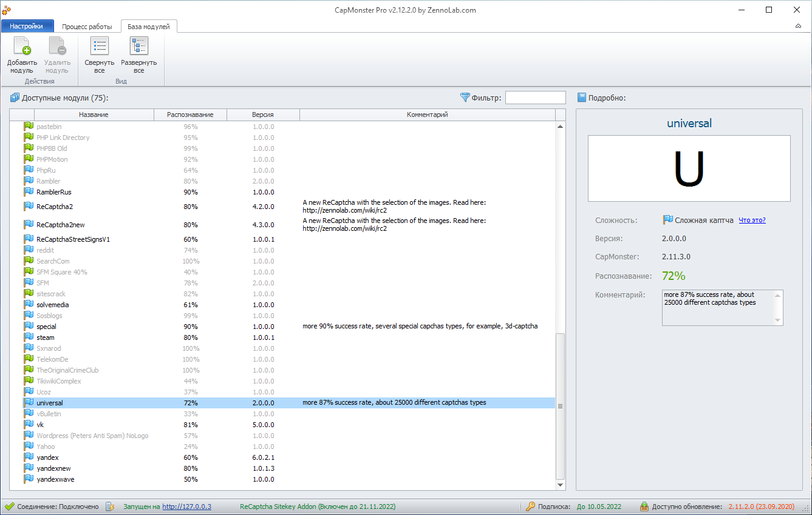
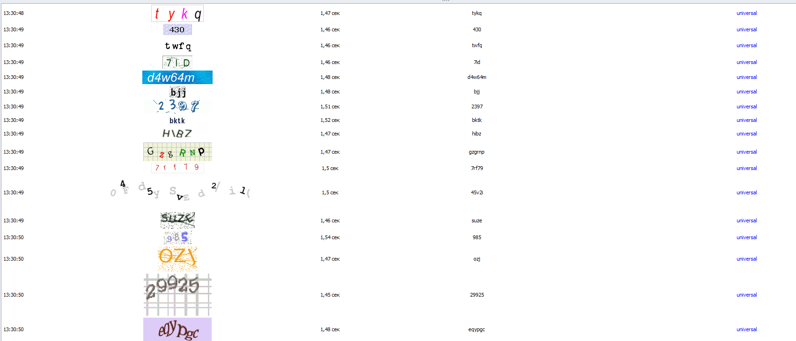
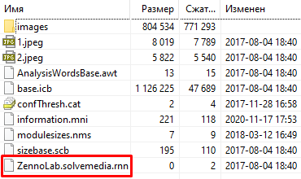

---
sidebar_position: 1
title: CAPTCHA Recognition
description: Let’s get started with solving CAPTCHAs.
---
import DisclaimerNotice from '@site/src/components/DisclaimerNotice';

<DisclaimerNotice />
## Launch.  
To start recognition, enable CAPTCHA service emulation in the settings and launch the program by clicking the “Start” button. After that, CapMonster will automatically intercept and solve CAPTCHAs sent by your SEO programs.  

:::tip  **In the settings, you can enable an option that will automatically start the service when the program launches.**  

:::
_______________________________________________
## Operation and statistics.  
After launching CapMonster, statistics and program activity monitoring become available to you.  

  

### Status.  
This section displays overall CAPTCHA recognition statistics.  

  

- **Server status** — running/stopped.  
- **Remaining solves** — the number of CAPTCHAs available for recognition per day.  
- **Processed CAPTCHAs** — the number of CAPTCHAs received by the program.   
- **Solved CAPTCHAs** — the number of CAPTCHAs that were solved.   
- **Money saved** — the amount you would have spent on recognition via manual services.  
- **Average response time** — the average time spent solving one CAPTCHA.  

#### More about limits. 
Daily limits (per 24 hours) depend on the program version:  
| Lite              | Standard | Pro |
| :----------------: | :------: | :----: |
| 100,000 simple, 20,000 complex, and ~2,200 ReCaptcha2  |   500,000 simple, 100,000 complex, and ~11,100 ReCaptcha2   | Up to 2,000,000 simple, 400,000 complex CAPTCHAs, and ~45,000 ReCaptcha2 |  

:::info **These limits do not apply to**
Local modules that you created yourself, or to ReCaptchaV3.
:::  

The counter updates every 10 seconds. For example, in the Pro version, approximately 231 CAPTCHAs available for recognition are restored every 10 seconds.  

For your version (taking additional packages into account), you can calculate this value using the formula:  
`Daily limit / (86,400 / 10)`  

:::tip **These limits can be increased for a fee**
In the [User Area](https://userarea.zennolab.com/), you can purchase additional CAPTCHAs. They are sold in packages of 3,000,000 for $97 (equivalent to the cost of the Pro version).
:::  
_______________________________________________
### Sitekey addon statistics.  
This window displays statistics only for ReCaptcha recognition via Sitekey.  

- **Tasks processed** — the number of ReCaptcha tasks received (also includes subtasks by categories: cars, road signs, etc.).  
- **Active threads** — shows how many tasks are currently in the recognition process.  
- **Successful tasks** — the number of successfully obtained tokens.  
- **Banned IP** — these tasks were not completed because the IP was banned by ReCaptcha.  
- **Bad IP** — in this case, tasks failed due to poor proxies (slow or invalid).  
- **Money saved** — the amount of money saved from fully successful tasks.  
- **Reset** — a button to reset Sitekey addon statistics.  
_______________________________________________
### CAPTCHA processing / Modules.  
This section shows a graph of CAPTCHA recognition per minute and their distribution across modules.  
| CAPTCHA processing    | Modules |
| -------- | ------- |
|   |     |  

### Log.  
Here you can track program activity.  

This window displays:  

- *the exact time a task was received*,  
- *processed CAPTCHAs*,  
- *time spent solving them*,  
- *the CAPTCHA response*,  
- *the module that was used*.  
_______________________________________________
## Module database.  
This tab displays all modules available in CapMonster.  

  

Available module characteristics:  
- **CAPTCHA complexity** *(green flag — simple, blue — complex)*;  
- **Its name/type**;  
- **Recognition success rate**;  
- **Module version number**;  
- **Comment with details**.  

Some modules are added by us as they are developed, while others you can create or purchase yourself and then connect manually.

To add a module, click “Add module” and select the saved file on your hard drive. To remove one, select the unnecessary module and click “Delete module.”  

  
_______________________________________________
### Module operations.  
Available in the context menu when you right-click the required module.  

- **Use module** — enable or disable the module.  
- **Recognize all CAPTCHAs via this module** — use a single module to recognize all CAPTCHAs. Useful if the required module is not detected automatically.  
- **Force UpperCase output** — always return the CAPTCHA answer in uppercase.  
- **Allowed image sizes** — lets you set CAPTCHA dimensions. This is necessary when there is a suitable module for a CAPTCHA, but the sizes of the received CAPTCHAs do not match it.  
  
- **Copy full module name** — needed, for example, to pass in additional request parameters when the program cannot determine it automatically.  
- **Delete module** — you can delete modules that you previously added.  
_______________________________________________
### Universal module.
If there is no separate module for a CAPTCHA, it is processed by the Universal one. This module recognizes more than 10,000 types of CAPTCHAs and runs on a remote server, without loading your PC.  

  

To have CAPTCHAs without a dedicated module automatically sent to the Universal one, you need to enable the setting **Use the universal module for CAPTCHAs whose type is not determined**.  

  

| Example of CAPTCHA recognition via this module | 
| -------- | 
|   | 
_______________________________________________
### Why aren’t complex CAPTCHAs solved instantly?
Many popular services track attempts to break their CAPTCHAs and change algorithms if they notice suspiciously fast decoding.  

The main sign of a breach is result statistics where recognition speed significantly exceeds human capabilities.  

To avoid such situations, we introduced a limit on the recognition time for complex CAPTCHAs. This means that answers for some types will be returned with a small delay, proportional to the number of characters. During this time, the processor is not loaded, so the delay does not affect your computer’s resources in any way.  

:::tip **Complex CAPTCHAs include**
Hotmail, Yandex, MailRu, Solvemedia, VK, OK, Special, Universal, and others.
:::
_______________________________________________
### The difference between “Local” and “Remote” modules.  
In CapMonster Desktop, **Local modules** are those that are installed and run directly on your computer. They use your system’s resources, since all CAPTCHA processing happens locally. This is convenient if you have powerful hardware and want to minimize delays.  

Modules that you created yourself are also considered local.  

| Updating local modules via settings: | 
| -------- | 
|   | 

**Remote modules**, on the other hand, operate and update on our servers, that is, in the cloud, without putting any load on your PC.

#### How can you easily determine the module type?
**1.** Find and open the folder: `C:\Program Files\ZennoLab\RU\CapMonster Pro\<SOFTWARE VERSION>\Progs\Modules`  
**2.** Select the required module with the `.cm` extension and open it with any archiver.  
**3.** If the archive contains a `.rnn` file, the module is **Remote**.  
**4.** If it contains `.cnn`, then it is **Local**.  

| Remote    | Local |
| -------- | ------- |
|   |     |
