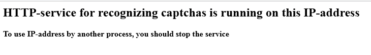

---
sidebar_position: 2
title: Connecting to external services
description: How do you connect CapMonster to the required program?
---
import DisclaimerNotice from '@site/src/components/DisclaimerNotice';

<DisclaimerNotice />
## How does it work?
CapMonster Desktop automatically intercepts CAPTCHAs sent to recognition services by most scripts and programs.

Standard requests of these services are supported — their format is described in the documentation of the corresponding APIs.

### CapMonster Desktop API.
When intercepting a request sent to a manual recognition service, CapMonster itself **determines the CAPTCHA type and solves it**.   

In addition, in the *Additional parameters* of the request you can specify a specific **module name** that should handle this CAPTCHA. In that case, the program will not determine the CAPTCHA type and will immediately send it for recognition by the specified module.

**Additional parameters**, for example, include:  
- *case sensitivity*;  
- *the CAPTCHA contains digits only*;  
- *math CAPTCHA*.  

:::tip **You can take the module name from the list of modules.**  
Right-click the required module to open the menu → **Copy full module name**.  

:::

If you want to manually select a module to solve **Solvemedia**, then the additional parameter will look like this: `CapMonsterModule=ZennoLab.solvemedia`  

The program also processes balance requests and returns the value **555**, so that scripts and programs which stop when the balance on manual recognition services is low can continue working without interruptions.  
_______________________________________________
### Automatic response return (Pingback / Callback).  
The **pingback (callback)** method allows you to receive the finished response from CapMonster without additional requests to `/res.php` or `/getTaskResult`.  

To receive the response automatically, you need to:  

**1.** When creating a task (`/in.php` for RuCaptcha or `/createTask` for Anti-Captcha), specify your URL in the **pingback (RuCaptcha)** or **callbackUrl (Anti-Captcha)** parameter.  
**2.** Process the HTTP POST request that our server will send to the specified URL:  
- For the RuCaptcha API, the data arrives as *URL-encoded FormData* (`application/x-www-form-urlencoded`) and contains two parameters: **id** — the CAPTCHA identifier and **code** — the finished response.  
- For the Anti-Captcha v2 API, the request structure is identical to the response of the `/getTaskResult` method.  
_______________________________________________
## Solving CAPTCHAs sent from another server.  
To receive CAPTCHAs from a specific server, in the CapMonster settings you need to specify its IP and port (default is 80). Requests will be sent to this address.  

  

:::warning **CAPTCHA service emulation mode works only on port 80.**
:::
_______________________________________________
#### How to correctly add your IP:  
**1.** Edit the file `MainSettings.xml`, located in the folder:  
`C:\Users\<USER NAME>\AppData\Roaming\ZennoLab\CapMonster\2\CapMonster`.  
**2.** Before changing the file `MainSettings.xml`, set any IP in the CapMonster settings and close the software.  
**3.** Enter the required IP in `MainSettings.xml`, close the file saving the changes, and start CapMonster.  
**4.** The required IP should now appear in the settings.  

:::info **The “Select IP address automatically” option.**  
After enabling it and restarting the software, the previously entered IP address will be removed. So you will need to enter it again into the `MainSettings.xml` file.
:::  

To apply IP address changes, you need to restart the program via **Stop** → **Start**. After that, a web server will be launched on the specified IP.

Now the server that sends CAPTCHAs must use this IP address to submit tasks. You can specify this IP directly in the program as the recognition service, or set up redirection from antigate.com (or another service you use) to the selected IP.  

To set up redirection, edit the **hosts** file located at: `C:\Windows\System32\drivers\etc\hosts`, adding the line: `192.168.1.10 antigate.com`. **Instead of *192.168.1.10*, enter your local IP**.  

:::tip **When using a router.**  
Specify the IP address that the router assigned to the device with CapMonster on the local network (you can view it in the Windows network settings).  

If the connection goes directly via an internet IP, specify this external address, but you must configure port forwarding on the router.
::: 

| If everything is set up correctly, then when you open this IP address in a browser, the CapMonster placeholder page will appear. | 
| -------- | 
|   |  
_______________________________________________
#### Sending CAPTCHAs from ZennoPoster.  
When sending CAPTCHAs from ZennoPoster over a local network, in its **CAPTCHAs** settings specify the local IP address on which CapMonster is running.  

