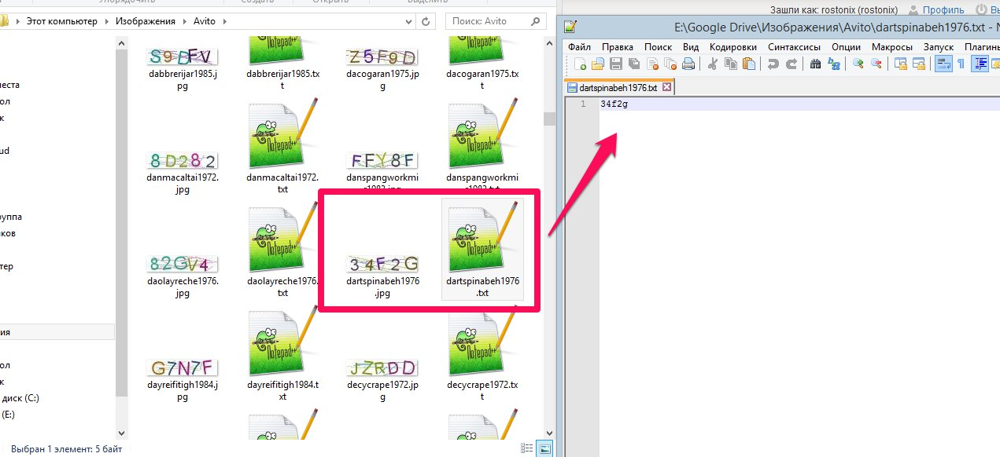

---
sidebar_position: 2
title: Step 1. Collecting CAPTCHAs
description: Collecting a CAPTCHA dataset for training the module.
---
import DisclaimerNotice from '@site/src/components/DisclaimerNotice';

<DisclaimerNotice />
_______________________________________________  
Open the program and create a **new project** with a clear, descriptive name.  

## Collecting a CAPTCHA dataset.  
The first step in creating a module is collecting a set of CAPTCHAs and their solutions, which your module will be trained and tested on.

**You can do this in two ways:**  
### 1. Collecting CAPTCHAs without answers and recognizing them later in the program.  
You can collect CAPTCHA images in advance using any convenient method, and then recognize them directly in **Module Creation Studio**.  

To do this, specify the login and password for one of the manual recognition services in the program settings (for example, RuCaptcha, AntiGate, etc.).  

After uploading the images, choose an appropriate recognition option. If you use manual recognition services, it’s better to split CAPTCHAs into groups:  
- for **character collection**, standard solutions are sufficient;  
- for **training and testing**, it’s recommended to use **100% confidence recognition**, where the CAPTCHA is sent to multiple workers simultaneously (this feature is available in RuCaptcha and AntiGate).  

### 2. Automatic collection via ZennoPoster.  
You can create a **simple template in ZennoPoster** that will automatically collect and recognize CAPTCHAs.  

The result of this stage should be a **folder on your disk** where each CAPTCHA and its answer are stored as a pair:  
- the CAPTCHA image — `.jpg`, `.png`, etc.;  
- a text file with the answer — `.txt`.  



These two files (the CAPTCHA and the answer) must have the same name, differing only by extension.  
**For example:**  
```csharp  
1234.jpg  
1234.txt
```
**An alternative option** is when the file name matches the CAPTCHA answer, for example:  
```csharp  
qwe.jpg
```  
This format is also correctly recognized by the program.
_______________________________________________ 
## How many CAPTCHAs do you need?
The number of required CAPTCHAs depends on their complexity:  
- for **simple CAPTCHAs** with minimal character distortion, about **300 images** are sufficient;  
- for **complex** CAPTCHAs — around **1000**.  

All of these CAPTCHAs will need to be recognized via manual recognition services, which usually costs anywhere from a few dozen cents to a couple of dollars.  

### Why do you need to collect CAPTCHAs?  
#### 1. To identify characters. 
Each character should appear from 3 to 150 times, depending on the complexity of the CAPTCHA.  

:::tip **In some CAPTCHAs, certain characters appear rarely.**
However, it’s important that their counts are roughly even across the entire dataset.
:::  

#### 2. To prevent false positives.  
You need ten times fewer of these CAPTCHAs than those used for character collection.  

#### 3. To test the module.  
About **100 CAPTCHAs** are set aside specifically to check the accuracy of the finished module.  

### Splitting CAPTCHAs by task.  
After adding CAPTCHAs to the project, **the program will automatically split** them into groups according to the specified categories.  

If you wish, you can configure this split manually; however, **you won’t be able to change it later**.  

:::warning **If you’re not sure, it’s better to leave the default settings.**
:::
_______________________________________________
