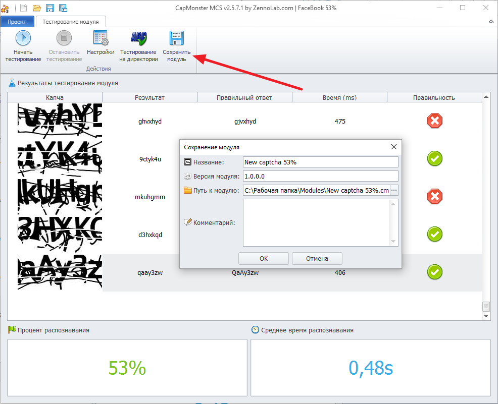

---
sidebar_position: 8
title: Step 7. Save the result
description: Finishing work on the module.
---
import DisclaimerNotice from '@site/src/components/DisclaimerNotice';

<DisclaimerNotice />
## Save the module.
When you have finished working on the module and are satisfied with the result, switch to **“Module Testing”** mode and click **“Save module”**. Then specify the save path.  

 

You now have your own fully finished recognition module. You can add it to CapMonster and use it to solve CAPTCHAs.  
_______________________________________________
