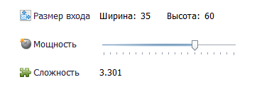
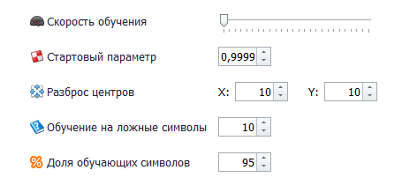
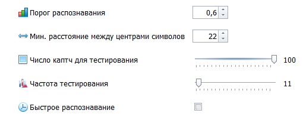
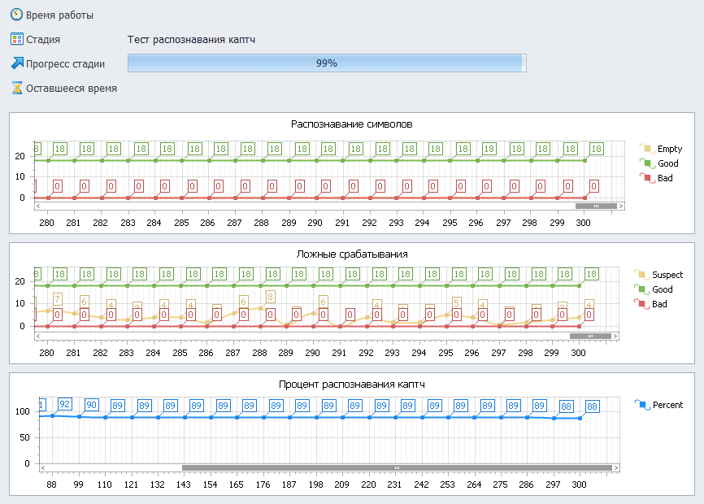
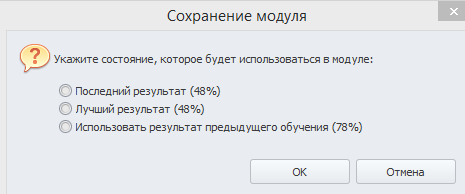
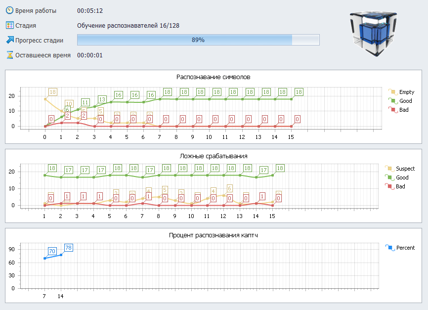
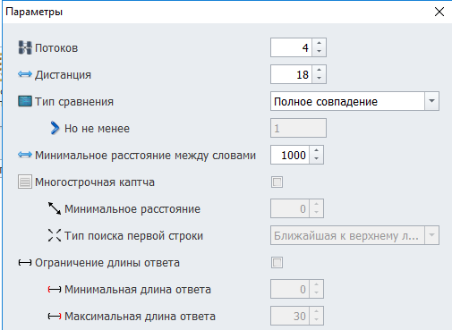

---
sidebar_position: 6
title: Step 5. Starting Training
description: The process of training the recognition module.
---
import DisclaimerNotice from '@site/src/components/DisclaimerNotice';

<DisclaimerNotice />
_______________________________________________  
## Description.
**Once all previous stages are completed, you can move on to training your own captcha recognition module.**  

### General training concept.  
At the initial stage, it is recommended to use a **simplified core** and run a **quick test training**:  
**1.** Take about **one third of the available symbols** for testing;  
**2.** Run the training for **a few dozen** iterations;  
**3.** **Evaluate the result** and adjust the parameters if necessary;  
**4.** After that, you can train the module **with a more powerful core and improved settings** to achieve maximum accuracy.  

This approach helps you quickly understand how correct your parameters and filters are, without wasting time on long training runs.  
_______________________________________________ 
### Main types of errors.  
- **Incorrect recognition.**  
The symbol is actually present, but it is identified incorrectly. For example, instead of **`a`**, the module thinks it is **`c`**.  
- **Missing symbol.**  
The symbol is present in the image, but the module does not see it at all. That is, we show **`a`**, and the system thinks there is nothing in that spot.  
- **False positive.**  
The module *finds* a symbol where there is actually none, for example, between two letters.  

Understanding these three types of errors will help you analyze training results more accurately and properly adjust the settings for the next iteration.  
_______________________________________________ 
## Preparing for training.  
### Core settings.  
  

Core power defines the balance between recognition quality and module performance:    
- **Higher power** — the module recognizes symbols more accurately, but speed decreases and CPU load increases.  
- **Lower power** — the module works faster, but makes mistakes more often.  

#### How to choose the optimal power?  
You should not start with the maximum values. Try the simplest core first — its accuracy may be more than sufficient for your tasks. If not, gradually increase the power while observing the results.  

Next to the parameter, a **core complexity rating** is displayed — this number shows how much CPU time is required to process a single point. This is **not an absolute unit** of measurement, but only a guideline for comparison: if one core has twice the complexity, it will also work approximately twice as long under equal conditions.  

#### What affects complexity?  
The final core complexity is influenced by two parameters:  
- **Core power**;  
- **Symbol recognition window size**.  

By adjusting these values, you can find the optimal balance between speed and accuracy, so the module works efficiently and stably.  
_______________________________________________ 
### Training parameters.  

#### Speed.  
The slower the training runs, the higher the quality of the result will be.  

However, you should not immediately start long training runs — begin with fast mode. This way, you can identify potential issues and fix them before spending time on full training.  

:::tip **Sometimes even the fast option gives a good enough result.**
:::  

#### Starting parameter.
This parameter defines the initial training speed.  

You should change it only if errors related to the training process appear (we will discuss them later). In normal cases, leave the default value.  

#### Symbol center spread.  
During training, each collected symbol is presented to the core at the point you specified as the symbol’s center.  

You can slightly **increase the spread of these points** — sometimes this helps improve recognition stability. But in some cases, it can наоборот worsen the result.  

#### False data training intensity.
If false positives often occur during training or recognition, try increasing this parameter. It helps the system distinguish real symbols from the background more effectively.  

:::tip **The recommended starting value is `10`.**
:::  

#### Share of training symbols.
Not all collected symbols participate in training — some of them are used to test the core during training (based on the first chart).  

This test is very important: it shows **how the process is going** and **whether anything needs to be adjusted**. There should be **at least 30–50 symbols** for testing. But do not allocate too many either — leave more for training.  

We recommend the following strategy:  
**1. First training** — with a larger number of test symbols to fine-tune the parameters.  
**2. Second (final) training** — using almost all collected symbols, leaving a minimum for testing, to achieve maximum quality.  
_______________________________________________ 
### Recognition parameters.

#### Recognition threshold.  
When the core analyzes a section of a captcha, it outputs a value from **0** to **1** for each symbol:  
- `0` — the symbol is definitely not present,  
- `1` — the core is confident that the symbol is located exactly here.  
To get a clear answer (“yes” or “no”), a *recognition threshold* is used.  

If the value is above the threshold, the **symbol is considered found**; if it is below, it is **ignored**.  

Later, in the section about training errors, you will learn how to change this parameter to adjust the module’s behavior.  

#### Minimum distance between symbols.  
This parameter prevents the module from searching for new symbols **too close to already detected ones**. This helps avoid many **false positives**.  

To determine an appropriate value:  
**1.** Open one of the captchas in Paint (or any other editor).  
**2.** Zoom in the same way your filter does.  
**3.** Measure the minimum distance in pixels between neighboring symbols.  

If you get it wrong, it’s not a big deal: during module testing, this parameter can be easily adjusted without retraining.  

#### Number of captchas for testing.  
During training, the system regularly performs test captcha recognition to determine the current accuracy percentage.  
- **Many captchas** → more accurate testing, but it takes more time.  
- **Few captchas** → testing is fast, but the result is less reliable.  
After several training cycles, you will be able to find the **optimal balance**.  

#### Testing frequency.  
To avoid wasting resources, testing is not performed after every training cycle, but at certain intervals.  

This parameter defines **how many cycles** should pass before running a test.

#### Fast recognition.  
For very complex captchas (with dense lines, heavy distortions, and lots of noise), training and recognition can take a long time.  

Enabling this parameter activates **optimizations** that speed up the recognition process by approximately **5–10 times**. However, this may slightly **reduce accuracy**.  

You can enable this parameter **before training** to speed up tests. Or apply it later, when checking the finished module. If the recognition rate changes afterward, try adjusting the center-of-mass settings.  

:::warning **Do not enable “Fast recognition” during the main training.**  
Without it, you will get the most accurate estimate of your module’s potential.
:::  
_______________________________________________  
## Training process.  
### Result charts.  
After setting all the parameters, you can finally start the training itself. During the process, you will have access to statistics displayed as three charts.  

  

#### Symbol recognition.  
The first chart shows how the module handles your collected symbols:  
- **Green line** — the number of correctly recognized symbols.  
- **Yellow line** — the number of cases where the core did not find a symbol at all (the second recognition error).  
- **Red line** — the number of incorrectly recognized symbols (the first recognition error).  

#### False positive check.  
This chart shows how the module reacts to places where symbols should not be present:
- **Green line** — the number of correct responses (the module found nothing — and that is correct).    
- **Yellow line** — the number of cases of suspicious core activity.    
- **Red line** — the number of false positive errors (the third recognition error).  

#### Overall recognition percentage.  
The third chart shows a preliminary accuracy percentage of the module — a visual assessment of how well the trained model currently recognizes captchas.  

### Stopping training. 
You can stop the training process at any time if you see that the results are no longer improving.  

  

After stopping (manually or automatically — after reaching 300 cycles), you need to choose which core will be used in your module.  

Options for choosing a core:  
- **With the best recognition percentage.**  
In this case, the core with the highest recognition accuracy will be selected, even if it was not the last one during training.  
- **The last core.**  
Suitable if few captchas were used for testing (fewer than 50), and the difference between the last core and the one with the best recognition percentage is insignificant. In that case, it makes more sense to take the last option as the most up to date.  
- **Core from previous training.**  
If the module showed better results with previous settings, you can keep the previous core without replacing it with a new one.  

### What correct training results look like.  
With properly configured and stable training, the charts should show the following trends:  

  

#### Symbol recognition chart:  
- **Green line** — confidently rises toward the maximum (more and more symbols are recognized correctly).    
- **Yellow and red lines** — gradually decrease toward zero (the number of missed symbols and recognition errors goes down).  

#### False positive chart.  
- **Green line** — always **at the top**, reflecting a large number of correct *empty* responses (where there really are no symbols).    
- **Yellow line** — slightly above the red one (approximately 5–10 times), but below the green.        
- **Red line** — close to zero (minimal false positives).  

#### The final chart.  
The recognition percentage should gradually increase: quickly at first, then more slowly, as it approaches a stable accuracy level.  

:::info **The screenshot was taken on a simple captcha with optimally selected parameters.**  
Keep in mind that your charts may look a bit different:  
- *the initial percentage may be lower*;  
- *the growth of the green line may be slower*;  
- *the decline of the yellow and red lines may be more gradual*.  

This depends on the training settings, filter quality, and captcha complexity.
::: 
_______________________________________________   
## Fixing errors.  
:::warning **The most important rule.**  
If you cannot achieve decent results for a long time and the tips below do not help — **do not waste your time**.

Just write on the forum in the program section — they will point out what exactly is wrong.
:::  

### The charts do not grow for a long time after training starts.
The green and red lines stay flat even after dozens of cycles. This means the **core is not learning**.  

**Try increasing** the starting training parameter by about **10 times** and restart the process. Repeat until the lines start to rise.  

### The red line is higher than the green one on the first chart.  
**There are more errors than correct results.**  
#### Possible reasons:  
- **The starting training parameter is too large.**  
Reduce it by 10 times and try again until the situation improves. If the previous error appears after reducing it, then the issue is not only in this parameter.  
- **Too few training symbols or incorrectly configured filters.**  
Check the filtering.  
- **Errors in symbol names.**  
You may have assigned incorrect letters during collection. Check the collection in the *Filters* section (click “Show text” to compare the image with the label under it).  

### The red line stays high (many type 1 errors).  
**Symbols are being recognized incorrectly.**   

There can be many reasons:  
- *not enough collected symbols*;  
- *the captcha is too complex*;  
- *the network is too simple*;  
- *training is too fast*;  
- *a large spread of centers of mass*;  
- *many different symbols in the captcha*.   

### Before training starts, the red line (Bad results) is already high.  
**Do not worry — this is not an error.**  

It simply means a **low recognition threshold** is set (0.5 or lower). After the first training cycle, the situation should normalize.  

### After 100+ cycles, the yellow line does not drop to zero.  
The core fails to recognize many symbols — a type 2 error.  

#### Possible reasons:  
- **The training threshold is too high** — optimal values are 0.5–0.6;   
- **The starting training parameter is too small** — increase it by 3–5 times;   
- **Too few training symbols, and they are heavily distorted**;   
- **The network is too complex**;   
- **Training is too fast**.  

### On the second chart, the red line has grown significantly.  
**Many false positives (type 3 errors).**  

Increase the false data training intensity — the core will become more cautious during recognition.  

### The third chart shows 0% recognition, while the other charts look normal.  
**Formally, training is going well, but the captcha is not being recognized.** The issue may be in the testing logic.  

Continue training the module until charts 1 and 2 stabilize at similar levels. Then stop training, go to the **“Module testing”** tab and run a test. See what specific errors occur and check the testing help section — it explains how to fix them.  

:::tip **Charts are your main diagnostic tool.**  
If the green line is growing while the red and yellow lines are gradually falling, you are on the right track.
::: 
_______________________________________________   
## Module testing parameters.  
  

### Threads.  
The number of parallel threads in which testing is performed.  

More threads mean faster testing, but also higher CPU load.  

### Distance.  
The minimum distance between symbols inside a captcha.  

Helps avoid situations where the module treats stuck-together symbols as one or confuses the boundaries between them.  

### Comparison type.  
Defines how test success is evaluated.  

If multiple matching words are found during comparison, the test is considered successful.  

### Minimum distance between words.  
The minimum allowed distance between words in a captcha.  

Used to separate phrases if the captcha contains several words in a row.  

### Multiline captcha.  
This parameter is needed for working with multiline captchas, for example, SolveMedia.  

Enable it if the text in the captcha is arranged in two or more lines — then the image will be processed correctly.  

### Minimum distance between lines.  
Defines the distance between lines of text.  

It is measured as the distance between the lower-left corner of the symbols in the upper line and the upper-right corner of the symbols in the lower line.  

### Answer length limit.  
Allows you to set the acceptable length of the recognized text.  

Answers that fall outside this range will be discarded.  

This parameter is used **only in module testing**.  
_______________________________________________
