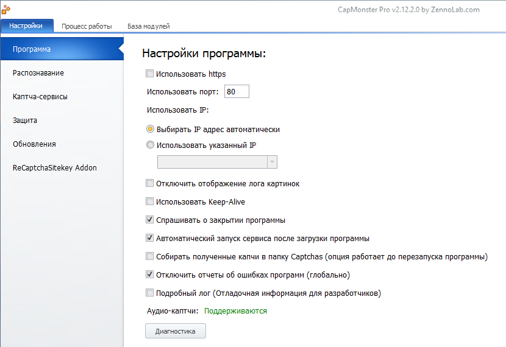
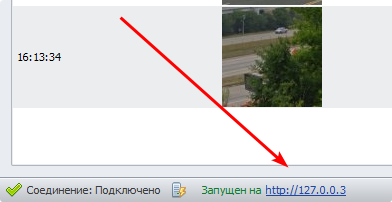

---
sidebar_position: 1
title: Program Settings
description: Parameters that affect how the program works.
---
import DisclaimerNotice from '@site/src/components/DisclaimerNotice';

<DisclaimerNotice />
## Description.
Here we will look at settings that are common to the entire program.  

### Use HTTPS.  
Sets the protocol that will be used to intercept requests.  

:::warning **To apply the changes, you need to restart the program via **Stop** → **Start**.**
:::  

### Use port.
Specify the port number on which the program will run.  

**The captcha service emulation mode works only on port 80**.  

:::warning **To apply the changes, you need to restart the program via **Stop** → **Start**.**
::: 

### Use IP.  
#### Select IP address automatically.  
CapMonster will automatically choose a suitable IP address for operation.

| The current IP address is visible in the bottom-right corner of the “Work Process” tab. | 
| :--------: | 
|    | 

#### Use a specified IP.  
Here you can specify an IP address manually. To do this, edit the **`MainSettings.xml`** file located in the folder:  
`C:\Users\<ИМЯ ЮЗЕРА>\AppData\Roaming\ZennoLab\CapMonster\2\CapMonster`  

Before changing this file, set any IP in the CapMonster settings and close the software. Then enter the required IP in `MainSettings.xml`, close the file saving the changes, and start the program. The specified IP should appear in the settings.  

If you then switch the setting to **Select automatically** and restart the software, the previously entered IP will be removed.  

:::warning **To apply the changes, you need to restart the program via **Stop** → **Start**.**
::: 

### Disable displaying the image log.  
If you check this option, recognized images will not be shown on the “Work Process” tab. This helps reduce your PC’s resource consumption when solving large volumes of captchas.  

### Use Keep-Alive.
When this option is enabled, the connection to the server is not closed immediately after a request is completed, but remains open for further work. This reduces network load and speeds up operation, especially for a series of requests to the same server.  

### Ask before closing the program.  
A confirmation prompt appears when closing the program.  

### Automatically start the service after the program loads.  
Recognition will start automatically after CapMonster is launched.  

### Collect received captchas.
All images from accepted tasks will be stored in the **Captchas** folder. This is useful when collecting a dataset to train your own module.  

:::info **Captchas will be collected only until the program is restarted.**
:::

### Disable program error reports (globally).  
When errors occur in the program, Windows error reports will no longer appear.  

### Detailed log.  
Enables logging with debug information for developers.  

### Audio captchas.  
The status shows whether the required codecs for supporting audio captchas are installed.  

### Diagnostics.
A button to launch the diagnostic utility (`diagnostic.exe`). It collects information when problems occur. After it finishes, a **`report.zip`** file will be created in the CapMonster installation directory.
