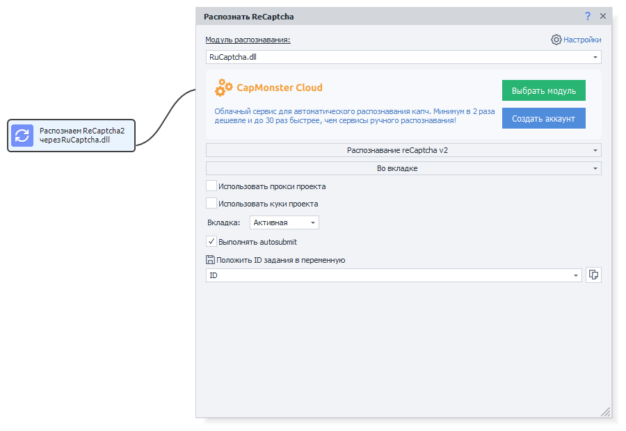
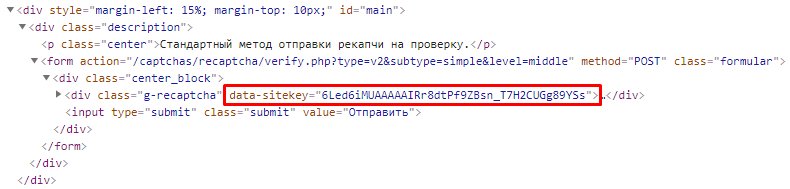

---
sidebar_position: 2
title: Solving ReCaptcha2 via Sitekey
description: Solving ReCaptchaV2 without a browser.
---
import DisclaimerNotice from '@site/src/components/DisclaimerNotice';

<DisclaimerNotice />
## Description.  
CapMonster can solve ReCaptchaV2 without launching a browser. This makes it possible to connect it to third‑party programs that send captchas to solving services using the sitekey method.

That is exactly why the additional module **ReCaptcha SiteKey Addon** was developed.
_______________________________________________
## Connection.
The ReCaptcha SiteKey Addon module is purchased in your personal account under the same account that has an active CapMonster subscription, and it is valid for one month.  

It’s enough to buy a single addon for the entire ZennoLab account — it will work with all CapMonster licenses. After purchase, you need to restart the program so the module can load.  

| Message confirming that the addon is successfully connected | 
| -------- | 
|   | 

### System requirements.  
#### Minimum:
Intel or AMD, 2 cores, at least 2.2 GHz per core, and 2 GB of RAM, Windows 7+ operating system.  

#### Recommended:  
Intel or AMD, 4+ cores, at least 3.1 GHz per core, and 4 GB of RAM, Windows 10/Windows Server 2012+ operating system.
_______________________________________________
## Solving.
### In ZennoPoster.  
First, you need to select a special action in Project Maker for solving ReCaptchaV2.  

Then, in the action settings, choose the **In tab** method. In this case, the required Sitekey will be detected automatically.  

On most websites, after selecting all the required images, the **autosubmit** event is triggered, which automatically submits the captcha solution. ZennoPoster has a dedicated setting for this — **“Perform autosubmit”**.  

If ZennoPoster cannot automatically determine the required Sitekey, then select the **“Via SiteKey”** mode instead of *“In tab”*. For this method, you will need to manually specify the **Sitekey of the target site** and its **URL**.  

:::tip **You can find the Sitekey on the page using DevTools (or by pressing F12).**  
In the page content, look for a line containing `sitekey`. It may look something like this:  

:::
_______________________________________________
### From other programs.  
There are two ways to receive captchas from third‑party software:  

#### Emulation mode for solving services.  
In the CapMonster settings, select the services you want to emulate. Then, in your program, specify sending ReCaptcha to one of these services. CapMonster will intercept the request, solve the captcha, and return the response in the API format of the selected service.  

#### Direct access to CapMonster.  
From third‑party programs, you can send requests to solve ReCaptchaV2 directly via the APIs of supported services:  
- [**CapMonster Cloud**](https://capmonster.cloud/ru);  
- [Anti-Captcha](https://anti-captcha.com/ru/apidoc/task-types/RecaptchaV2Task);  
- [ImageTyperzCaptchaModule](https://www.imagetyperz.com/Forms/api/api.html#-recaptcha-submit-recaptcha);  
- [RuCaptcha](https://rucaptcha.com/api-docs/recaptcha-v2);  
- [DeathByCaptcha](https://blog.deathbycaptcha.com/api#newrec);  
- [2Captcha](https://2captcha.com/ru/2captcha-api#solving_recaptchav2_new);  

:::tip **For example, a request might look like this:**  
`http://127.0.0.3/in.php?key=123sdffff&method=userrecaptcha&googlekey=sitekey&pageurl=https://site.com`
:::

Here you specify:  
- **URL of the solving service** *(`http://ip:port`, port 80 by default, where CapMonster is running)*;  
- **API key of this service**;  
- **Solving method** *(via googlekey)*;  
- **Sitekey** obtained from the target site;  
- **URL of the page with the captcha**.  

In response, you will receive the string `OK|CaptchaID`, which you can use to retrieve the result with the following request:  
`http://127.0.0.3/res.php?action=get&id=CaptchaID`

Requests sent to the service are intercepted by CapMonster and return the same response as the original service would.  

Captcha solving is performed on a remote ReCaptchaV2 module on our servers. Clicking on images is handled by a built‑in local browser, which automatically selects the appropriate user‑agent for ReCaptcha and supports proxies specified in the request or configured in the program.
_______________________________________________
## Limits, resources, accuracy, and solving speed.  
### Limits.
The number of ReCaptchaV2 captchas that can be solved per day depends on the CapMonster version:  
- **Pro** — about 45,000 captchas per 24 hours;  
- **Standart** — about 11,000 captchas per 24 hours;  
- **Lite** — about 2,200 captchas per 24 hours;  

### PC resources.  
The module puts almost no load on the CPU — **less than 1%** during operation, and RAM usage is **up to 150 MB per thread**, since solving **is performed in a browser** with loading and clicking on ReCaptcha2.  

### Accuracy and response time.  
Since solving is performed on a remote ReCaptchaV2 module, the success rate is the same as with regular browser‑based solving — **about 83%**, depending on the task type.  

The average response time for a captcha depends on the website, the number of requests, and the proxies used. According to test results:  
- **Average time**: 40 seconds;  
- **Minimum**: 14 seconds;  
- **Maximum**: 254 seconds.
_______________________________________________
