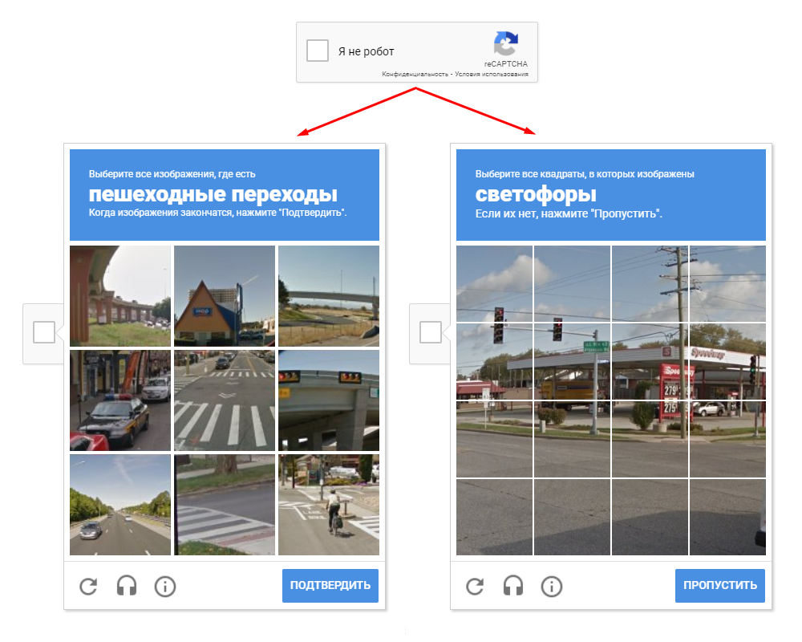
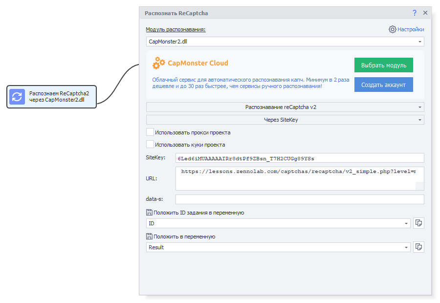

---
sidebar_position: 1
title: ReCaptcha2
description: ReCaptcha2 recognition.
---
import DisclaimerNotice from '@site/src/components/DisclaimerNotice';

<DisclaimerNotice />
## Description.  
ReCaptchaV2 is a bot protection system released by Google. On the web page, there is an **“I’m not a robot”** button. When you click it, several images appear, and you need to select all the images specified in the task.  

| This is how it looks | 
| -------- | 
|   | 

:::tip **[Demo page](https://2captcha.com/demo/recaptcha-v2) with an example of ReCaptchaV2.**
:::

## How it works.
To submit ReCaptchaV2 for recognition in CapMonster, you need to form a request that includes:  
- an image with a set of answer options;  
- an additional parameter **Task** — *this is the text of the captcha task itself, for example “Cars”*.  

After processing, CapMonster returns a string of digits without separators — these are the numbers of the images you need to click. The digits are ordered by decreasing probability that the specified object is present in the image.  

### Example.  
If the task is to select images with cars, and the response received is `597`, it means you need to mark images **No. 5**, **No. 9**, and **No. 7**, and then click **Confirm**.  

The digit **5** comes first because the probability of a car being present in that image is higher than in **No. 9** and **No. 7**.  


If CapMonster cannot confidently identify at least two suitable images (this is the minimum number of correct answers), it will return an empty string. In this case, the captcha can be additionally sent to a manual recognition service.  

## Using with ZennoPoster.  
To submit ReCaptchaV2 from ZennoPoster, you can use the special action **recognize ReCaptcha2**.  

  

In this action, you can set the required parameters for recognition.  


You can also recognize ReCaptchaV2 via SiteKey by specifying the site key and its URL.  

  

### Ready-made snippet.  
To submit ReCaptchaV2 from ZennoPoster version higher than **5.9.0.0**, you can use the snippet we prepared:  

[**SNIPPET**](./assets/rc-2/Snippet.cs)

#### Note.  
The snippet can perform any number of attempts to solve ReCaptchaV2.  

If you are using slow proxies, you can increase the wait time for element loading, the number of reload attempts, and set an option to check the correctness of the recognized answer. To do this, you can modify the following parameters:  
```csharp
// wait time
var waitTime = 3000;
// number of recognition attempts
var tryRecognize = 10;
// number of attempts to select dynamic images
var dynamicImagesRecognizeAttempts = 20;
// number of attempts to load an element
var tryLoadElement = 60;
// get full answer
bool fullAnswer = false;
// get recognition progress messages
var needShowMessages = false;
// check the correctness of the recognized answer
var needToCheck = true;
```

The behavior of ReCaptchaV2 also depends on the IP address from which these actions are performed. Sometimes the system ignores skipping one required image or a random click on an incorrect one. However, with frequent errors, ReCaptchaV2 may stop accepting even correct answers, so it is recommended to use high-quality proxies.
