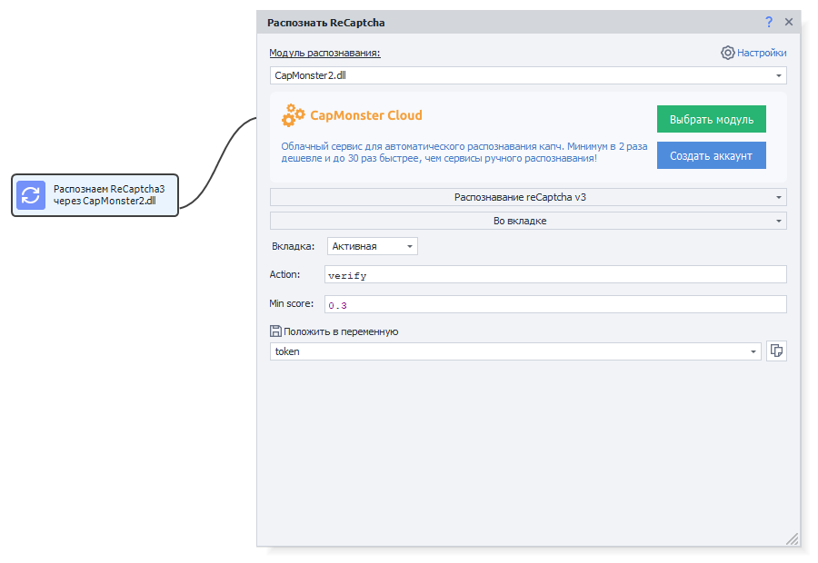
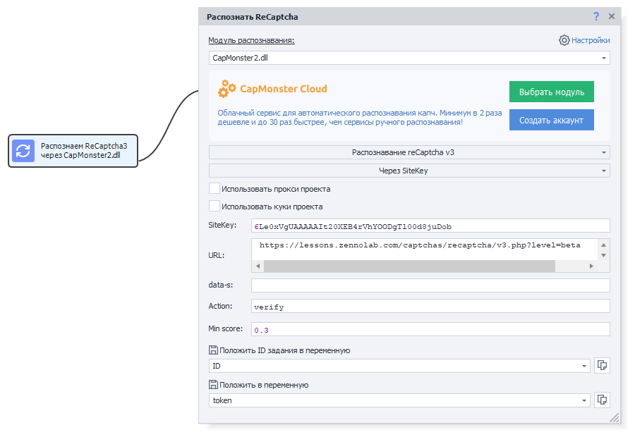

---
sidebar_position: 4
title: ReCaptcha3
description: ReCaptchaV3 recognition.
---
import DisclaimerNotice from '@site/src/components/DisclaimerNotice';

<DisclaimerNotice />
## Description.  
This version of the captcha works in the background and checks the user without requiring any action from them.  

ReCaptchaV3 analyzes the behavior of site visitors and other parameters, rating them on a scale from 0 to 1, where 1 is good. Based on this score, the system decides what to do with the user: allow access, block, limit functionality, deny the action, or trigger an additional check.  

| This icon on the page indicates that ReCaptchaV3 is present | 
| :--------: | 
|   | 

### How it works.
As we have already found out, the ReCaptchaV3 mechanism is based on analyzing user behavior. A special script from Google is placed on the site, which quietly collects information about the visitor’s actions—mouse movements, click speed, time spent on the page, and other behavioral factors.  

Then, based on this data, the system calculates a trust level and issues a token—a unique string that reflects the probability that it is a human rather than a bot. This token is sent to the site’s server, where the final user verification takes place.  

:::tip **Example of integrating ReCaptchaV3 on a page:**  
```
<script src="https://www.google.com/recaptcha/api.js?render=reCAPTCHA_site_key"></script>
<script>
  grecaptcha.ready(function() {
      grecaptcha.execute('reCAPTCHA_site_key', {action: 'homepage'}).then(function(token) {
         //верификация пользователя
      });
  });
</script>
```
:::  

To send ReCaptchaV3 for recognition to CapMonster, you need to create a request that includes three parameters: **the page URL**, **sitekey**, and **action** (for example, `homepage`). In response, CapMonster returns a token that can be used to pass the verification on the site.  
_______________________________________________
## Solution in ZennoPoster.  
To get ReCaptchaV3 tasks from ZennoPoster, you can use the special cube **Recognize ReCaptcha**:  

  

In this action, you can set the captcha parameters: **action** and **min score**.  

If ZennoPoster cannot automatically determine the required Sitekey, then select the **“Via SiteKey”** mode instead of *“In tab”*. For this method, you will need to manually specify the **Sitekey of the target site** and its **URL address**.  

    
_______________________________________________
## ReCaptchaV3 recognition.  
### Supported modules.  
In addition to CapMonster Desktop, solving ReCaptchaV3 is supported through the following third-party modules:   
- [**CapMonster Cloud**](https://capmonster.cloud/ru);  
- [Anti-Captcha](https://anti-captcha.com/ru/apidoc/task-types/RecaptchaV2Task);  
- [ImageTyperzCaptchaModule](https://www.imagetyperz.com/Forms/api/api.html#-recaptcha-submit-recaptcha);  
- [RuCaptcha](https://rucaptcha.com/api-docs/recaptcha-v2);  
- [DeathByCaptcha](https://blog.deathbycaptcha.com/api#newrec);  
- [2Captcha](https://2captcha.com/ru/2captcha-api#solving_recaptchav2_new);  

### Working with the token.  
After receiving the token, it must be passed to the verification function. Since the check can be performed at any time, you need to manage to intercept the request for obtaining the token and, in the response, replace it with the token from CapMonster.  

For convenience, you can use a ready-made snippet that automatically performs the token replacement:  
```csharp
var sitekey = //SiteKey
string newToken = //New Token
string replaceRegex = @"(?<=\[""rresp"","").*?(?="")";

instance.ChangeResponse("https://www.google.com/recaptcha/api2/reload\\?k="+sitekey, 
                        new List<string> {replaceRegex}, new List<string> {newToken}, false);
```

#### Note.  
Using the SiteKey in the snippet is not mandatory. However, you should keep in mind that without it, requests from all types of captchas will be intercepted, including ReCaptchaV2.  

If this does not cause any inconvenience, you can use a simplified version of the snippet:  
```csharp
string newToken = //New Token
string replaceRegex = @"(?<=\[""rresp"","").*?(?="")";

instance.ChangeResponse("https://www.google.com/recaptcha/api2/reload", 
                        new List<string> {replaceRegex}, new List<string> {newToken}, false);
```
_______________________________________________
