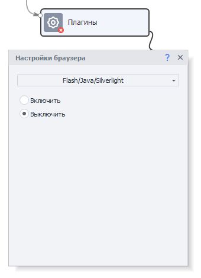

---
sidebar_position: 7
title: SolveMedia Audio
description: Solving SolveMedia audio CAPTCHAs.
---
import DisclaimerNotice from '@site/src/components/DisclaimerNotice';

<DisclaimerNotice />
## Description.  
CapMonster supports solving SolveMedia audio CAPTCHAs. This is done using the `ZennoLab.AudioSolveMedia` module.  
_______________________________________________
## Solving via ZennoPoster.  
We’ve prepared a snippet for you that helps send SolveMedia audio CAPTCHAs from ZennoPoster to CapMonster:  

[**Snippet for solving SolveMedia Audio**](./assets/Snippet_audioSM.cs)  

### Note. 
  

Before loading the page with the SolveMedia CAPTCHA and running the snippet, **make sure to disable plugins** — otherwise, the link to download the audio file simply won’t appear.  

 

Also pay attention to the **key parameters** of the snippet, which you can adjust to suit your tasks:  
- **waiting time for the required element to load: `var waitTime`**;  
- **number of attempts to refresh or load the element on the page: `var tryLoadElement`**;  
- **folder for temporary storage of audio files (it is created automatically in your project directory): `var mainAudiofolderName = "sm_audio"`**.    

:::info **The function for sending the CAPTCHA to the service looks like this:**
```
ZennoPoster.CaptchaRecognition("CapMonster2.dll", base64StringAudioBytes, "CapMonsterModule=ZennoLab.AudioSolveMedia");
```  
:::
_______________________________________________

## Recognition quality.  
:::tip **For stable operation, it’s important to use high-quality proxies.**
:::

The thing is, both the visual and audio versions of this CAPTCHA start to degrade over time when requests are made too frequently. As a result, they become difficult to recognize — both for humans and for our system. That’s why the success rate indicated for the module should be considered **indicative** rather than absolute.  

On a *fresh* IP address, accuracy is usually **higher than the stated level**, but after several hundred solved CAPTCHAs, it naturally decreases.  

In addition, the **length of the audio recording** also affects the result — the more words are spoken, the harder it is to recognize.  
_______________________________________________
