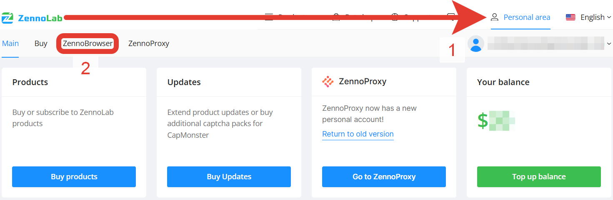
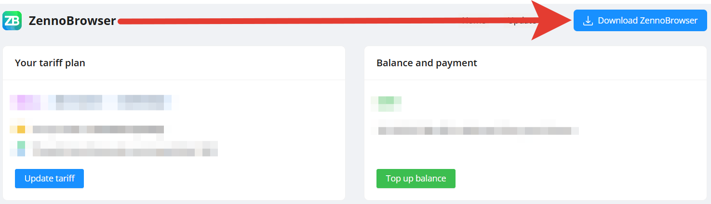

import DisclaimerNotice from '@site/src/components/DisclaimerNotice';

# ZennoBrowser Installation
<DisclaimerNotice />

**Step 1.** Go to your [ZennoLab personal account](https://account.zennolab.com/personal-area-main/).

**Step 2.** In the upper left part of the screen, find the tabs "Home," "Buy," and "ZennoBrowser." Open the one with the same name.

**Step 3.** In the upper right corner, click the download button, then download and install the browser.

**Step 4.** Installation is complete! You can start using the browser.