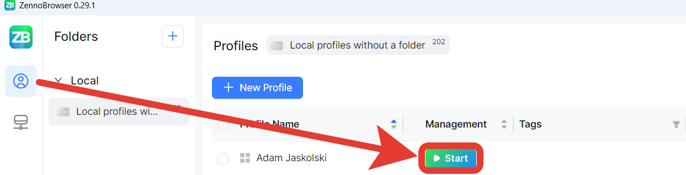
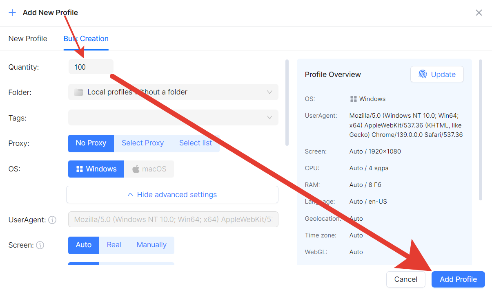
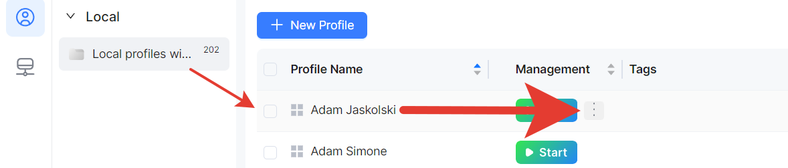
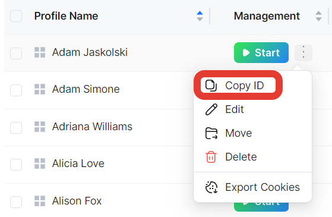
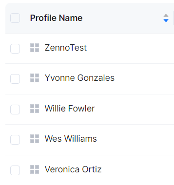
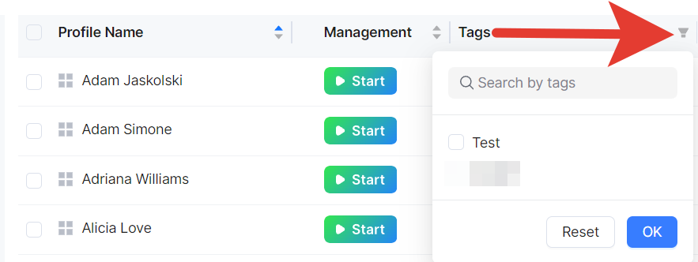
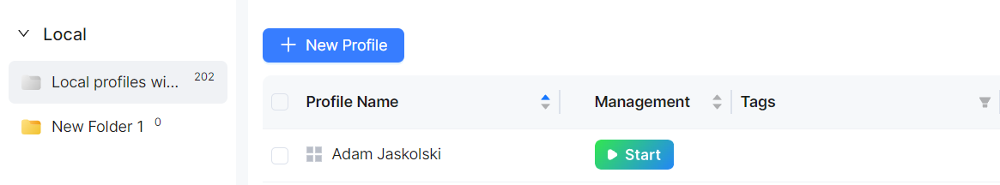
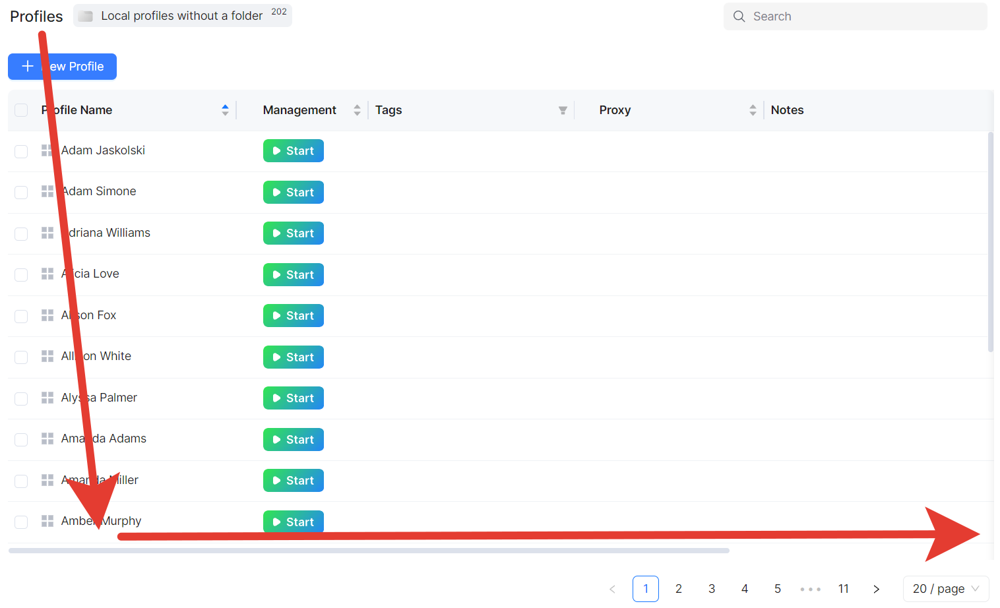
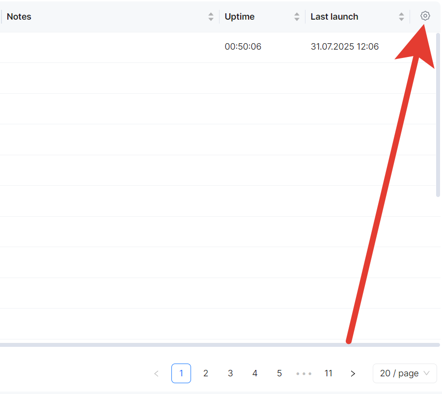
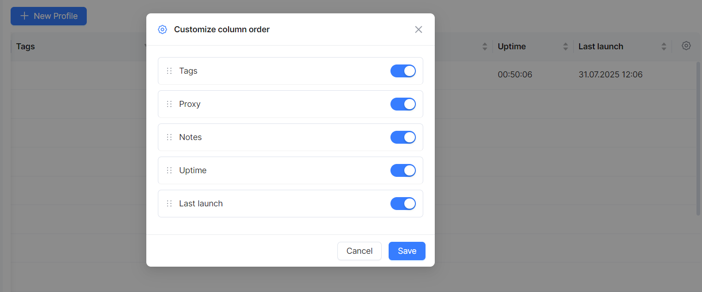

import DisclaimerNotice from '@site/src/components/DisclaimerNotice';

# Profile Launch
<DisclaimerNotice />

 1. Find the profile you created in the folder.
 2. Use the controls in the "Manage" column.
 3. Click the profile launch button.

 

### **Bulk Operations (for advanced users)**

 1. Creating multiple profiles:
 2. Select "Bulk Profile Creation".
 3. Specify the quantity (up to 1000 profiles).
 4. Set up parameters for all profiles at once.
 5. Choose the proxy usage mode.

### **Managing a Profile Group:**

 1. Use checkboxes to select multiple profiles.
 2. Perform bulk actions:
 - Start/stop profiles;
 - Replace proxies;
 - Move to folders;
 - Manage tags;
 - Export cookies.
 
### **Useful Interface Features**

**Navigation and Search:**
 - Search — by profile name and ID;
 - Sorting — by any table column;
 - Filtering — use tags for quick search;
 - Folders — organize profiles.

The **profile ID** is needed to work in integration mode with ZennoPoster. To get it, in ZennoBrowser, hover over the desired profile, click the three dots in the “Manage” column, and select “Copy ID”:

**Sorting** allows you to arrange the list in any format you find convenient:

**Quick tag search** works by clicking the filter icon in the upper right corner of the field:

**Folders** allow you to store profiles in a localized way: 

**Display:**
 - Up to 1000 profiles per page (Profile Manager);
 - Up to 1000 proxies per page (Proxy Manager);
 - Customizable table columns;
 - Hide unnecessary columns.

To arrange columns, scroll to the right using the scrollbar, click the gear icon, and set the desired display options:

### **Recommendations**

💡 Tip: For effective work, we recommend using our [ZennoProxy](https://zenno.club/discussion/forums/zennoproxy.331/) service.

**For beginners:**

 1. Start by creating 1-2 profiles for testing.
 2. Use local profiles at first.
 3. Create folders to organize your profiles.
 4. Add meaningful names and tags.

**For advanced users:**
 1. Use cloud profiles for synchronization.
 2. Set up proxy lists by region/purpose.
 3. Apply bulk operations for efficiency.
 4. Regularly check proxy performance.