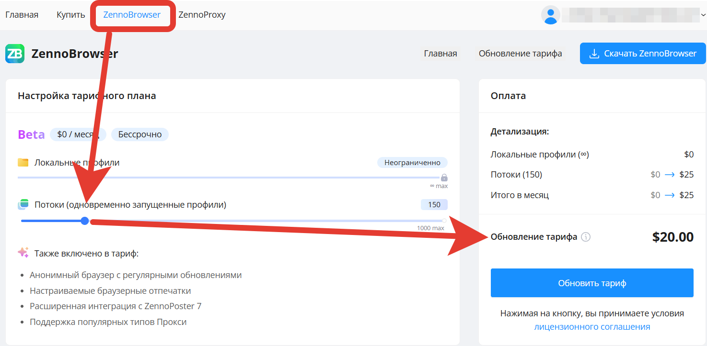
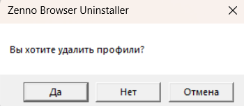

import DisclaimerNotice from '@site/src/components/DisclaimerNotice';

# Frequently Asked Questions
<DisclaimerNotice />

— You can pay for additional threads [in your personal account](https://account.zennolab.com/personal-area-zenno-browser/update-tariff), under the “ZennoBrowser” tab. It will show information about available plans:



— If you see the error “WebBrowserSettings Action Failed to Start ZennoBrowser Profile (16F092BE-3196-4F94-89B3-885DF9FE64AC): Can't get correct workspace ```{WorkspaceId}```”, updating to the current version ZP 7.8.2.0 will help.

— Integrating ZB and ZP7 allows you to assign a separate proxy for each profile when creating them in bulk.

— Profile filtering will be added in upcoming releases.

— There’s no limit to the number of profiles you can create in ZB; the maximum is determined by available space on your PC’s hard drive.

— Profile folders are stored at: C:\Users\{User}\AppData\Local\ZennoLab\Profiles. You can also move them to a different drive. To do this, add the zp8.profilemanager.json file in your “Documents” folder with the following content:

``` json
{
 "Paths": {
   "ProfilesRootPath": "C:/Users/Administrator/Desktop/TWST"
}
}
```

In this file, you need to specify the new path for profiles.

Currently, there’s no import or export feature in the program, but we plan to add it in the future.

— To avoid losing created data, you can select the “Do not delete profiles” option during reinstallation.



— You can install and use one ZennoBrowser license on multiple PCs, but the thread limit will be shared across all devices.

— You can launch ZennoBrowser profiles through the ZennoPoster integration.

— Mobile profiles for Android and iOS are not yet available in ZB.

— You cannot manually set the UserAgent; you can only use the available options.