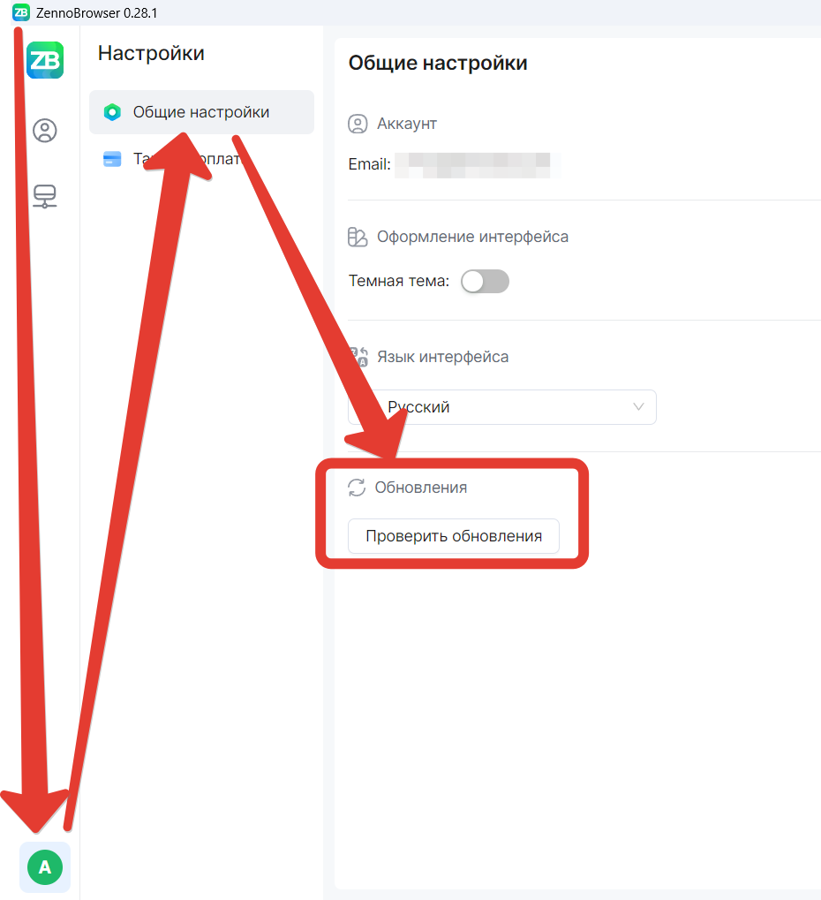

import DisclaimerNotice from '@site/src/components/DisclaimerNotice';

# Update
<DisclaimerNotice />

ZennoBrowser is always installed in its current version. When an update becomes available, you need to open the program, click on your user profile icon in the lower left corner of the screen, and in “General settings” start the update check: an available update will appear, and ZennoBrowser will update itself.

There's also an important feature: when you update the browser, your profile versions will also be updated accordingly. Updated profiles will always have the current browser core version.

We always announce updates [in our Telegram channel](https://t.me/zennolab) and [on the forum](https://zenno.club/discussion/forums/zennobrowser.340/).
You'll also find out about a new version release directly in the browser when a notification window appears:

