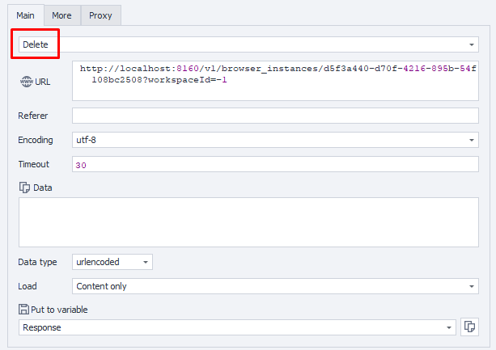

import DisclaimerNotice from '@site/src/components/DisclaimerNotice';

<DisclaimerNotice />

**Description:** This method stops the existing browser instance associated with the specified profile.  
This operation permanently closes the browser instance and releases all associated resources.

#### **Request parameters:**

| Parameter | Type | Format | Default | Description |
| :-----: | :-----: | :-----: | :-----: | :----- |
| profileId | string | uuid | (required) | The target browser instance ID |
| workspaceId | integer | int64 | \-1 | Workspace identifier. `-1` means the default workspace. | 

#### **Example request:**

**DELETE**  
**CURL:**

```bash
curl 'http://localhost:8160/v1/browser_instances/{profileId}?workspaceId=-1' \
  --request DELETE \
  --header 'Api-Token: YOUR_SECRET_TOKEN'
```  

**C#:**

```csharp
using System.Net.Http.Headers;
var client = new HttpClient();
var request = new HttpRequestMessage
{
    Method = HttpMethod.Delete,
    RequestUri = new Uri("http://localhost:8160/v1/browser_instances/{profileId}?workspaceId=-1"),
    Headers =
    {
        { "Api-Token", "YOUR_SECRET_TOKEN" },
    },
};
using (var response = await client.SendAsync(request))
{
    response.EnsureSuccessStatusCode();
    var body = await response.Content.ReadAsStringAsync();
    Console.WriteLine(body);
}
```

**Cube:**  
```
http://localhost:8160/v1/browser_instances/{profileId}?workspaceId=-1
```



**Additionally:**  
User-Agent: `{-Profile.UserAgent-}`  
Api-Token: Token from **UserArea2**.  


#### **Response API:**

| Response code | Result |
| :---: | :---: |
| `200 OK` | Success |
| `500 Error` | Internal Server Error |

**Success Response (200 OK):**

No content returned on successful deletion.

**Error Response (500):**

```json
{
  "message": null
}
```

---