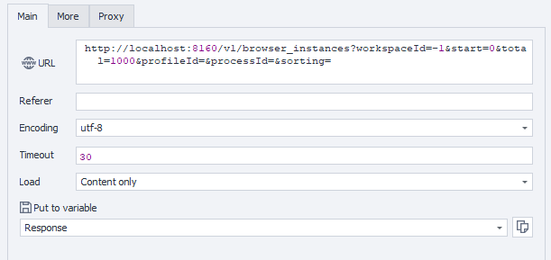

---
sidebar_position: 1
sidebar_label: Getting Browser Instances
title: Getting Browser Instances
description: Retrieve the list of active browser instances - comprehensive guide for ZennoBrowser Public API. Detailed instructions, usage examples, and configuration guide
---
import DisclaimerNotice from '@site/src/components/DisclaimerNotice';

<DisclaimerNotice />

**Description:** This method returns the list of browser processes available for the current user with detailed information.  
Results can be filtered by profile ID or process ID and optionally sorted or limited by number of returned entries.

:::warning
These actions are applied **only** to browser instances launched via the API.
:::

#### **Request parameters:**

| Parameter | Type | Format | Default | Description |
| ----- | ----- | ----- | ----- | ----- |
| workspaceId | integer | int64 | \-1 | Workspace identifier. `-1` means the default workspace. |
| start | integer | int32 | 0 | Starting index for pagination |
| total | integer | int32 | 1000 | Maximum number of results to return |
| profileId | string | uuid | (empty) | Filter by profile ID (optional). |
| processId | integer | int32 | (empty) | Filter by browser process ID (optional). |
| sorting | string |  | (empty) | Sorting parameters:ConnectionString, ProcessId, ProfileId (optional). |
 

#### **Example request:**

**GET**  
**CURL:**

```bash
curl 'http://localhost:8160/v1/browser_instances?workspaceId=-1&start=0&total=1000&profileId=&processId=&sorting=' \
  --header 'Api-Token: YOUR_SECRET_TOKEN'
```

**C#:**

```csharp
using System.Net.Http.Headers;
var client = new HttpClient();
var request = new HttpRequestMessage
{
    Method = HttpMethod.Get,
    RequestUri = new Uri("http://localhost:8160/v1/browser_instances?workspaceId=-1&start=0&total=1000&profileId=&processId=&sorting="),
    Headers =
    {
        { "Api-Token", "YOUR_SECRET_TOKEN" },
    },
};
using (var response = await client.SendAsync(request))
{
    response.EnsureSuccessStatusCode();
    var body = await response.Content.ReadAsStringAsync();
    Console.WriteLine(body);
}
```

**Cube:**  
```
http://localhost:8160/v1/browser_instances?workspaceId=-1&start=0&total=1000&profileId=&processId=&sorting=
```



**Additionally:**  
User-Agent: `{-Profile.UserAgent-}`  
Api-Token: Token from **UserArea2**.  


#### **Response API:**

| Response code | Result |
| :---: | :---: |
| `200 OK` | Success |
| `500 Error` | Internal Server Error |

**Success Response (200 OK):**

```json
{
  "totalCount": 1,
  "items": [
    {
      "profileId": "123e4567-e89b-12d3-a456-426614174000",
      "processId": 1,
      "connectionString": null
    }
  ]
}
```

**Error Response (500):**

```json
{
  "message": null
}
```

---
