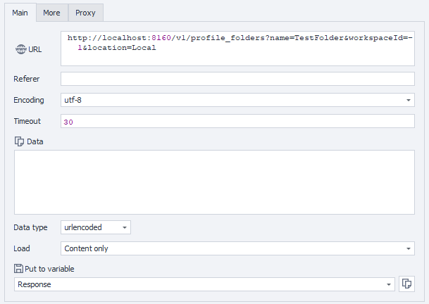

---
sidebar_position: 2
sidebar_label: Creating Profile Folder
title: Creating New Profile Folder
description: Create a profile folder in a specified workspace and location - comprehensive guide for ZennoBrowser Public API. Detailed instructions, usage examples, and configuration guide
---
import DisclaimerNotice from '@site/src/components/DisclaimerNotice';

<DisclaimerNotice />

**Description:** This method creates a profile folder. The caller must ensure that the specified workspace ID and location are valid.

#### **Request parameters:**

| Parameter | Type | Format | Default | Description |
| :-----: | :-----: | :-----: | :-----: | :----- |
| name | string |  |  | Name of the profile folder. Cannot be null or empty. |
| workspaceId | integer | int64 | \-1 | ID of the workspace where the profile folder will be created. Defaults to \-1 if not specified. |
| location | string (enum) |  | Local | The location where the profile folder will be created. Folder location: `"Local"` or `"Cloud"`. |

#### 

#### **Example request:**

**POST**  
**CURL:**

```bash
curl 'http://localhost:8160/v1/profile_folders?name=&workspaceId=-1&location=Local' \
  --request POST \
  --header 'Api-Token: YOUR_SECRET_TOKEN'
```

**C#:**

```csharp
using System.Net.Http.Headers;
var client = new HttpClient();
var request = new HttpRequestMessage
{
    Method = HttpMethod.Post,
    RequestUri = new Uri("http://localhost:8160/v1/profile_folders?name=&workspaceId=-1&location=Local"),
    Headers =
    {
        { "Api-Token", "YOUR_SECRET_TOKEN" },
    },
};
using (var response = await client.SendAsync(request))
{
    response.EnsureSuccessStatusCode();
    var body = await response.Content.ReadAsStringAsync();
    Console.WriteLine(body);
}
```

**Cube:**  
```
http://localhost:8160/v1/profile_folders?name=&workspaceId=-1&location=Local
```



**Additionally:**  
User-Agent: `{-Profile.UserAgent-}`  
Api-Token: Token from **UserArea2**.  


#### **Response API:**

| Response code | Result |
| :---: | :---: |
| `200 OK` | Success |
| `500 Error` | Internal Server Error |

**Success Response (200 OK):**

Returns the ID of the newly created profile folder:

```
"123e4567-e89b-12d3-a456-426614174000"
```

**Error Response (500):**

```json
{
  "message": null
}
```

---