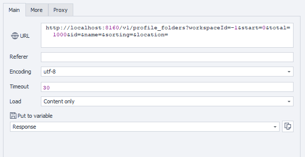

---
sidebar_position: 1
sidebar_label: Getting Folder List
title: Getting Folder List
description: Retrieve a list of folders available in the specified workspace with optional filters and sorting - comprehensive guide for ZennoBrowser Public API. Detailed instructions, usage examples, and configuration guide
---
import DisclaimerNotice from '@site/src/components/DisclaimerNotice';

<DisclaimerNotice />

**Description:** This retrieves a list of folders available in the specified workspace.  
Optionally, it is possible to limit the number of results, specify filters, or define sorting conditions.

#### **Request parameters:**

| Parameter | Type | Format | Default | Description |
| :-----: | :-----: | :-----: | :-----: | :----- |
| workspaceId | integer | int64 | \-1 | ID of the workspace where the profile folder will be created. Defaults to \-1 if not specified. |
| start | integer | int32 | 0 | Index of the first folder (starting from zero). |
| total | integer | int32 | 1000 | Maximum number of folders to retrieve. |
| id | string | uuid | (empty) | Unique folder identifier (optional filter). |
| name | string |  | (empty) | Folder name (optional filter). |
| sorting | string |  | (empty) | Sorting condition: Id, Name, FolderType, Quantity (optional filter). |
| location | string (enum) |  | Local | Folder location: `"Local"` or `"Cloud"`. |

#### 

#### **Example request:**

**GET**  
**CURL:**

```bash
curl 'http://localhost:8160/v1/profile_folders?workspaceId=-1&start=0&total=1000&id=&name=&sorting=&location=' \
  --header 'Api-Token: YOUR_SECRET_TOKEN'
```

**С#:**

```csharp
using System.Net.Http.Headers;
var client = new HttpClient();
var request = new HttpRequestMessage
{
    Method = HttpMethod.Get,
    RequestUri = new Uri("http://localhost:8160/v1/profile_folders?workspaceId=-1&start=0&total=1000&id=&name=&sorting=&location="),
    Headers =
    {
        { "Api-Token", "YOUR_SECRET_TOKEN" },
    },
};
using (var response = await client.SendAsync(request))
{
    response.EnsureSuccessStatusCode();
    var body = await response.Content.ReadAsStringAsync();
    Console.WriteLine(body);
}
```

**Cube:**  
```
http://localhost:8160/v1/profile_folders?workspaceId=-1&start=0&total=1000&id=&name=&sorting=&location=
```  


**Additionally:**  
User-Agent: `{-Profile.UserAgent-}`  
Api-Token: Token from **UserArea2**.  


#### **Response API:**

| Response code | Result |
| :---: | :---: |
| `200 OK` | Success |
| `500 Error` | Internal Server Error |

**Success Response (200 OK):**

```json
{
  "totalCount": 1,
  "items": [
    {
      "id": "123e4567-e89b-12d3-a456-426614174000",
      "name": null,
      "location": "Local",
      "quantity": 1
    }
  ]
}
```

**Error Response (500):**

```json
{
  "message": null
}
```

---