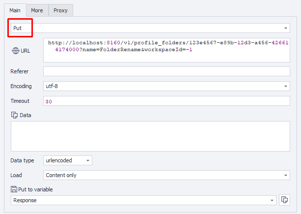

---
sidebar_position: 3
sidebar_label: Updating Profile Folder
title: Updating Profile Folder
description: Update an existing profile folder's properties and settings - comprehensive guide for ZennoBrowser Public API. Detailed instructions, usage examples, and configuration guide
---
import DisclaimerNotice from '@site/src/components/DisclaimerNotice';

<DisclaimerNotice />

**Description:** This method can be used to update the profile folder name.

#### **Request parameters:**

| Parameter | Type | Format | Default | Description |
| :-----: | :-----: | :-----: | :-----: | :----- |
| profileFolderId | string | uuid |  | Unique identifier of the profile folder to update. |
| name | string |  |  | The new name for the profile folder. |
| workspaceId | integer | int64 | \-1 | The identifier of the workspace associated with the profile folder. Defaults to \-1 if not specified. |

:::note
The ID of the edited profile folder should be specified inside curly braces `{ }` in the URL path.
:::  

#### **Example request:**

**PUT**  
**CURL:**

```bash
curl 'http://localhost:8160/v1/profile_folders/{profileFolderId}?name=&workspaceId=-1' \
  --request PUT \
  --header 'Api-Token: YOUR_SECRET_TOKEN'
```

**C#:**

```csharp
using System.Net.Http.Headers;
var client = new HttpClient();
var request = new HttpRequestMessage
{
    Method = HttpMethod.Put,
    RequestUri = new Uri("http://localhost:8160/v1/profile_folders/{profileFolderId}?name=&workspaceId=-1"),
    Headers =
    {
        { "Api-Token", "YOUR_SECRET_TOKEN" },
    },
};
using (var response = await client.SendAsync(request))
{
    response.EnsureSuccessStatusCode();
    var body = await response.Content.ReadAsStringAsync();
    Console.WriteLine(body);
}
```

**Cube:**  
[`http://localhost:8160/v1/profile_folders/{profileFolderId}?name=&workspaceId=-1`](http://localhost:8160/v1/profile_folders/{profileFolderId}?name=&workspaceId=-1)



**Additionally:**  
User-Agent: `{-Profile.UserAgent-}`  
Api-Token: Token from **UserArea2**.  


#### **Response API:**

| Response code | Result |
| :---: | :---: |
| `200 OK` | Success |
| `500 Error` | Internal Server Error |

**Success Response (200 OK):**

No content returned on successful update.

**Error Response (500):**

```json
{
  "message": null
}
```

---
