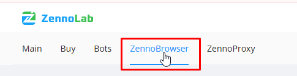
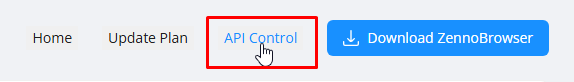
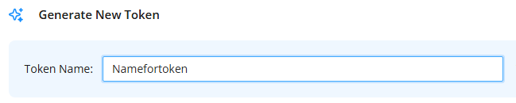
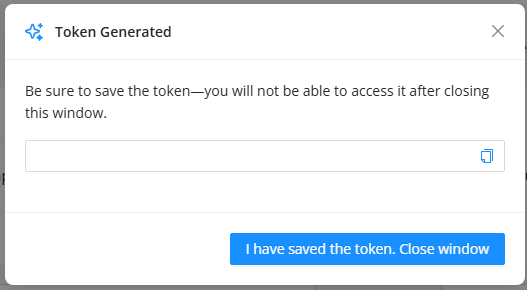

---
sidebar_position: 1
sidebar_label: Getting Started
title: Getting Started with the ZennoBrowser API
description: Learn how to obtain API tokens and execute your first requests to ZennoBrowser Public API - comprehensive guide for ZennoBrowser Public API. Detailed instructions, usage examples, and configuration guide
---
import DisclaimerNotice from '@site/src/components/DisclaimerNotice';

# Getting Started with the ZennoBrowser API

<DisclaimerNotice />

## Getting Started with the ZennoBrowser API

The API Token is required to execute all requests. It can obtained as follows:

1. Log in to UserArea2 with active ZennoBrowser subscription;
2. Open "ZennoBrowser" section at the top of the main page;

3. Click the "API Control" link;

4. Specify token name (minimum 3 characters);

5. Select the period which this token will be valid for (7 days, 30 days, 60 days, etc.);

6. Click "Generate token";

7. Copy the generated token. After closing the window, it is not possible to copy the token again, so be sure to save the generated token.

8. Use the generated token to execute requests.

**Note:**

1. After deleting the token, it will continue functioning within 1.5-2 hours;  
2. After token has expired, it will cease to function;  
3. If you have lost a previously created token, you can create a new one.
