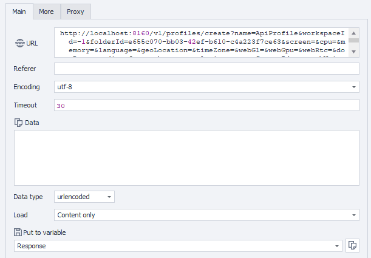

import DisclaimerNotice from '@site/src/components/DisclaimerNotice';

<DisclaimerNotice />

**Description:** This method creates a new browser profile in the specified workspace and the folder. It is possible to customize various parameters such as screen size, hardware emulation, language, timezone, proxy, and others. All parameters are optional if another is not specified.

#### **Request parameters:**

| Parameter | Type | Format | Default | Description |
| :-----: | :-----: | :-----: | :-----: | :----- |
| name | string |  | (empty) | The profile name. |
| workspaceId | integer | int64 | -1 | Workspace identifier. -1 means the default workspace. |
| folderId | string | uuid | (empty) | Folder identifier (optional). |
| screen | string |  | (empty) | Screen configuration settings. The allowed values are: "auto" to use value from fingerprint, "ignore" to use system value or "width x height" to set custom screen resolution (`auto`, `ignore` or or manual screen resolution entry, such as SVGA, WSVGA, HD+, etc. The complete list of manually configurable resolutions is provided below)<br/>"SVGA" = 800x600; "0.69M3" = 960x720;<br/>"0.59M9" = 1024x576; "WSVGA" = 1024x600;<br/>"0.66MA" = 1024x640; "XGA" = 1024x768;<br/>"1152x648" = 1152x648; "XGA+" = 1152x864;<br/>"HD" = 1280x720; "WXGA" = 1280x768;<br/>"WXGA+" = 1280x800; "SXGA-" = 1280x960;<br/>"SXGA" = 1280x1024; "1360x768" = 1360x768;<br/>"WXGA HD" = 1366x768; "SXGA+" = 1400x1050;<br/>"WSXGA" = 1440x900; "1.56M3" = 1440x1080;<br/>"1536x864" = 1536x864; "HD+" = 1600x900;<br/>"UXGA" = 1600x1200; "WSXGA+" = 1680x1050;<br/>"1832x1392" = 1832x1392; "FHD" = 1920x1080;<br/>"WUXGA" = 1920x1200; "2.76M3" = 1920x1440;<br/>"QWXGA" = 2048x1152; "QXGA" = 2048x1536;<br/>"3.32MA" = 2304x1440; "WQHD" = 2560x1440;<br/>"WQXGA" = 2560x1600; "QSXGA" = 2560x2048;<br/>"5.18MA" = 2880x1800; "4K UHD-1" = 3840x2160;<br/>"9.44M9" = 4096x2304; "5K" = 5120x2880;<br/>"8K UHD-2" = 7680x4320; |
| cpu | string |  | (empty) | CPU configuration settings. The allowed values are: "auto" to use value from fingerprint, "ignore" to use system value or integer number to set custom processor core count (`auto`, `ignore`, or number of cores ("2/4", "4/8", "6/12", "8/16", "10/20", "12/24", "14/28", "16/32", "32/64", "64/128")) |
| memory | string |  | (empty) | Memory configuration settings. Allowed values: "auto" - use the value from the fingerprint, "ignore" - use the system value, or an integer to specify a custom memory size (auto, ignore, or memory size ("2", "4", "8", "16", "32", "64", "128")) |
| language | string |  | (empty) | Browser language settings. The allowed values are: "auto" to use value from fingerprint, "ignore" to use system value or language locale value (`auto`, `ignorate`, or locale: Russian - ru English (United States) - en-US German - de French - fr Spanish - es English (United Kingdom) - en-GB |
| geoLocation | string |  | (empty) | Geographic location settings. The allowed values are: "auto" to use value from fingerprint, "ignore" to use system value. It is also possible to specify from one to seven floating point numbers that represent the following geo coordinates: Latitude, Longitude, Altitude, Accuracy, AltitudeAccuracy, Heading, Speed, Radius. Some coordinates can be skipped. For example, the following value sequence is valid: 10, , 40, , 60, 70 - means Latitude = 10, Longitude = random, Altitude = 40, Accuracy = random, AltitudeAccuracy = 60, Heading = 70, Speed = random, Radius = random (`auto`, `ignore` or coordinates (latitude, longitude, etc.)) |
| timeZone | string |  | (empty) | Timezone settings. The allowed values are: "auto" to use value from fingerprint, "ignore" to use system value or custom timezone value (`auto`, `ignore`, or specific value (e.g. `Europe/Moscow`)) |
| webGl | string |  | (empty) | WebGL configuration settings. The allowed values are: "auto" to use value from fingerprint, "ignore" to use system value. (`auto` or `ignore)` |
| webGpu | string |  | (empty) | WebGPU configuration settings. The allowed values are: "on" to enable or "off" to disable this feature.(`on` or `off)` |
| webRtc | string |  | (empty) | WebRTC configuration settings. The allowed values are: "Emulate" to use value from fingerprint, "Real" to use system value or "Hide" to disable this feature.(`Emulate`, `Real` or `Hide)` |
| domRect | string |  | (empty) | DOM Rectangle configuration settings. The allowed values are: "Ignore" to disable this feature or "Noise" to use dom rect noising.(`Ignore` or `Noise)` |
| audio | string |  | (empty) | Audio configuration settings. The allowed values are: "on" to enable or "off" to disable this feature. (`on` or `off)` |
| fonts | string |  | (empty) | Font configuration settings. The allowed values are: "on" to enable or "off" to disable this feature. `(on` or `off)` |
| battery | string |  | (empty) | Battery configuration settings. The allowed values are: "on" to enable or "off" to disable this feature. (`on` or `off)` |
| plugins | string |  | (empty) | Browser plugins configuration. The allowed values are: "on" to enable or "off" to disable this feature. (`on` or `off)` |
| proxyServerId | string | uuid | (empty) | Proxy server identifier (optional). |
| speechVoices | string |  | (empty) | Speech voices configuration. The allowed values are: "on" to enable or "off" to disable this feature. (`on` or `off)` |
| notes | string |  | (empty) | Additional notes for the profile. |
| tags | string |  | (empty) | Profile tags separated by spaces. (e.g. `1 2 3 4`) |
| canvas | string |  | (empty) | Canvas settings. The allowed values are: Ignore to disable this feature or Noise to use noising. |
| mediaDevices | string |  | (empty) | Media devices settings. The allowed values are: auto to use value from fingerprint, ignore to use real values or custom location values. You can specify from one to three integer numbers that represent the following values: AudioInput, AudioOutput and VideoInput The numbers can be skipped. For example, the following values are valid: 1,,5 - means AudioInput = 1, AudioOutput = random, VideoInput = 5 |
| commandLineArguments | string |  | (empty) | Custom command line arguments to pass to the browser on startup |
| presetId | string | uuid | (empty) | Optional preset identifier used to initialize the profile configuration. |

#### **Example request:**

**POST**  
**CURL:**

```bash
curl 'http://localhost:8160/v1/profiles/create?name=ApiEntity&workspaceId=-1&folderId=123e4567-e89b-12d3-a456-426614174000&screen=1920%20x%201080&cpu=8%2F16&memory=8&language=en-US&geoLocation=55.7558%2C37.6176&timeZone=Europe%2FMoscow&webGl=auto&webGpu=on&webRtc=Emulate&domRect=Noise&audio=on&fonts=on&battery=on&plugins=on&proxyServerId=123e4567-e89b-12d3-a456-426614174000&speechVoices=on&notes=Created%20from%20API&tags=tag1%20tag2&canvas=Noise&mediaDevices=1%2C1%2C1&commandLineArguments=--disable-gpu&presetId=123e4567-e89b-12d3-a456-426614174000' \
  --request POST \
  --header 'Api-Token: YOUR_SECRET_TOKEN'

```

**C#:**

```csharp
using System.Text;
var client = new HttpClient();
var request = new HttpRequestMessage
{
    Method = HttpMethod.Post,
    RequestUri = new Uri("http://localhost:8160/v1/profiles/create?name=ApiEntity&workspaceId=-1&folderId=123e4567-e89b-12d3-a456-426614174000&screen=1920%20x%201080&cpu=8%2F16&memory=8&language=en-US&geoLocation=55.7558%2C37.6176&timeZone=Europe%2FMoscow&webGl=auto&webGpu=on&webRtc=Emulate&domRect=Noise&audio=on&fonts=on&battery=on&plugins=on&proxyServerId=123e4567-e89b-12d3-a456-426614174000&speechVoices=on&notes=Created%20from%20API&tags=tag1%20tag2&canvas=Noise&mediaDevices=1%2C1%2C1&commandLineArguments=--disable-gpu&presetId=123e4567-e89b-12d3-a456-426614174000"),
    Headers =
    {
        { "Api-Token", "YOUR_SECRET_TOKEN" },
    },
};
using (var response = await client.SendAsync(request))
{
    response.EnsureSuccessStatusCode();
    var body = await response.Content.ReadAsStringAsync();
    Console.WriteLine(body);
}
```

**Cube:**  
```
http://localhost:8160/v1/profiles/create?name=ApiProfile&workspaceId=-1&folderId=&screen=&cpu=&memory=&language=&geoLocation=&timeZone=&webGl=&webGpu=&webRtc=&domRect=&audio=&fonts=&battery=&plugins=&proxyServerId=&speechVoices=&cookies=&notes=&tags=
```



**Additionally:**  
User-Agent: `{-Profile.UserAgent-}`  
Api-Token: Token from **UserArea2**.


#### **Response API:**

| Response code | Result |
| :---: | :---: |
| `200 OK` | OK |
| `401 Unauthorized` | Unauthorized |
| `403 Forbidden` | Forbidden |
| `500 Internal Server Error` | Internal Server Error |

**Success Response (200 OK):**

```text
123e4567-e89b-12d3-a456-426614174000
```

**Error Response (500):**

```json
{
  "message": null
}
```

---
