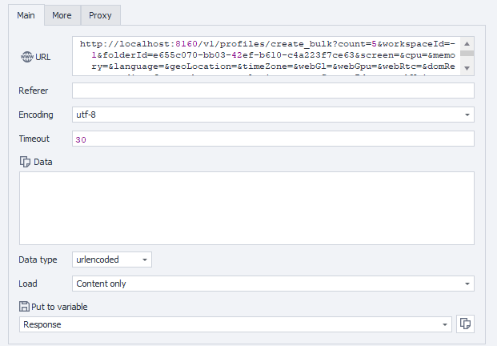

---
sidebar_position: 3
sidebar_label: Creating Profiles (Bulk)
title: Creating Browser Profiles (Bulk)
description: Create multiple browser profiles at once with custom configurations - comprehensive guide for ZennoBrowser Public API. Detailed instructions, usage examples, and configuration guide
---
import DisclaimerNotice from '@site/src/components/DisclaimerNotice';

<DisclaimerNotice />

**Description:** This method is used to create new multiple browser profiles in the specified workspace and the folder.  
Each profile can have its own configuration, including screen size, hardware emulation, language, timezone, proxy, and other parameters.  
All fields are optional if another is not specified.

#### **Request parameters:**

| Parameter | Type | Format | Default | Description |
| :-----: | :-----: | :-----: | :-----: | :----- |
| count | integer | int32 |  | Number of profiles to create |
| workspaceId | integer | int64 | \-1 | Workspace identifier. \-1 means the default workspace. |
| folderId | string | uuid | (empty) | Folder identifier (optional). |
| screen | string |  | (empty) | Screen configuration settings. The allowed values are: “auto” to use value from fingerprint, “ignore” to use system value or “width x height” to set custom screen resolution (`auto`, `ignore` or or manual screen resolution entry, such as SVGA, WSVGA, HD+, etc. The complete list of manually configurable resolutions is provided below)<br/>"SVGA" \= 800×600; "0.69M3" \= 960×720;<br/>"0.59M9" \= 1024×576; "WSVGA" \= 1024×600;<br/>"0.66MA" \= 1024×640; "XGA" \= 1024×768;<br/>"1152×648" \= 1152×648; "XGA+" \= 1152×864;<br/>"HD" \= 1280×720; "WXGA" \= 1280×768;<br/>"WXGA+" \= 1280×800; "SXGA-" \= 1280×960;<br/>"SXGA" \= 1280×1024; "1360×768" \= 1360×768;<br/>"WXGA HD" \= 1366×768; "SXGA+" \= 1400×1050;<br/>"WSXGA" \= 1440×900; "1.56M3" \= 1440×1080;<br/>"1536×864" \= 1536×864; "HD+" \= 1600×900;<br/>"UXGA" \= 1600×1200; "WSXGA+" \= 1680×1050;<br/>"1832×1392" \= 1832×1392; "FHD" \= 1920×1080;<br/>"WUXGA" \= 1920×1200; "2.76M3" \= 1920×1440;<br/>"QWXGA" \= 2048×1152; "QXGA" \= 2048×1536;<br/>"3.32MA" \= 2304×1440; "WQHD" \= 2560×1440;<br/>"WQXGA" \= 2560×1600; "QSXGA" \= 2560×2048;<br/>"5.18MA" \= 2880×1800; "4K UHD-1" \= 3840×2160;<br/>"9.44M9" \= 4096×2304; "5K" \= 5120×2880;<br/>"8K UHD-2" \= 7680×4320; |
| cpu | string |  | (empty) | CPU configuration settings. The allowed values are: “auto” to use value from fingerprint, “ignore” to use system value or integer number to set custom processor core count (`auto`, `ignore`, or number of cores ("2/4", "4/8", "6/12",  "8/16",  "10/20", "12/24", "14/28", "16/32", "32/64", "64/128")) |
| memory | string |  | (empty) | Memory configuration settings. The allowed values are: “auto” to use value from fingerprint, “ignore” to use system value or integer number to custom memory size in megabytes (auto, ignore or memory size in MB) |
| language | string |  | (empty) | Browser language settings. The allowed values are: “auto” to use value from fingerprint, “ignore” to use system value or custom language value (auto, ignore, or locale Russian \- ru English (United States) \- en-US German \- de French \- fr Spanish \- es English (United Kingdom) \- en-GB |
| geoLocation | string |  | (empty) | Geographic location settings. The allowed values are: “auto” to use value from fingerprint, “ignore” to use system value. You can also specify from one to seven floating point numbers that represent the following geo coordinates: Latitude, Longitude, Altitude, Accuracy, AltitudeAccuracy, Heading, Speed, Radius. Some coordinates can be skipped. For example, the following sequence is valid: 10, , 40, , 60, 70 \- means Latitude \= 10, Longitude \= random, Altitude \= 40, Accuracy \= random, AltitudeAccuracy \= 60, Heading \= 70, Speed \= random, Radius \= random (auto, ignore or coordinates (latitude, longitude, etc.)) |
| timeZone | string |  | (empty) | Time zone settings. The allowed values are: “auto” to use value from fingerprint, “ignore” to use system value or custom timezone value (auto, ignore, or specific value (e.g. Europe/Moscow)) |
| webGl | string |  | (empty) | WebGL configuration settings. The allowed values are: “auto” to use value from fingerprint, “ignore” to use system value. (auto or ignore) |
| webGpu | string |  | (empty) | WebGPU configuration settings. The allowed values are: on to enable or off to disable this feature.(on or off) |
| webRtc | string |  | (empty) | WebRTC configuration settings. The allowed values are: ‘Emulate’ to use value from fingerprint, ‘Real’ to use system value or “Hide” to disable this feature.(Emulate, Real or Hide) |
| domRect | string |  | (empty) | DOM Rectangle configuration settings. The allowed values are: “Ignore” to disable this feature or “Noise” to use dom rect noising.(Ignore or Noise) |
| audio | string |  | (empty) | Audio configuration settings. The allowed values are: “on” to enable or “off” to disable this feature. (on or off) |
| fonts | string |  | (empty) | Font configuration settings. The allowed values are: “on” to enable or “off” to disable this feature. (on or off) |
| battery | string |  | (empty) | Battery configuration settings. The allowed values are: “on” to enable or “off” to disable this feature. (on or off) |
| plugins | string |  | (empty) | Browser plugins configuration. The allowed values are: “on” to enable or “off” to disable this feature. (on or off) |
| proxyServerId | string | uuid | (empty) | Proxy server identifier (optional). |
| speechVoices | string |  | (empty) | Speech voices configuration. The allowed values are: “on” to enable or “off” to disable this feature. (on or off) |
| tags | string |  | (empty) | Profile tags separated by spaces or commas. (e.g. `1 2 3 4`) |

#### 

#### **Example request:**

**POST**  
**CURL:**

```bash
curl 'http://localhost:8160/v1/profiles/create_bulk?count=&workspaceId=-1&folderId=&screen=&cpu=&memory=&language=&geoLocation=&timeZone=&webGl=&webGpu=&webRtc=&domRect=&audio=&fonts=&battery=&plugins=&proxyServerId=&speechVoices=&tags=' \
  --request POST \
  --header 'Api-Token: YOUR_SECRET_TOKEN'
```

**C#:**

```csharp
using System.Net.Http.Headers;
var client = new HttpClient();
var request = new HttpRequestMessage
{
    Method = HttpMethod.Post,
    RequestUri = new Uri("http://localhost:8160/v1/profiles/create_bulk?count=&workspaceId=-1&folderId=&screen=&cpu=&memory=&language=&geoLocation=&timeZone=&webGl=&webGpu=&webRtc=&domRect=&audio=&fonts=&battery=&plugins=&proxyServerId=&speechVoices=&tags="),
    Headers =
    {
        { "Api-Token", "YOUR_SECRET_TOKEN" },
    },
};
using (var response = await client.SendAsync(request))
{
    response.EnsureSuccessStatusCode();
    var body = await response.Content.ReadAsStringAsync();
    Console.WriteLine(body);
}
```

**Cube:**  
```
http://localhost:8160/v1/profiles/create_bulk?count=&workspaceId=-1&folderId=&screen=&cpu=&memory=&language=&geoLocation=&timeZone=&webGl=&webGpu=&webRtc=&domRect=&audio=&fonts=&battery=&plugins=&proxyServerId=&speechVoices=&tags=
```



**Additionally:**  
User-Agent: `{-Profile.UserAgent-}`  
Api-Token: Token from **UserArea2**  


#### **Response API:**

| Response code | Result |
| :---: | :---: |
| `200 OK` | Success |
| `500 Error` | Internal Server Error |

**Success Response (200 OK):**

Returns an array of IDs for the newly created profiles:

```json
[
  "123e4567-e89b-12d3-a456-426614174000"
]
```

**Error Response (500):**

```json
{
  "message": null
}
```

---
