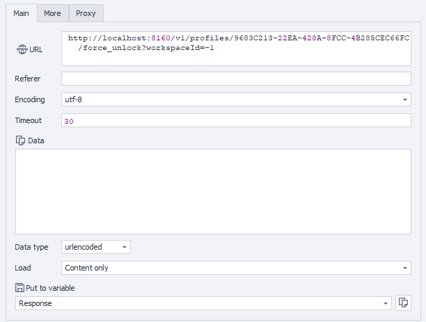

import DisclaimerNotice from '@site/src/components/DisclaimerNotice';

<DisclaimerNotice />

**Description:** This method can be used to force unlock a cloud browser profile that is currently locked by another machine in the specified workspace.

#### **Request parameters:**

| Parameter | Type | Format | Default | Description |
| :-----: | :-----: | :-----: | :-----: | :----- |
| profileId | string | uuid | (required) | Unique identifier of the profile to force unlock (required). |
| workspaceId | integer | int64 | -1 | Workspace identifier. -1 means the default workspace. |

#### **Example request:**

**POST**  
**CURL:**

```bash
curl 'http://localhost:8160/v1/profiles/123e4567-e89b-12d3-a456-426614174000/force_unlock?workspaceId=-1' \
  --request POST \
  --header 'Api-Token: YOUR_SECRET_TOKEN'

```

**C#:**

```csharp
using System.Text;
var client = new HttpClient();
var request = new HttpRequestMessage
{
    Method = HttpMethod.Post,
    RequestUri = new Uri("http://localhost:8160/v1/profiles/123e4567-e89b-12d3-a456-426614174000/force_unlock?workspaceId=-1"),
    Headers =
    {
        { "Api-Token", "YOUR_SECRET_TOKEN" },
    },
};
using (var response = await client.SendAsync(request))
{
    response.EnsureSuccessStatusCode();
    var body = await response.Content.ReadAsStringAsync();
    Console.WriteLine(body);
}
```

**Cube:**
```
http://localhost:8160/v1/profiles/123e4567-e89b-12d3-a456-426614174000/force_unlock?workspaceId=-1
```



**Additionally:**  
User-Agent: `{-Profile.UserAgent-}`  
Api-Token: Token from **UserArea2**.


#### **Response API:**

| Response code | Result |
| :---: | :---: |
| `200 OK` | OK |
| `401 Unauthorized` | Unauthorized |
| `403 Forbidden` | Forbidden |
| `500 Internal Server Error` | Internal Server Error |

**Success Response (200 OK):**

No response body.

**Error Response (500):**

```json
{
  "message": null
}
```

---
