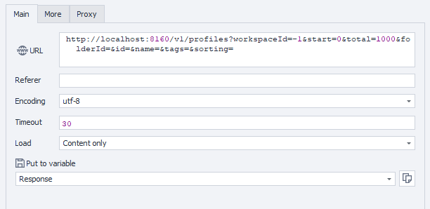

---
sidebar_position: 1
sidebar_label: Getting Browser Profiles
title: Getting Accessible Browser Profiles
description: Retrieve the list of browser profiles available in the workspace - comprehensive guide for ZennoBrowser Public API. Detailed instructions, usage examples, and configuration guide
---
import DisclaimerNotice from '@site/src/components/DisclaimerNotice';

<DisclaimerNotice />

**Description:** This method retrieves a list of profiles with their attributes from the specified workspace and the [folder.](http://folder.It) It is possible to optionally filter results by ID, name, tags, sorting.

#### **Request parameters:**

| Parameter | Type | Format | Default | Description |
| :-----: | :-----: | :-----: | :-----: | :----- |
| workspaceId | integer | int64 | \-1 | Workspace identifier. `-1` means the default workspace. |
| start | integer | int32 | 0 | Zero-based index of the first profile folder to retrieve. Defaults to 0\. |
| total | integer | int32 | 1000 | Maximum number of results to return |
| folderId | string | uuid | (empty) | Folder identifier for filtering (optional). |
| id | string | uuid | (empty) | Profile identifier for filtering (optional). |
| name | string |  | (empty) | Profile name for filtering (optional). |
| tags | string |  | (empty) | Tags for filtering (optional). Multiple tags can be separated by spaces. |
| sorting | string |  | (empty) | Sorting parameters (optional). Id, ContainerId, Name, CreationTime, User.Sex, User.Name, User.Surname, User.Age, User.Country, OperationSystem.Name, OperationSystem.Version, Brand.Name, Brand.Version, Proxy, Proxy.Name, ProfileState.DisplayStatus, ProfileState.Description, Status, OperationalState.OperationStatus, OperationalState.CanChangeOperationStatus, UsedTime, LastStartTime, LastErrorMessage, Tags, Tags.Id, Notes |

#### 

#### **Example request:**

**GET**  
**CURL:**

```bash
curl 'http://localhost:8160/v1/profiles?workspaceId=-1&start=0&total=1000&folderId=&id=&name=&tags=&sorting=' \
  --header 'Api-Token: YOUR_SECRET_TOKEN'
```

**C#:**

```csharp
using System.Net.Http.Headers;
var client = new HttpClient();
var request = new HttpRequestMessage
{
    Method = HttpMethod.Get,
    RequestUri = new Uri("http://localhost:8160/v1/profiles?workspaceId=-1&start=0&total=1000&folderId=&id=&name=&tags=&sorting="),
    Headers =
    {
        { "Api-Token", "YOUR_SECRET_TOKEN" },
    },
};
using (var response = await client.SendAsync(request))
{
    response.EnsureSuccessStatusCode();
    var body = await response.Content.ReadAsStringAsync();
    Console.WriteLine(body);
}
```

**Cube:**  
```
http://localhost:8160/v1/profiles?workspaceId=-1&start=0&total=1000&folderId=&id=&name=&tags=&sorting=
```



**Additionally:**  
User-Agent: `{-Profile.UserAgent-}`  
Api-Token: Token from **UserArea2**  


#### **Response API:**

| Response code | Result |
| :---: | :---: |
| `200 OK` | Success |
| `500 Error` | Internal Server Error |

**Success Response (200 OK):**

```json
{
  "totalCount": 1,
  "items": [
    {
      "id": "123e4567-e89b-12d3-a456-426614174000",
      "name": null,
      "folderId": "123e4567-e89b-12d3-a456-426614174000",
      "creationTime": "2025-07-25T09:34:29.768Z",
      "user": {
        "sex": "Male",
        "name": null,
        "surname": null,
        "age": 1,
        "country": null
      },
      "browser": {
        "operationSystem": {
          "name": null,
          "version": null
        },
        "brand": {
          "name": null,
          "version": null
        }
      },
      "proxy": {
        "id": "123e4567-e89b-12d3-a456-426614174000",
        "name": null
      },
      "status": null,
      "usedTimeSeconds": null,
      "lastStartTime": null,
      "lastErrorMessage": null,
      "tags": [
        {
          "name": null,
          "color": null
        }
      ],
      "notes": null
    }
  ]
}
```

**Error Response (500):**

```json
{
  "message": null
}
```

---
