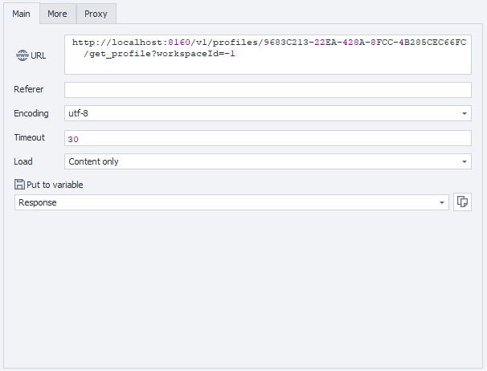

import DisclaimerNotice from '@site/src/components/DisclaimerNotice';

<DisclaimerNotice />

**Description:** Retrieves detailed information about a specific Browser Profile

#### **Request parameters:**

| Parameter | Type | Format | Default | Description |
| :-----: | :-----: | :-----: | :-----: | :----- |
| profileId | string | uuid | (required) | The unique identifier of the profile to retrieve |
| workspaceId | integer | int64 | -1 | The identifier of the workspace. Defaults to -1 if not specified. |

#### **Example request:**

**GET**  
**CURL:**

```bash
curl 'http://localhost:8160/v1/profiles/123e4567-e89b-12d3-a456-426614174000/get_profile?workspaceId=-1' \
  --header 'Api-Token: YOUR_SECRET_TOKEN'

```

**C#:**

```csharp
using System.Text;
var client = new HttpClient();
var request = new HttpRequestMessage
{
    Method = HttpMethod.Get,
    RequestUri = new Uri("http://localhost:8160/v1/profiles/123e4567-e89b-12d3-a456-426614174000/get_profile?workspaceId=-1"),
    Headers =
    {
        { "Api-Token", "YOUR_SECRET_TOKEN" },
    },
};
using (var response = await client.SendAsync(request))
{
    response.EnsureSuccessStatusCode();
    var body = await response.Content.ReadAsStringAsync();
    Console.WriteLine(body);
}
```

**Cube:**
```
http://localhost:8160/v1/profiles/123e4567-e89b-12d3-a456-426614174000/get_profile?workspaceId=-1
```



**Additionally:**  
User-Agent: `{-Profile.UserAgent-}`  
Api-Token: Token from **UserArea2**.


#### **Response API:**

| Response code | Result |
| :---: | :---: |
| `200 OK` | OK |
| `401 Unauthorized` | Unauthorized |
| `403 Forbidden` | Forbidden |
| `500 Internal Server Error` | Internal Server Error |

**Success Response (200 OK):**

```json
{
  "id": "123e4567-e89b-12d3-a456-426614174000",
  "name": "Sample Name",
  "folderId": "123e4567-e89b-12d3-a456-426614174000",
  "proxyServerId": "123e4567-e89b-12d3-a456-426614174000",
  "tags": [
    {
      "name": "Sample Name",
      "color": "#4F46E5"
    }
  ],
  "notes": "string",
  "screen": "string",
  "cpu": "string",
  "memory": "string",
  "language": "string",
  "geoLocation": "string",
  "timeZone": "string",
  "webGl": "string",
  "webGpu": "string",
  "webRtc": "string",
  "domRect": "string",
  "canvas": "string",
  "mediaDevices": "string",
  "commandLineArguments": "string",
  "audio": "string",
  "fonts": "string",
  "battery": "string",
  "plugins": "string",
  "speechVoices": "string",
  "presetId": "123e4567-e89b-12d3-a456-426614174000"
}
```

**Error Response (500):**

```json
{
  "message": null
}
```

---
