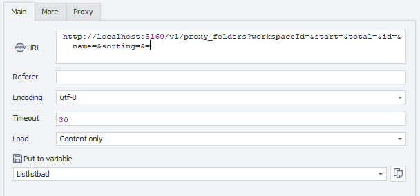

---
sidebar_position: 1
sidebar_label: Getting Proxy Folders
title: Getting Proxy Folder List
description: Retrieve a list of proxy folders in the workspace - comprehensive guide for ZennoBrowser Public API. Detailed instructions, usage examples, and configuration guide
---
import DisclaimerNotice from '@site/src/components/DisclaimerNotice';

<DisclaimerNotice />

**Description:** This method is used to get the list of proxy folders. It supports filtering, sorting, and pagination in returned results. Optional query parameters can be used to refine the result set. If parameters are not specified, the method returns the first page of proxy folders in the default sorting order.

#### **Request parameters:**

| Parameter | Type | Format | Default | Description |
| :-----: | :-----: | :-----: | :-----: | :----- |
| workspaceId | integer | int64 | \-1 | Workspace identifier. \-1 means the default workspace. |
| start | integer | int32 | 0 | Index of the first folder to return (zero-based) |
| total | integer | int32 | 1000 | Maximum number of results to return |
| id | string | uuid | (empty) | Filter by certain folder identifier |
| name | string |  | (empty) | Filter by folder name |
| sorting | string |  | (empty) | Result sorting condition |
| location | string (enum) |  | (empty) | Proxy type filter (Local or Cloud) |

#### 

#### **Example request:**

**GET**  
**CURL:**

```bash
curl 'http://localhost:8160/v1/proxy_folders?workspaceId=&start=&total=&id=&name=&sorting=&=' \
  --header 'Api-Token: YOUR_SECRET_TOKEN'
```

**C#:**

```csharp
using System.Net.Http.Headers;
var client = new HttpClient();
var request = new HttpRequestMessage
{
    Method = HttpMethod.Get,
    RequestUri = new Uri("http://localhost:8160/v1/proxy_folders?workspaceId=&start=&total=&id=&name=&sorting=&="),
    Headers =
    {
        { "Api-Token", "YOUR_SECRET_TOKEN" },
    },
};
using (var response = await client.SendAsync(request))
{
    response.EnsureSuccessStatusCode();
    var body = await response.Content.ReadAsStringAsync();
    Console.WriteLine(body);
}
```

**Cube:**   
```
http://localhost:8160/v1/proxy_folders?workspaceId=&start=&total=&id=&name=&sorting=&=
```



**Additionally:**  
User-Agent: `{-Profile.UserAgent-}`  
Api-Token: Token from **UserArea2**.


#### **Response API:**

| Response code | Result |
| :---: | :---: |
| `200 OK` | Success |
| `500 Error` | Internal Server Error |

**Success Response (200 OK):**

```json
{
  "totalCount": 1,
  "items": [
    {
      "id": "123e4567-e89b-12d3-a456-426614174000",
      "name": null,
      "location": "Local",
      "quantity": 1
    }
  ]
}
```

**Error Response (500):**

```json
{
  "message": null
}
```

---