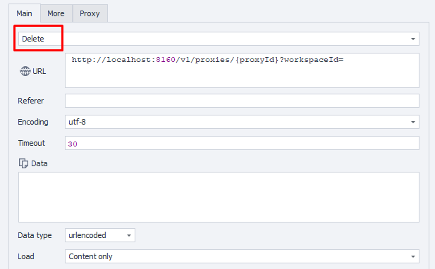
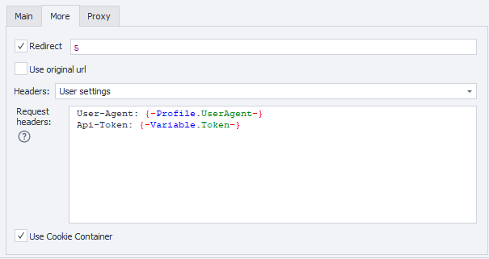

---
sidebar_position: 4
sidebar_label: Deleting Proxy
title: Deleting Proxy
description: Delete a single proxy server from the workspace - comprehensive guide for ZennoBrowser Public API. Detailed instructions, usage examples, and configuration guide
---
import DisclaimerNotice from '@site/src/components/DisclaimerNotice';

<DisclaimerNotice />

**Description:** This method deletes proxy from a list by specified ID.

#### **Request parameters:**

| Parameter | Type | Format | Default | Description |
| :-----: | :-----: | :-----: | :-----: | :----- |
| proxyId | string | uuid | (empty) | Unique identifier of the proxy (required). |
| workspaceId | integer | int64 | \-1 | Workspace identifier. \-1 means the default workspace. |

:::note
The ID of the proxy to delete should be specified inside curly braces `{ }` in the URL path.
:::

#### **Example request:**

**DELETE**  
**CURL:**

```bash
curl 'http://localhost:8160/v1/proxies/{proxyId}?workspaceId=' \
  --request DELETE \
  --header 'Api-Token: YOUR_SECRET_TOKEN'
```

**C#:**

```csharp
using System.Net.Http.Headers;
var client = new HttpClient();
var request = new HttpRequestMessage
{
    Method = HttpMethod.Delete,
    RequestUri = new Uri("http://localhost:8160/v1/proxies/{proxyId}?workspaceId="),
    Headers =
    {
        { "Api-Token", "YOUR_SECRET_TOKEN" },
    },
};
using (var response = await client.SendAsync(request))
{
    response.EnsureSuccessStatusCode();
    var body = await response.Content.ReadAsStringAsync();
    Console.WriteLine(body);
}
```

**Cube:**   
[`http://localhost:8160/v1/proxies/{proxyId}?workspaceId=`](http://localhost:8160/v1/proxies/{proxyId}?workspaceId=) 



**Additionally:**  
User-Agent: `{-Profile.UserAgent-}`  
Api-Token: Token from **UserArea2**.



#### **Response API:**

| Response code | Result |
| :---: | :---: |
| `200 OK` | Success |
| `500 Error` | Internal Server Error |

**Success Response (200 OK):**

No content returned on successful deletion.

**Error Response (500):**

```json
{
  "message": null
}
```

---