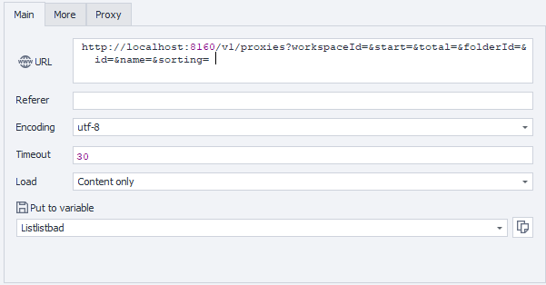

---
sidebar_position: 1
sidebar_label: Getting Proxy List
title: Getting Proxy List with Parameters
description: Retrieve a list of proxy servers with filtering and pagination options - comprehensive guide for ZennoBrowser Public API. Detailed instructions, usage examples, and configuration guide
---
import DisclaimerNotice from '@site/src/components/DisclaimerNotice';

<DisclaimerNotice />

**Description:** This method provides functionality for filtering, sorting, and paginating proxies. It is used to utilize the available parameters to customize the output. If parameters are not specified, the response will return the default page with results in standard order.

#### **Request parameters:**

| Parameter | Type | Format | Default | Description |
| :-----: | :-----: | :-----: | :-----: | :----- |
| workspaceId | integer | int64 | \-1 | Workspace identifier. `-1` means the default workspace. |
| start | integer | int32 | 0 | Starting index for the list of proxies to retrieve. |
| total | integer | int32 | 1000 | Maximum number of proxies to retrieve. |
| folderId | string | uuid | (empty) | Optional folder ID for filtering proxies. Pass null to ignore this filter. |
| id | string | uuid | (empty) | Ooptional proxy ID to filter. Pass null to ignore this filter. |
| name | string |  | (empty) | Optional name for filtering proxies. Pass null to ignore this filter. |
| sorting | string |  | (empty) | Ooptional sorting string to determine the order of the returned proxies. Pass null to ignore this filter. |

#### 

#### **Example request:**

**GET**  
**CURL:**

```bash
curl 'http://localhost:8160/v1/proxies?workspaceId=&start=&total=&folderId=&id=&name=&sorting=' \
  --header 'Api-Token: YOUR_SECRET_TOKEN'
```

**C#:**

```csharp
using System.Net.Http.Headers;
var client = new HttpClient();
var request = new HttpRequestMessage
{
    Method = HttpMethod.Get,
    RequestUri = new Uri("http://localhost:8160/v1/proxies?workspaceId=&start=&total=&folderId=&id=&name=&sorting="),
    Headers =
    {
        { "Api-Token", "YOUR_SECRET_TOKEN" },
    },
};
using (var response = await client.SendAsync(request))
{
    response.EnsureSuccessStatusCode();
    var body = await response.Content.ReadAsStringAsync();
    Console.WriteLine(body);
}
```

**Cube:** 
```
http://localhost:8160/v1/proxies?workspaceId=&start=&total=&folderId=&id=&name=&sorting=
``` 



**Additionally:**  
User-Agent: `{-Profile.UserAgent-}`  
Api-Token: Token from **UserArea2**.


#### **Response API:**

| Response code | Result |
| :---: | :---: |
| `200 OK` | Success |
| `500 Error` | Internal Server Error |

**Success Response (200 OK):**

```json
{
  "totalCount": 1,
  "items": [
    {
      "id": "123e4567-e89b-12d3-a456-426614174000",
      "folderId": "123e4567-e89b-12d3-a456-426614174000",
      "name": null,
      "proxyUri": null,
      "checkStatus": "Unknown",
      "checkStatusLastUpdateTime": null,
      "ipChangeUrl": null
    }
  ]
}
```

**Error Response (500):**

```json
{
  "message": null
}
```

---
