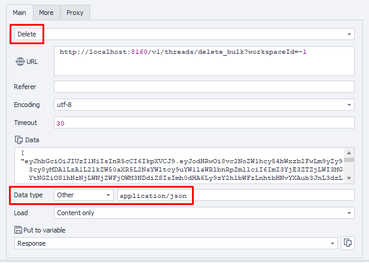

---
sidebar_position: 7
sidebar_label: Deleting Threads (Bulk)
title: Deleting Multiple Threads
description: Delete multiple execution threads at once - comprehensive guide for ZennoBrowser Public API. Detailed instructions, usage examples, and configuration guide
---
import DisclaimerNotice from '@site/src/components/DisclaimerNotice';

<DisclaimerNotice />

**Description:** This method deletes multiple execution threads.

#### **Request parameters:**

| Parameter | Type | Format | Default | Description |
| :-----: | :-----: | :-----: | :-----: | :----- |
| workspaceId | integer | int64 | \-1 | Workspace identifier. `-1` means the default workspace. |
| body | JSON-Array |  |  | Target execution thread tokens Example: `["uuid1", "uuid2"]` |

:::note
The list of thread tokens to delete should be specified as an array in the request body using the following format:

```json
[
  "threadToken1",
  "threadToken2"
]
```
:::

#### **Example request:**

**DELETE**  
**CURL:**

```bash
curl 'http://localhost:8160/v1/threads/delete_bulk?workspaceId=-1' \
  --request DELETE \
  --header 'Content-Type: application/json' \
  --header 'Api-Token: YOUR_SECRET_TOKEN' \
  --data '[
    "threadToken1",
    "threadToken2"
  ]'
```

**C#:**

```csharp
using System.Net.Http.Headers;
var client = new HttpClient();
var request = new HttpRequestMessage
{
    Method = HttpMethod.Delete,
    RequestUri = new Uri("http://localhost:8160/v1/threads/delete_bulk?workspaceId=-1"),
    Headers =
    {
        { "Api-Token", "YOUR_SECRET_TOKEN" },
    },
    Content = new StringContent("[\n  \"threadToken1\",\n  \"threadToken2\"\n]")
    {
        Headers =
        {
            ContentType = new MediaTypeHeaderValue("application/json")
        }
    }
};
using (var response = await client.SendAsync(request))
{
    response.EnsureSuccessStatusCode();
    var body = await response.Content.ReadAsStringAsync();
    Console.WriteLine(body);
}
```

**Cube:**  
```
http://localhost:8160/v1/threads/delete_bulk?workspaceId=-1
```  
**Body:**  
`["threadToken1", "threadToken2"]`



**Additionally:**  
User-Agent: `{-Profile.UserAgent-}`  
Api-Token: Token from **UserArea2**.  


#### **Response API:**

| Response code | Result |
| :---: | :---: |
| `200 OK` | Success |
| `500 Error` | Internal Server Error |

**Success Response (200 OK):**

No content returned on successful deletion.

**Error Response (500):**

```json
{
  "message": null
}
```

---
