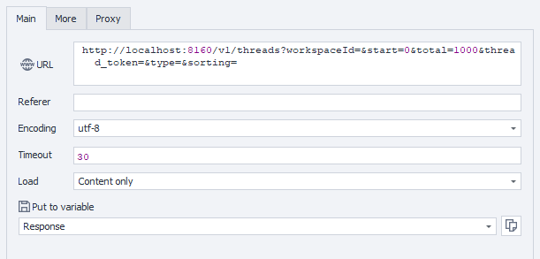

import DisclaimerNotice from '@site/src/components/DisclaimerNotice';

<DisclaimerNotice />

**Description:** This method retrieves the list of execution threads for the specified workspace. Threads can be filtered by token or type, limited by the number of results, and sorted using the provided parameters.

#### **Request parameters:**

| Parameter | Type | Format | Default | Description |
| :-----: | :-----: | :-----: | :-----: | :----- |
| workspaceId | integer | int64 | -1 | Workspace identifier. -1 means the default workspace. |
| start | integer | int32 | (empty) | Starting index for pagination. |
| total | integer | int32 | (empty) | Maximum number of threads to return. |
| thread_token | string |  | (empty) | Filter by certain thread token (optional). |
| type | string |  | (empty) | Filter by token type (Manual, BrowserInstance) (optional). |
| sorting | string |  | (empty) | Sorting parameters: CreatedAt, ThreadToken, Type, WorkspaceId (optional). |

#### **Example request:**

**GET**  
**CURL:**

```bash
curl 'http://localhost:8160/v1/threads?workspaceId=-1&start=0&total=1000&thread_token=&type=&sorting=name%20ASC' \
  --header 'Api-Token: YOUR_SECRET_TOKEN'

```

**C#:**

```csharp
using System.Text;
var client = new HttpClient();
var request = new HttpRequestMessage
{
    Method = HttpMethod.Get,
    RequestUri = new Uri("http://localhost:8160/v1/threads?workspaceId=-1&start=0&total=1000&thread_token=&type=&sorting=name%20ASC"),
    Headers =
    {
        { "Api-Token", "YOUR_SECRET_TOKEN" },
    },
};
using (var response = await client.SendAsync(request))
{
    response.EnsureSuccessStatusCode();
    var body = await response.Content.ReadAsStringAsync();
    Console.WriteLine(body);
}
```

**Cube:**  
```
http://localhost:8160/v1/threads?workspaceId=&start=&total=&thread_token=&=&sorting=
```



**Additionally:**  
User-Agent: `{-Profile.UserAgent-}`  
Api-Token: Token from **UserArea2**.


#### **Response API:**

| Response code | Result |
| :---: | :---: |
| `200 OK` | OK |
| `401 Unauthorized` | Unauthorized |
| `403 Forbidden` | Forbidden |
| `500 Internal Server Error` | Internal Server Error |

**Success Response (200 OK):**

```json
{
  "totalCount": 1,
  "items": [
    {
      "workspaceId": 1,
      "threadToken": "thread-token-1",
      "type": "string",
      "createdAt": "2026-05-19T10:00:00Z"
    }
  ]
}
```

**Error Response (500):**

```json
{
  "message": null
}
```

---
