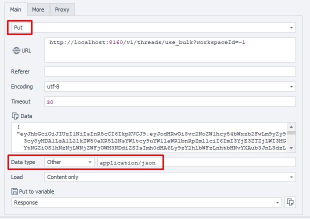

import DisclaimerNotice from '@site/src/components/DisclaimerNotice';

<DisclaimerNotice />

**Description:** This method is used to update the specified execution threads, allowing them to continue working. The threadTokens parameter should contain the array of valid tokens with existing workspace IDs.

#### **Request parameters:**

| Parameter | Type | Format | Default | Description |
| :-----: | :-----: | :-----: | :-----: | :----- |
| workspaceId | integer | int64 | -1 | The identifier of the workspace associated with the execution threads. Defaults to -1 if not specified. |

#### **Request body:**

| Field | Type | Format | Required | Description |
| :-----: | :-----: | :-----: | :-----: | :----- |
| body | array[string] |  | (optional) | Array of thread tokens representing the execution threads to update. Cannot be null or empty. |

#### **Example request:**

**PUT**  
**CURL:**

```bash
curl 'http://localhost:8160/v1/threads/use_bulk?workspaceId=-1' \
  --request PUT \
  --header 'Api-Token: YOUR_SECRET_TOKEN' \

  --header 'Content-Type: application/json' \
  --data '[
  "string"
]'
```

**C#:**

```csharp
using System.Text;
var client = new HttpClient();
var request = new HttpRequestMessage
{
    Method = HttpMethod.Put,
    RequestUri = new Uri("http://localhost:8160/v1/threads/use_bulk?workspaceId=-1"),
    Headers =
    {
        { "Api-Token", "YOUR_SECRET_TOKEN" },
    },
};
request.Content = new StringContent("[\n  \"string\"\n]", Encoding.UTF8, "application/json");
using (var response = await client.SendAsync(request))
{
    response.EnsureSuccessStatusCode();
    var body = await response.Content.ReadAsStringAsync();
    Console.WriteLine(body);
}
```

**Cube:**  
```
http://localhost:8160/v1/threads/use_bulk?workspaceId=-1
```  
**Body (JSON):**
```json
[
  "threadToken1",
  "threadToken2"
]
```



**Additionally:**  
User-Agent: `{-Profile.UserAgent-}`  
Api-Token: Token from **UserArea2**.


#### **Response API:**

| Response code | Result |
| :---: | :---: |
| `200 OK` | OK |
| `401 Unauthorized` | Unauthorized |
| `403 Forbidden` | Forbidden |
| `500 Internal Server Error` | Internal Server Error |

**Success Response (200 OK):**

No response body.

**Error Response (500):**

```json
{
  "message": null
}
```

---
