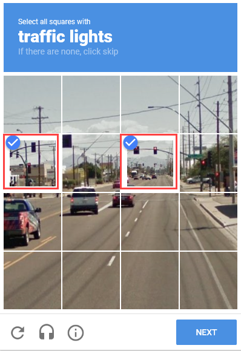
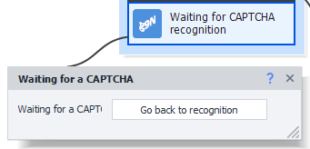
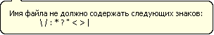

:::info **Please read the [*Material Usage Rules on this site*](../../Disclaimer).**
:::
_______________________________________________  
## Description  
This action can be used both for [**automatically solving captchas via services**](https://capmonster.cloud) and for **manual input**.

A **captcha** is an automatically generated test to check if a user is a person or a computer (bot). The simple versions usually show a distorted string of letters and/or numbers that might be colored, noisy, warped, or overlaid with lines and random shapes.

|     | 
| :--------: | 
| **Examples of text captchas.**  |  

There are also other types of captchas, where you not only need to type in symbols from an image, but complete some action. For example, you might be asked to find buses, palm trees, motorcycles, or other objects; solve a puzzle; put things in a certain order; or sort items.

#### More captcha examples:  

|     |  |
| :--------: | :-------: |
| [**ReCaptcha**](https://developers.google.com/recaptcha)  | [**HCaptcha**](https://www.hcaptcha.com/)    |  

|     |  |
| :--------: | :-------: |
| [**FunCaptcha**](https://www.arkoselabs.com/arkose-matchkey/)  | [**CloudFlare**](https://www.cloudflare.com/)    |
_______________________________________________  
## How to add to your project?  
There are two ways:  
### Through the emulator/device window.  
**Right-click the captcha image → "This is a CAPTCHA!"**

  

### Through the context menu.  
**Add action → Android → Recognize captcha.**

  

:::tip **Downside of the second way.**
You'll have to download the captcha image to your computer first, then specify its file path in the action.
:::  
_______________________________________________ 
## Working with the window  
### "Main" tab  
The window looks different depending on how you open it:

|  |  |
| :--------: | :-------: |
| **When opened through the emulator/device window** | **Through context menu** |   

#### Recognition Module  
Choose the service from the dropdown menu to send your captcha for solving. **We recommend CapMonster Cloud** as it's the most reliable and stable.


:::info `MonkeyEnter.dll`
This module is for manually solving captchas. No automatic solving service will be used.
:::  

#### Element Search  
There are two ways to search for elements on a page:  
- **Classic**  
By HTML element parameters: tag, attribute, and its value.
- **xPath**  
Using [**XPath expressions**](../../Tools/JSON_Tester), which lets you create more flexible and layout-proof data searches.

#### Recognize from file  
Enter the path to the captcha image you want to solve. You can also use a variable.

#### Put to variable  
Add a variable for the response.

#### Settings  
Click the gear button to open settings, where you can adjust data for recognition modules.
_______________________________________________ 
### "More" tab  
|  |  |
| :--------: | :-------: |
| **When opened through the emulator/device window** | **Through context menu** |  

#### Waiting  
- **Wait before execution**  
Specify a *FROM* and *TO* range in seconds. The delay before starting will be chosen randomly within this range.
- **Wait no longer than**  
If the captcha isn't found within the time here (in seconds), the action will finish with an error (exit via the red branch).
  
#### Module Settings 
You can use this field to provide extra parameters or conditions for solving the captcha, such as:  
- *Case sensitivity*;  
- *Cyrillic recognition*;  
- *Math value*;  
- *Multiple words*.

:::info **How to format extra parameters**
`parameter_name=parameter_value`.  
Multiple values are separated by `&`.
:::  

**Examples for CapMonster Cloud API:**  
- `CapMonsterModule = ZennoLab.vk` (choose a particular text module);  
- `CaseSensitive = true` (case-sensitive);  
- `Numeric = false` (captcha isn't only digits);  
- `Math = true` (task has a math operation).  

#### Scale  
This lets you increase or decrease the size of the captcha image you send for solving.

#### Stick captchas  
Some captchas are made up of multiple images, so you may need to combine them for a quick and accurate solution.

Check **Stitch captchas** for the first item. Then, right-click each following item and choose **Stick to the CAPTCHA** from the context menu.

  

Each click creates a new action. On the last one, don't forget to check **Final captcha**.

#### Async recognition  
  

This setting lets you avoid waiting for a response from the service and keep your template running.

It creates an **Waiting for a CAPTCHA** action. It has no settings, just a **Go back to recognition** button, which jumps you to the main captcha-solving action. This is especially handy if these actions are far apart in your workspace. In the main action, there's a button to go **Go to the end of recognition**.

  

**How it works:**  
1. The template gets to the main **Recognize captcha** action.  
2. Captcha is sent to the service.  
3. Template keeps running up to the **Waiting for a captcha** action.  
4. Waits for the service to respond.  
5. When the result comes, you can save it to a variable.

#### Save a URL for complaints  
This option is for submitting a complaint to the service if a captcha is solved incorrectly. Some solvers let you request a refund for a failed captcha.

In the field, enter the name of the variable where you'll store the service URL for complaints.

:::warning **Use this responsibly.**
If you complain and request refunds too often, the service might block you.

First, try to determine why failures happen and fix those issues.
:::  
_______________________________________________ 
### Saving  
  

Here you can save both the captcha image and its answer to a specified folder.

#### Available parameters  
- **Directory**. Indicate the folder where the images will be saved. You can use [**variables**](../../Data/WorkWithVariables).  
- **Answers**. Choose from two ways to save the answers:  
    - *In the filename*  
    Handy, but sometimes not possible, since Windows doesn't allow certain characters that may appear in some answers.  
      
    - *In a file*  
    The captcha image will be saved as `captcha(X).png`, where **X** is the captcha's sequence number.  
    A text file `captcha(X).txt` will also be created with the answer for that captcha.  
- **Ignore answer "sorry"**. Sometimes, due to errors, the action will return **`sorry`** instead of a captcha answer. If enabled, the program won't save such captchas.

:::tip **Saving captchas with answers can be useful**
When [creating your own module](https://capmonster.cloud/UserModules) on **CapMonster Cloud**.
:::  
_______________________________________________ 
## Usage examples  
### Typical use  
1. Right-click the captcha image and pick **This is a captcha!** from the menu.  
1.2. *Right after you add this action, the **manual solving window** will pop up — you can just close it.*  
2. Choose the recognition module you want.  
2.1. *Don't forget to set your API key in the [**settings**](../../Settings/Captcha) and make sure you have funds in your service account.*  
3. Now, right-click the field where you need to type the captcha answer and choose **Field for captcha recognition result**.  
3.1. *Or manually find the field with the [**Action Builder**](../../pm/Interface/ActionBuilder) and use the [**Set Value**](./SetValue) action to put the answer there.*

### When you need to stitch  
For this example, we're using a test page with this HTML code:  
```html  
...html sample omitted...
```
Here, each character is a separate HTML element.

1. Right-click the first image and choose **This is a captcha!**  
2. Turn on **Stitch captchas** in the action settings.  
3. Then right-click each remaining image → **Attach to captcha**.  
4. In the end, you'll have 4 actions:  
  
5. When you run it, the first three actions will collect and combine images, but only the last action will handle the final piece and send it to the service for recognition.  
:::tip **If the answer to the captcha needs to give a mathematical operation**
Don't forget to add `Math = true` to **Module Parameters**.


::: 
_______________________________________________ 
## Useful tips  
### Plain text captcha  
Sometimes on less protected sites, you'll see captchas that aren't graphic text images, but just written as regular plain text (like in Notepad).

You shouldn't send these to a service — instead just parse them right from the page's text. Use the [**Text Processing**](../../Data/Text) action. Choose the page text, enable **parse result**, and enter a [**regular expression**](../../Tools/RegEx_Tester) as a parameter to parse the data.

### Math captchas  
You might also see plain-text captchas with math expressions (addition, subtraction, multiplication, division).

You can turn these into images and send them for recognition, or simply use [**JavaScript**](../../Project%20Editor/CustomCode/JS) from the **Your code** section.

Put a link to the variable with the math expression in the code field, and you'll get the answer as the result.

### Flash captcha
You can also just convert it into a regular image and send it to a service. Find the flash object in the [**Element Tree**](../../pm/Interface/ElementTree), right-click it, and choose **This is a captcha!**
_______________________________________________  
## Helpful links  
- [**All about captcha solving**](https://blog.capmonster.cloud/ru)  
- [**POST request**](../../Project%20Editor/HTTP%20and%20FTP/POST)  
- [**Image processing**](../../Data/Images)