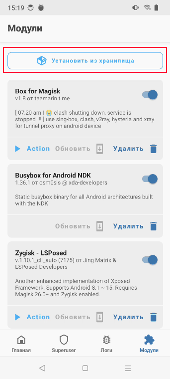
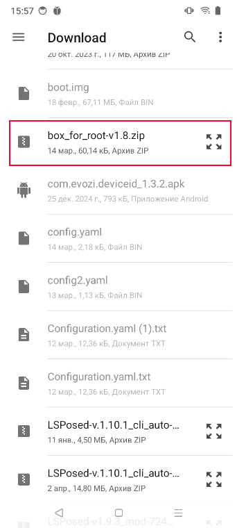
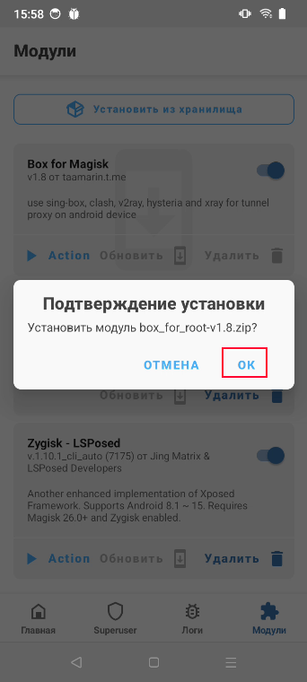
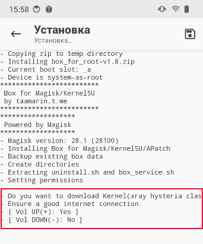

:::info **Please read the [*Material Usage Rules on this Resource*](../../Disclaimer).**
:::
_______________________________________________
## Description  
Clash lets you set up a transparent proxy on Android devices with Root. It's part of the Box for Root module for Magisk.

You'll need this program to [Set up a proxy in Clash mode](../../Settings/Proxy_Traffic_Ent).
_______________________________________________
## Manual Installation  
:::warning **You don't have to install the module manually.**
Box for Root installs automatically the first time you use a proxy in Clash mode.
:::

To install the module, you'll need a phone with [**Magisk**](https://github.com/topjohnwu/Magisk).

Download the latest version of [Box for Root](https://github.com/taamarin/box_for_magisk/releases/latest) to your phone's `sdcard/Download/` folder and install it using the standard menu.

### **1. Open Magisk → go to the *Modules* tab → Install from Storage.**

### **2. Find the installer among your downloaded files.**

### **3. Confirm the installation.**

### **4. During installation, you'll see the message `Do you want to download Kernel` in the log**

**At this point, you need to hold down the *volume up* button on your phone. This will start downloading the extra files needed for the module to work.**
:::warning **After installation, you need to reboot your device.**
:::
_______________________________________________