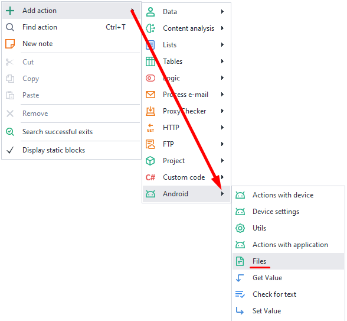
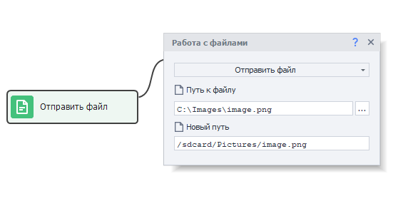
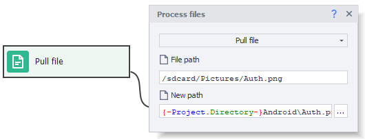

---
sidebar_position: 5
title: Working with Files (Enterprise)
description: Sending files from your computer to a real device.
---

:::info **Please read the [*Material Usage Rules on this site*](../../Disclaimer).**
:::
_______________________________________________
This action lets you send files from your computer to a device and vice versa.
_______________________________________________
## How do I add it to my project?
***Right-click → Add Action → Android → Files***

_______________________________________________
### Sending a file
This function is used to copy a file from your computer to a device.

#### Available parameters:
- *File path*. The full path to the file on your computer.
- *New path*. The location where the copied file will be saved.
You can specify a full path with the filename right away, like `/sdcard/Pictures/pic.png`, or just a folder, like `/sdcard/Pictures/`. In the second case, the file will be copied with its original name. Media files will automatically update in the Gallery after being sent.
:::info Note
To send files to folders that require superuser (root) access, you'll first need to send the file to the `/data/local/tmp/` folder on the device. After that, use the [**Console Command (ADB Shell)**](./Utilities_Ent#консольная-команда-adb-shell) action to move the file to the desired location.

For example:  `su -c cp /data/local/tmp/myfile /data/data/app/myfile`
:::

### Getting a file
This action lets you do the opposite: copy a file from your device to your computer.

#### Available parameters:
- *File path*. The full path to the file on your device.
- *New path*. The place on your computer where the file will be saved.
You can specify a full path with the filename, like `c:\Images\pic.png`, or just a folder, like `/sdcard/Pictures/`. In the second case, the file will be copied with its current name.
_______________________________________________
## Useful links
- [**Getting Root Access**](../../Enterprise/Root)