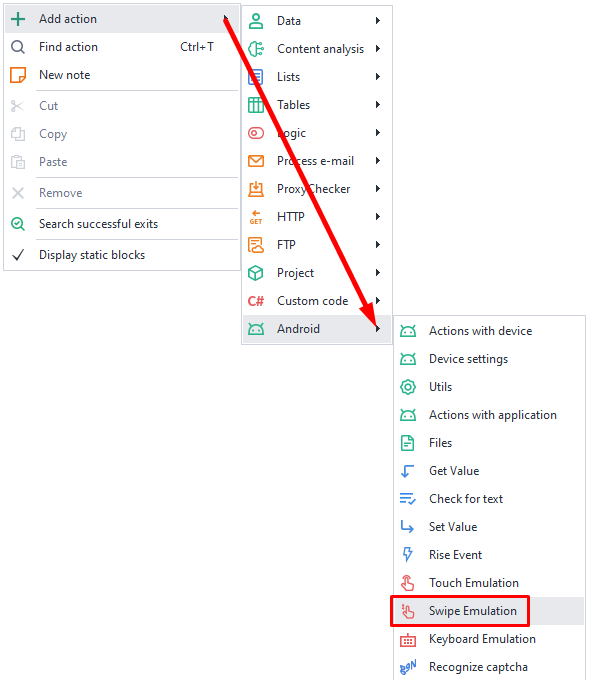
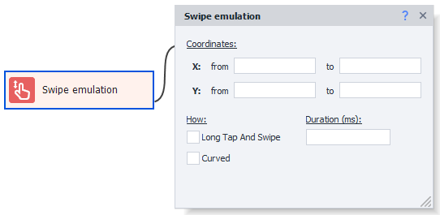

---
sidebar_position: 11
title: Swipe Emulation
description: Scrolling the page with your finger.
---
:::info **Please read the [*Material Usage Rules on this site*](../../Disclaimer).**
:::
_______________________________________________
## Swipe emulation in ZD
This action lets you perform a swipe. It's used for vertical scrolling in the browser and other apps, moving through horizontal menus, or swiping diagonally across the screen.
### How do you add it to your project?
*Right-click → Add action → Android → Swipe emulation*

_______________________________________________
### Available options

#### Coordinates
Set the coordinates for the starting ***(X from and Y from)*** and ending ***(X to and Y to)*** points of the swipe.
***X*** stands for the horizontal coordinate, and ***Y*** is for the vertical.
#### Long Tap And Swipe
If you check this box, it will simulate a long press before the swipe.
#### Duration (ms)
This setting controls the speed of the swipe in milliseconds.
#### Curved
Lets you perform a more realistic swipe that follows a curved line instead of a straight one.