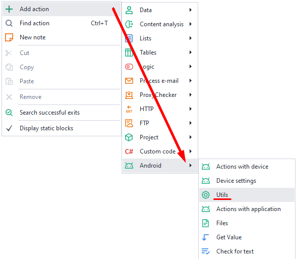
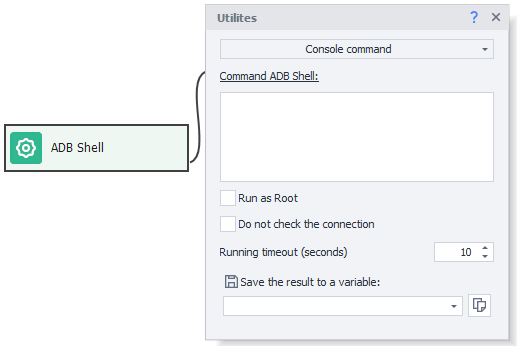
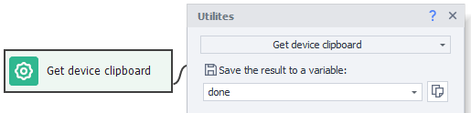
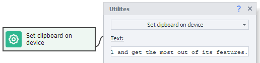
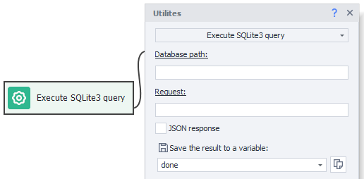

:::info **Please read the [*Material Usage Rules on this site*](../../Disclaimer).**
:::
_______________________________________________
This action brings together a variety of functions that can be useful when working on a project.

## How do you add utilities to a project?
***Right-click → Add Action → Android → Utilities***

_______________________________________________
## Available Utilities
### Console Command (ADB Shell)

:::danger This action is not an ADB command in the strict sense.
Think of it more like a console or emulator terminal. All commands should be entered without "ADB Shell" at the start.
:::

This utility works similarly to the [**Terminal Emulator for Android**](https://apkpure.com/terminal-emulator-for-android/jackpal.androidterm) app. It lets you execute Linux console commands built into Android.

There's a 10-second timeout for this action. If your command doesn't finish in that time, the action will end with an error (exit on the red branch).

Example commands:
- **`ls -la /sdcard/Download`** — list all files and folders at *`/sdcard/Download`*.
- **`pm list packages`** — all installed apps.
- **`pm list packages -3`** — only third-party apps.

#### Save result to variable
Here you'll need to specify an existing or new variable to store the output.

#### Sending/receiving files and folders
This utility also lets you run commands to send and receive files to/from the device:
- Send a folder: *`adb push`* **`"c:\MyFolder"`**   **`/sdcard/`**
- Send a file: *`adb push`* **`"{-Project.Directory-}myFile.txt"`** **`/sdcard/myFileNewName.txt`**
- Get a folder: *`adb pull`* **`/sdcard/myFolder`** **`c:\Users\Public`**
- Get a file: *`adb pull`* **`/sdcard/myFile.txt`** **`"{-Project.Directory-}myFileNewName.txt"`**
:::tip The first path in the command is *where you're getting the file from*, the second is *where you're sending it to*.
:::
_______________________________________________
### WiFi Settings
  

With this action, you can spoof the **network name (SSID)** and **MAC address (BSSID)** of the WiFi network your device is connected to.

:::warning You'll need the [ZennoDroid module for LSPosed](../../Enterprise/LSPosed) installed.
:::
_______________________________________________
### Set Geo-location
This utility lets you spoof the device's location.

#### Available parameters:
- *Latitude*. Accepts values from -90 to 90.
- *Longitude*. Accepts values from -180 to 180.
- *Height*. Height above sea level in meters.
- *Direction*. Accepts values from 0 to 360.
- *Speed*. How fast your phone is "moving" in km/h (pretend you're traveling).
You can use decimals, either with a [**.**] dot or [**,**] comma as a separator.
For example, New York latitude and longitude: *40.7143* and *-74.006*
_______________________________________________
### Get Structure of Elements (XML)
  

Lets you grab the screen's element structure as an XML string. This is the same data you see in the *element tree window*, just as **XML text**. Then you can process it using the *JSON and XML Processing* action.
#### Some useful attributes you can get from an element:
- coordinates and size (the **`bounds`** attribute)
- displayed text (the **`text`** or **`content-desc`** attribute)
- element's unique id (the **`resource-id`** attribute)
_______________________________________________
### Scaling
  

Use this action to zoom in or out: **Zoom Out** (reduce) or **Zoom In** (increase).
#### Available parameters:
- *Coordinates*: the point relative to which scaling will happen
- *Coefficient*: how much to shrink or enlarge
_______________________________________________
### Send SMS to the Device
  

This utility simulates sending an SMS to the device.
#### Available parameters:
- *Phone*. Sender's phone number.
- *Message*. Text you want to send.
:::danger You'll need root access to use this action.
:::
_______________________________________________
### Get ADB Connection Settings
  

This action lets you get the serial number or address and port of the connected device (depending on how it's connected).

Use this when you need to run specific ADB commands: `adb -s serial mdns services`
_______________________________________________
### Get Device Clipboard
  

Lets you save the contents of the device clipboard to a variable.
_______________________________________________
### Set Clipboard on Device
  

Lets you set the clipboard content on the device.

Afterward, using the [**Keyboard Emulation**](./Keyboard) action, you can paste the content into any field using the `{AndroidKeys.PASTE}` macro.
_______________________________________________
### Execute SQLite3 Query
  

Lets you run an SQL query on a database located on the device. On first launch, any needed files will be automatically installed on your device, depending on its architecture.
#### Available parameters:
- *Database path*. Full path to the file. For example, `/data/data/com.android.providers.contacts/databases/contacts2.db`
- *Request*. SQL query, like `SELECT * FROM contacts`
- *JSON response*. If you set this, the query result will be returned in JSON format (you can read it using the [**JSON and XML Processing**](../../Data/JSON_XML) action). Otherwise, the response will be returned as an array of strings. The separator is the **|** (vertical bar) symbol.
:::danger You'll need root access to use this action.
:::
_______________________________________________
### Execute Frida Script
  

A utility to run a Frida script. On first launch, all necessary files will be installed automatically depending on your device's architecture. After that, the Frida server will be started.
#### Available parameters:
- *Application name*. The name of the app where the script should be loaded.
- *Script*. Script content. Macros are supported.
:::danger You'll need root access to use this action.
:::
_______________________________________________
## Useful Links
- [**Frida server**](../../Tools/Frida)
- [**X/JSON Path tester**](../../Tools/JSON_Tester)
- [**SMS module settings**](../../Settings/SMS)