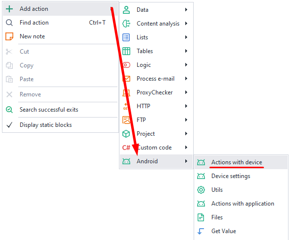
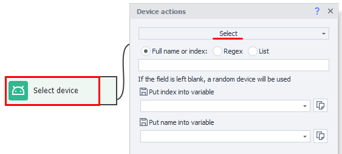
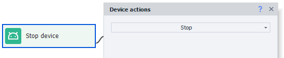
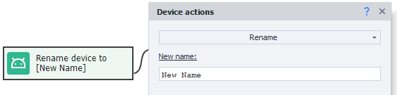
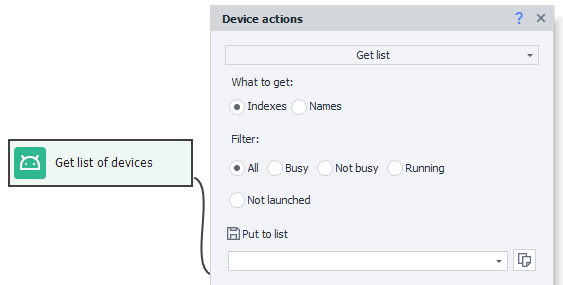

---
sidebar_position: 1
title: Device Actions (Enterprise)
description: How to work with a device via ProjectMaker
---

:::info **Please read the [*Material Usage Rules on this site*](../../Disclaimer).**
:::
_______________________________________________
export const VideoSample = ({source}) => (
  <video controls playsInline muted preload="auto" className='docsVideo'>
    <source src={source} type="video/mp4" />
</video>
);   

## How to add an action to a project?  

To open the context menu, right-click on an empty space.  
Then select **Add Action → Android → Device Actions**.  

  
_______________________________________________
## How to select a device?  

This action lets you pick a device to work with.  

 

### Available settings:  
- ***Full name or index***  
Enter the device's serial number or index (starts from zero). If you leave this empty, a random device will be chosen.
- ***Regex***  
If you choose this option, a random device will be picked from the list of all connected devices whose serial numbers match your Regex expression.
- ***Put index/name in variable***  
This lets you save the chosen device's name or index to variables. Usually this is used with random selection, so you know which device was picked.
_______________________________________________
## How to start or restart a device?  
This action starts a connection to the selected device and begins interacting with it, or restarts an existing connection.

 
  
:::danger Before you start, make sure you've *selected* the device you want the program to work with.
:::
_______________________________________________
## How to stop a device?  
This action stops a running device.   

   
_______________________________________________
## How to rename a device?  
Lets you change the name of the current device.  

 

:::info Please note:
*The name changes for the device selected using the **Select** feature (described earlier in this article).*
:::
_______________________________________________
## How to get a list of devices?  

This action allows you to save all available devices to a list.  

 
#### Available settings:  
- ***What to get***  
You can choose what exactly to save in the list: either the device indexes or their serial numbers.
- ***Put into list***  
This is the list where the result will be saved.
- ***Filter***  
You can also filter the list by device state:  
  - **All.** Includes all created devices, regardless of their state.
  - **Busy.** The device is busy in one of the running threads. This works only when run in ZennoDroid. (ProjectMaker doesn't see threads running in ZennoDroid).
  - **Not busy.** The device isn't in use by any running thread. This filter also works only in ZennoDroid.
  - **Running.** The device is connected to your computer and there is communication through ADB.
  - **Not running.** The device is connected, but there's no communication via ADB. For example, the device isn't authorized or is offline.
_______________________________________________  
## Useful links   
- [**Automating app work**](../../get-started/apps)  
- [**Device window**](../../pm/Interface/DeviceWindow)