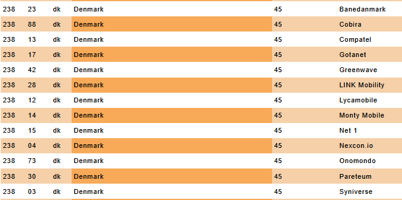

:::info **Please read the [*Material Usage Rules on this site*](../../Disclaimer).**
:::
_______________________________________________
export const VideoSample = ({source}) => (
  <video controls playsInline muted preload="auto" className='docsVideo'>
    <source src={source} type="video/mp4" />
</video>
); 


## How to add an action to a project?  

To open the context menu, right-click on an empty space.  
Then select **Add Action → Android → Device Settings**.  

  
_______________________________________________ 
## How to set up device identifiers  

With this feature, you can change parameters like [IMEI](https://ru.wikipedia.org/wiki/IMEI), Android ID (device identifier), [IMSI](https://ru.wikipedia.org/wiki/IMSI), and Sim Serial (SIM card serial number).  

  

You can enter the data manually or use it from the active profile.  

:::warning **You need to have the [*ZennoDroid module for LSPosed*](../../Enterprise/LSPosed#installing-the-zennodroid-module) installed.**
:::
_______________________________________________ 
## How to add a mobile operator?  

  

You can enter the data manually or use the current profile. For manual entry, all necessary information can be found [**here**](https://www.mcc-mnc.com/)  

### Settings available:  

 
- ***Country***. Two letters from the ISO column.  
- ***Operator code***. MCC and MNC columns combined (for example, 25002 for MegaFon).  
- ***Operator name***. The Network column (Baykal Westcom, BeeLine/VimpelCom, MTS).  
- ***Phone number***. Don't add the "+" sign at the start—just 79*** and so on.  

:::warning **You need to have the [*ZennoDroid module for LSPosed*](../../Enterprise/LSPosed#installing-the-zennodroid-module) installed.**
:::
_______________________________________________ 
## How to specify the device model?  

 
### Available settings:  
- ***Manufacturer***. Which device are you emulating? (Samsung, Huawei, Xiaomi, Google, Meizu, etc.)  
- ***Model***. Which model is being used. You can find it in build.prop (more on that below).  
- ***ro.product.brand***. If this field is empty, repeat the Manufacturer value.  
- ***ro.product.board***. For newer phones, this is not relevant—you can leave it empty.  
- ***ro.hardware*** and ***ro.build.fingerprint***. Get these from build.prop.  

:::warning **You need to have the [*ZennoDroid module for LSPosed*](../../Enterprise/LSPosed#installing-the-zennodroid-module) installed.**
:::

### How to find data in build.prop:  
You need to search like this in your search engine:  
***build.prop phone_model*** (for example, build.prop Samsung s10).  
Go to one of the results, and in the text look for what you need:  
`ro.product.brand=samsung`  
`ro.hardware.chipname=exynos9820`  
`ro.product.board = нет`  
`ro.product.model` or `ro.product.system.model`  
:::info **How to find out your phone's parameters?**
*In the terminal (like [Terminal Emulator for Android](https://apkpure.com/terminal-emulator-for-android/jackpal.androidterm#google_vignette)), run the *getprop* command.*
:::
 
_______________________________________________
## How to set the WiFi MAC address:  
Here you can set a new MAC address for the device's WiFi adapter. You can enter the data manually or use the active profile.

 

Format: use colons XX:XX:XX:XX:XX:XX, or just type it without colons XXXXXXXXXXXX (12 characters)  

:::warning **You need to have the [*ZennoDroid module for LSPosed*](../../Enterprise/LSPosed#installing-the-zennodroid-module) installed.**
::: 
_______________________________________________
## System language selection:  
This setting changes the language of the connected smartphone.   
Available values: ***en, ko, de, ja, fr, ru, es, pt, hr, cn, sr, it, cs, th, in, pl, tr, uk, ar, vi, fil***  

:::warning **Before changing these settings, make sure the device is powered off.**
:::
_______________________________________________
## Setting the time zone:  
Lets you pick the device's time zone.  
The format is: ***Europe/Moscow*** or ***America/New_York***, etc.  
  
You can check the full list of time zones [**here**](https://en.wikipedia.org/wiki/List_of_tz_database_time_zones)  
_______________________________________________ 
## How to set the date and time:  
Set whatever you want: **year, month, day, hour, minute, and second**.  
    
If you leave all fields empty, the time will sync automatically with the current time.  
_______________________________________________  
## How to set up a proxy:  
This setting lets you set a proxy for all connected devices.  
  
Proxy format:  
- **With authorization**: `protocol://login:password@ip:port`  
- **Without authorization**: `protocol://ip:port`  
Possible values for **protocol**: ***http***, ***socks4*** or ***socks5***. If not specified, ***http*** is used by default.  

### [Proxifier](https://proxifier.com/).  
A powerful and flexible app that lets you route internet traffic through a proxy server. It allows apps that don't support proxies to work with them.  

#### DNS addresses.  
Here you can set DNS server addresses. If you have several, separate them with a comma `,`  

#### Local IP.  
*Set the device's local IP address.*  

If you make the last part of your address zero, for example, `192.168.20.0`, a random address from that subnet will be generated: `192.168.20.2-192.168.20.254`.

### Redsocks.  
To proxy traffic, Redsocks2 is used — a transparent redirector of TCP/UDP connections to a proxy.  

#### Use computer's internet connection.  
When this is on, all phone traffic will be routed to your computer.

#### DNS addresses.  
Here you can set DNS server addresses. If you have several, separate them with a comma `,`  

By default DNS requests are sent through the proxy server. If your requests are blocked (can't connect to the internet or get **`DNS_PROBE_FINISHED_NO_INTERNET`** errors), you need to disable DNS forwarding.  

:::info **C# code to disable DNS forwarding.**  
```csharp
var settings = new DroidProxySettings.Redsocks();
settings.UseDnsTcp = false;
settings.UseDnsUdp = false;
instance.DroidInstance.Proxy.SetProxy("socks5://10.20.30.40:8080", settings);
```  
**You should run this code before setting up the proxy.**
:::  

#### Local IP *(only if using the computer's internet connection)*.  
*Set the device's local IP address.*  

If you make the last part of your address zero, for example, `192.168.20.0`, a random address from that subnet will be generated: `192.168.20.2-192.168.20.254`.


### Clash.
A powerful proxy client that can route traffic according to rules you set.  

 

:::warning **BusyBox version 1.36.1 or higher is required.**
:::

#### Use computer's internet connection.  
When this is on, all traffic from the phone is routed through the computer.  

:::info **In this mode, IPv6 proxies are *not supported*.**
:::

#### DNS addresses.  
Here you can set DNS server addresses. If you have several, separate them with a comma `,`  

#### Local IP *(only if using the computer's internet connection)*.  
*Set the device's local IP address.*  

If you make the last part of your address zero, for example, `192.168.20.0`, a random address from that subnet will be generated: `192.168.20.2-192.168.20.254`.  

#### Local IPv6.  
You can also set the local IPv6 address for the device here.  

Example: `fdfe:dcba:9806::1/126`  
If you use an address like `fdfe:dcba:0::1/126` then the **`0`** will be replaced with a random hexadecimal value.  

#### Whitelist.  
A list of apps whose traffic goes through the proxy (list each app separated by a comma). All other apps will use a direct internet connection (no proxy).  

You can find an app's identifier using the [Installed Apps](../../Tools/Installed_App) tool.  

#### Blacklist.
Here, it's the opposite—you set the list of apps that won't use the proxy. Their traffic goes straight to the internet, and all other apps use the proxy.  

You can find an app's identifier using the [Installed Apps](../../Tools/Installed_App) tool.  

:::warning **You can use either whitelist or blacklist, not both.**
If both are filled in, only the whitelist will be used.
::: 
___________________________________________  
## Useful links.   
- [**How to get Root access**](../../Enterprise/Root).     
- [**Device Window**](../../pm/Interface/DeviceWindow).