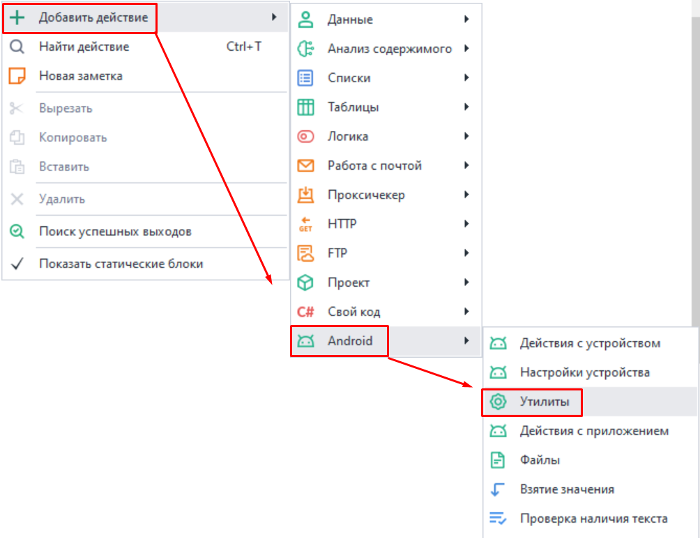
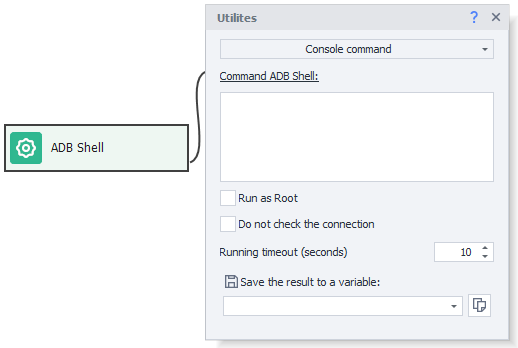
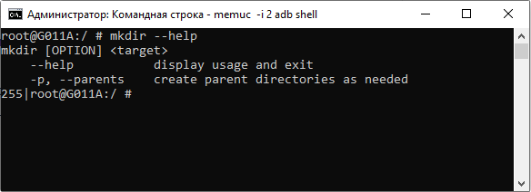

:::info **Please read the [*Guidelines for using materials on this resource*](../../Disclaimer).**
:::
_______________________________________________
## ADB Shell  
This is the command line interface for interacting with Android devices. With it, you can run various commands to control your smartphone, test apps, and analyze how they work.

### How do you add it to a project?
#### Through the context menu:  
**Add Action → Android → Utilities**



This action lets you run built-in Android console Linux commands.


_______________________________________________
## Commands
:::warning **All commands should be entered without starting with `ADB Shell`.**
:::

There are tons of commands, so a whole separate manual would be needed to cover them all. Here we’ll just go over the most popular ones.

### File System
| Name    | Description |
| :-------- | :-------: |
| `ls`  | **Shows a list of files and folders in the current directory** |
| `cd <path>` | **Go to the specified directory** |
| `pwd`    | **Shows the current path** |
| `mkdir <folder_name>`  | **Creates a new folder** |
| `rm <file>` | **Deletes the specified file** |
| `rm -r <folder>`    | **Deletes a folder and its contents** |

### Working with Files
| Name    | Description |
| :-------- | :-------: |
| `cat <file>`  | **Displays the file contents** |
| `cp <source> <destination>` | **Copies a file** |
| `mv <source> <destination>`    | **Moves or renames a file** |
| `touch <file_name>`  | **Creates an empty file** |
| `stat <file>` | **Displays info about a file (size, permissions, modification time)** |

### System Commands
| Name    | Description |
| :-------- | :-------: |
| `reboot`  | **Reboots the device** |
| `reboot recovery` | **Reboots the device into recovery mode** |
| `top`    | **Shows a list of running processes and their resource usage** |
| `free`  | **Shows RAM usage** |
| `df` | **Displays free space info for disks** |  

### App Management
| Name    | Description |
| :-------- | :-------: |
| `pm list packages`  | **Shows a list of installed apps** |
| `pm uninstall <app_name>` | **Uninstalls an app** |
| `pm install <path>`    | **Installs an app from the specified APK file** |
| `pm clear <app_name>`  | **Clears an app’s data** |
| `am force-stop <app_name>` | **Force stops an app** |

### How can you see all available commands?
:::tip  **BusyBox is a set of UNIX command-line utilities.**
:::

To display a list of commands, just enter this in the console: `busybox`

<details>
<summary>***Example output***</summary>  


```
root@x86:/ # busybox
BusyBox v1.22.1 bionic (2018-09-25 14:13 +0800) multi-call binary.
BusyBox is copyrighted by many authors between 1998-2012.
Licensed under GPLv2. See source distribution for detailed
copyright notices. Merged for bionic by tpruvot@github

Usage: busybox [function [arguments]...]
   or: busybox --list[-full]
   or: busybox --install [-s] [DIR]
   or: function [arguments]...

        BusyBox is a multi-call binary that combines many common Unix
        utilities into a single executable.  Most people will create a
        link to busybox for each function they wish to use and BusyBox
        will act like whatever it was invoked as.

Currently defined functions:
        [, [[, adjtimex, arp, ash, awk, base64, basename, bbconfig, blkid,
        blockdev, brctl, bunzip2, bzcat, bzip2, cal, cat, catv, chattr, chcon,
        chgrp, chmod, chown, chroot, chvt, clear, cmp, and so on...
```
     
</details>    

### Command Hints
For some commands, you can get a quick help message describing what they do. Just type `<command_name> --help`. The info will be in English only.

| `mkdir --help` | 
| :-------- |
|   |  

:::tip  **If this way doesn’t seem informative to you.**
You can always look up detailed info online. Since all these commands are basic Linux commands, there’s a ton of guides and explanations for them.
:::
_______________________________________________ 
## Special Commands
### Activity Manager `am`
This is an Android system command for managing apps, their states, and interacting with system components. It's useful for developers and testers, since it lets you automate different actions on the device.

In Android, apps are made up of components, the main ones being **Activity** and **Intent**. These are related concepts that play a big role in app architecture.

#### Activity
This is a component of an Android app that represents a single screen of the user interface. Like a page in a browser or a window in an app. Usually, Activity windows take up the whole available screen. Each Activity works independently but can interact with other Activities, both within the same app and across different apps.

**Example Activities in an email app:**  
- Inbox Activity (list of incoming emails)  
- Email Activity (reading a particular email)  
- Compose Activity (writing an email)  
- Settings Activity (app settings)  

:::info  **Call Examples**
- **Launch file manager:**  
`am start com.cyanogenmod.filemanager/com.cyanogenmod.filemanager.activities.NavigationActivity`  
- **Open settings:** `am start -n com.android.settings/.Settings`  
- **Launch browser:** `am start -n com.android.browser/.BrowserActivity`
:::

#### Intent
This is an object that tells the system what needs to be “done” (for example, open a URL, send an email to a specific address, call a phone number, or take a photo). In the web, you use a URL (link) to go to another page; in Android, you use intents to launch apps or other Activities. An app can create such an intent and send it to the system, and the system decides which activity (or other component) will handle it.

:::info  **Call Examples**
- **Open URL:** `am start -a android.intent.action.VIEW -d https://zennolab.com`  
- **Search via the browser (browser must already be running):**  
`am start -a android.intent.action.WEB_SEARCH -n com.android.browser/.BrowserActivity --es query 'Hello, world!'`  
::: 

### Package Manager `pm`
This command is for managing installed apps and packages. With it, you can delete data, enable or disable an app, get a list of installed apps, and so on. The **`pm`** command is especially useful for automating app testing and managing devices that don’t have a graphical interface.

:::info  **Call Examples**
- **Uninstall an app:** `pm uninstall com.example.MyApp`    
- **Get a list of all apps:** `pm list packages`  
You can also get this list using the [**Installed Apps**](../../Tools/Installed_App) tool.
:::
_______________________________________________
## Useful Links
- [**How Android Works**](https://habr.com/ru/companies/solarsecurity/articles/338494/)
- [**Intro to Intents. Launching Activities.**](https://metanit.com/java/android/2.2.php)