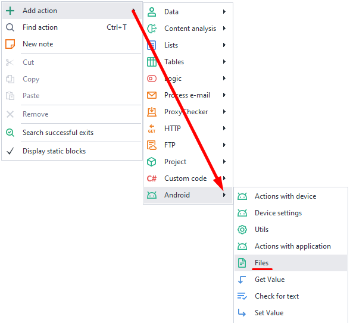
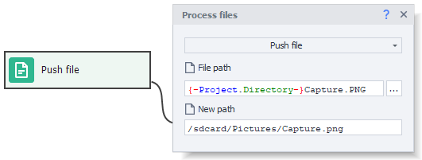

:::info Please read the [*Terms of Use for materials on this resource*](../../Disclaimer).
:::
_______________________________________________
This action lets you send files from your computer to your device and vice versa.
_______________________________________________
## How to add it to your project?
***Right-click → Add Action → Android → Files***

_______________________________________________
### Sending a file.

Use this feature if you want to copy a file from your computer onto your device.

#### Available options:
- *File path*. The full path to the file on your computer.
- *New path*. Where the copied file will be saved.

You can specify the full path, including the file name: `/sdcard/Pictures/pic.png`, or just pick a folder: `/sdcard/Pictures/`. In the second case, the file will be copied with its original name.

Media files will automatically show up in your gallery after they're sent.
:::info Please note:
To send files to folders that are **Read-only** like **/system**, you'll need to run `mount -o remount,rw /system` first using the [**Console Command (ADB Shell)**](./Utilities#консольная-команда-adb-shell) action.
:::

### Receiving a file.
This action lets you do the opposite: copy a file from your device to your computer.

#### Available options:
- *File path*. The full path to the file on your smartphone.
- *New path*. Where on your computer you want this file to go.

Again, you can specify the full path, with the file name right away, like `c:\Images\pic.png`, or just pick a folder: `/sdcard/Pictures/`. In the second case, the file will be copied with its original name.